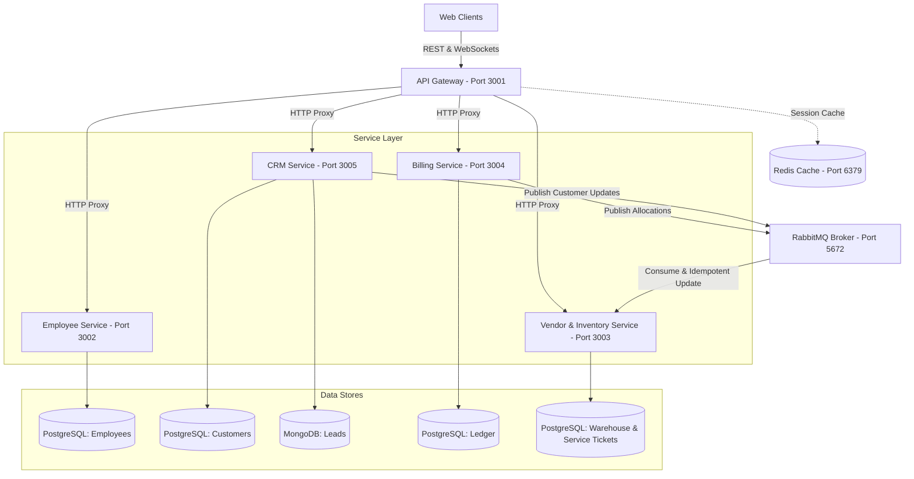
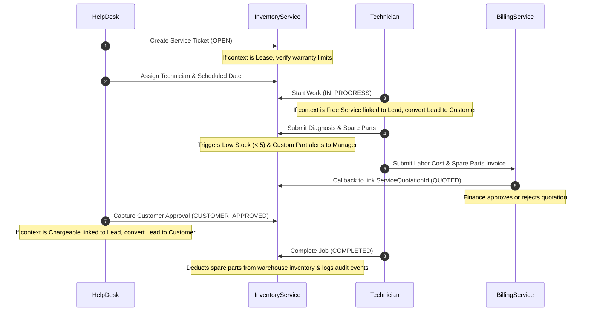

# Xerocare ERP

**Xerocare** is an enterprise-grade, microservices-based ERP and Asset Management System built with Node.js, TypeScript, Next.js, and PostgreSQL. It features robust role-based authentication, real-time event-driven workflows, and a cohesive financial ledger tracking system.

---

## 🌐 High-Level System Architecture

Xerocare's backend is implemented as a monorepo consisting of independent microservices proxied through a unified API Gateway, using **RabbitMQ** for event choreography and **Redis** for state caching.



---

## 🛠️ Microservices Monorepo Layout

- `backend/api_gateway/`: Handles client authentication, rate limiting, and proxies requests to sub-services.
- `backend/employee_service/`: Manages HR directories, payroll calculations, and token issuance.
- `backend/crm_service/`: Tracks client leads (MongoDB) and customer directories (PostgreSQL).
- `backend/billing_service/`: Manages service quotations, contract ledger entries, usage tracking, and invoice settlements.
- `backend/ven_inv_service/`: Manages warehouse spare parts, RFQ logs, machine serials, and the new **Service Management module**.
- `frontend/`: A responsive Next.js web application utilizing TailwindCSS/Vanilla CSS components.

---

## 🔧 Service Management Module

The newly implemented **Service Management module** manages the lifecycle of printer installations, preventive maintenance, breakdown repairs, and meter reading inspections.

### 👥 Role-Based Access Control (RBAC)

- **ADMIN / MANAGER**: Full administrative access over all service tickets, assignments, diagnostics, and approvals.
- **SERVICE_HELP_DESK**: Creates tickets, assigns tasks to technicians, schedules visit dates, and captures final client approvals.
- **SERVICE_TECHNICIAN**: Views assigned tickets, logs repair diagnoses, requests spare parts (both standard inventory and custom unregistered parts), creates quotations, starts jobs, and logs completion notes.

### 🔄 End-to-End Service Flow



### 📈 Customer Intelligence View

Available to help-desk workers and technicians directly within the ticket detail drawer:

- **Local Service Tickets**: Full history of past breakdowns, PMs, and repairs.
- **Contract & Invoice History**: Active leases, rentals, and payments grouped by contract types (`SALE`, `RENT`, `LEASE`, `SERVICE`) queried live from the `billing_service`.

---

## 🚀 Developer Onboarding & Quick Start

For detailed system mechanics, build settings, database schemas, complex business logics, and login flow references, please consult the master **[Developer Onboarding & Reference Guide](docs/DEVELOPER_GUIDE.md)**.

### ⏱️ Quick Start Commands

1. **Install workspace dependencies**:
   ```bash
   pnpm install
   ```
2. **Start Postgres, MongoDB, Redis & RabbitMQ**:
   ```bash
   docker-compose up -d postgres mongodb redis rabbitmq
   ```
3. **Run services in development mode**:
   ```bash
   pnpm dev
   ```
4. **Compile and build frontend/backend packages**:
   ```bash
   pnpm run build
   ```
5. **Run typechecks and lints**:
   ```bash
   pnpm run lint
   pnpm run typecheck
   ```
