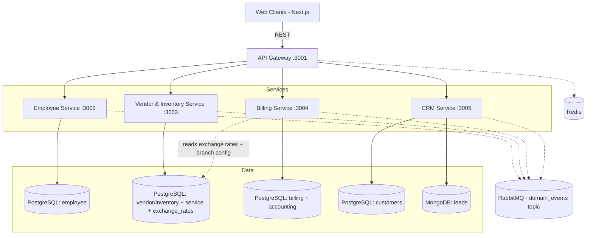
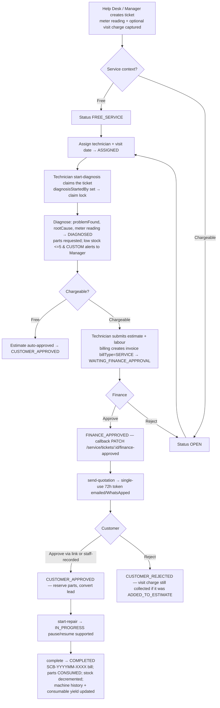

# Xerocare ERP — Complete Documentation

> Single consolidated reference for the whole system: architecture, every service,
> the money/accounting engine, the service (repair) module, the event bus, cron jobs,
> the database, and environment configuration.
>
> **Last rewritten:** 2026-09-10 — verified against the code on branch `nadhil`.
> Supersedes the 2026-07-08 consolidation; the accounting module, sale-workflow
> module, service-contract overhaul, warranty policy, visit-charge collection,
> targets/incentives, stock transfers, B2B/B2C customers and remote-signing flows
> were all added or reworked after that date and are folded in here.

**Contents**

1. [System Overview & Architecture](#1-system-overview--architecture)
2. [Quick Start & Development](#2-quick-start--development)
3. [Roles & Permissions](#3-roles--permissions)
4. [Authentication & JWT](#4-authentication--jwt)
5. [API Gateway](#5-api-gateway)
6. [Frontend Application](#6-frontend-application)
7. [Employee Service](#7-employee-service)
8. [CRM Service](#8-crm-service)
9. [Vendor & Inventory Service](#9-vendor--inventory-service)
10. [Billing Service — Sales, Contracts & Collections](#10-billing-service--sales-contracts--collections)
11. [Billing Service — Accounting Module](#11-billing-service--accounting-module)
12. [Multi-Currency & Tax System](#12-multi-currency--tax-system)
13. [Service Module (Repair Tickets & Contracts)](#13-service-module-repair-tickets--contracts)
14. [Procurement & Inventory Allocation Workflow](#14-procurement--inventory-allocation-workflow)
15. [Event Bus (RabbitMQ)](#15-event-bus-rabbitmq)
16. [Scheduled Jobs (Cron)](#16-scheduled-jobs-cron)
17. [Database Schema Reference](#17-database-schema-reference)
18. [Inter-Service Communication Patterns](#18-inter-service-communication-patterns)
19. [Environment Variables](#19-environment-variables)

---

## 1. System Overview & Architecture

**Xerocare** is an enterprise, microservices ERP and asset-management system for a
**multi-country printer sales, rental, leasing and service** business operating across
the Gulf (UAE / AED, Qatar / QAR, and any further branches added with their own
currency and tax regime). It is a **Node.js + TypeScript monorepo** managed with
**pnpm workspaces**, with a **Next.js (App Router)** frontend.

The backend is five independent services behind a single API Gateway. Services talk
to each other **synchronously over HTTP** (for data they need an immediate answer for)
and **asynchronously over RabbitMQ** (for eventual-consistency updates). Redis backs
rate limiting and the gateway's customer/employee/branch caches.



### Services

| Service            | Port | Owns                                                                                                                                                                                                                                                                                        |
| ------------------ | ---- | ------------------------------------------------------------------------------------------------------------------------------------------------------------------------------------------------------------------------------------------------------------------------------------------- |
| `api_gateway`      | 3001 | The only public entry point. Auth, CORS, rate limiting, reverse proxy, invoice aggregation, per-route service-role gating, private-file URL signing.                                                                                                                                        |
| `employee_service` | 3002 | Staff accounts, authentication/JWT, leave, late marks, payroll, in-app notifications, the outbound email worker, a local branch mirror.                                                                                                                                                     |
| `ven_inv_service`  | 3003 | Branches, vendors, product catalog (models/brands/products), warehouses, inventory, spare parts, procurement (RFQ → lot → purchase), stock transfers, tax reports, and the **entire service (repair) module** including service contracts.                                                  |
| `billing_service`  | 3004 | Quotations, contracts, invoices, usage/meter billing, payments, credit notes, returns, the **sale-workflow module** (contract agreements, installation, machine swap/replacement, sale payments, security deposits), targets & incentives, and the **full double-entry accounting module**. |
| `crm_service`      | 3005 | Customers (PostgreSQL) with B2B/B2C type, VAT status and bank details; marketing leads (MongoDB); lead → customer conversion.                                                                                                                                                               |

### Path prefixes

The gateway maps a one-letter prefix to each service and **strips it** before
forwarding (`/e/auth/login` → `/auth/login`).

| Prefix | Service          |
| ------ | ---------------- |
| `/e/`  | employee_service |
| `/i/`  | ven_inv_service  |
| `/b/`  | billing_service  |
| `/c/`  | crm_service      |

### Technology stack

| Concern            | Choice                                                                                                                                                    |
| ------------------ | --------------------------------------------------------------------------------------------------------------------------------------------------------- |
| Runtime / language | Node.js, TypeScript                                                                                                                                       |
| HTTP framework     | Express                                                                                                                                                   |
| ORM                | TypeORM, **`synchronize: false`** — schema is managed by raw idempotent SQL in each service's startup (`connectWithRetry` / `dataSource.ts` / `db.ts`)    |
| Databases          | PostgreSQL per service (managed — Neon); MongoDB for CRM leads (managed — Atlas)                                                                          |
| Cache              | Redis (rate limits, gateway aggregation cache)                                                                                                            |
| Message bus        | RabbitMQ — one topic exchange, `domain_events`                                                                                                            |
| File storage       | Cloudflare R2. Objects are stored **by key**; responses are rewritten to signed/public URLs on the way out by a `signFileUrls` middleware in each service |
| PDF generation     | Custom generators in ven_inv_service and billing_service                                                                                                  |
| Scheduling         | `node-cron` + `setInterval`                                                                                                                               |
| Email / WhatsApp   | `nodemailer` (SMTP) via the employee_service email worker; WhatsApp Business API                                                                          |

> **Docker has been removed.** PostgreSQL and MongoDB are external managed services
> (Neon, MongoDB Atlas). Only Redis and RabbitMQ run locally in development.

---

## 2. Quick Start & Development

```bash
pnpm install                       # workspace deps

# Local infra (Debian/Ubuntu example) — Postgres/Mongo are remote, only these are local:
sudo apt install -y redis-server rabbitmq-server
sudo systemctl enable --now redis-server rabbitmq-server
redis-cli ping                     # -> PONG
sudo rabbitmqctl status

pnpm dev                           # run all services + frontend in watch mode
pnpm run build                     # build everything
pnpm run lint && pnpm run typecheck
```

Set connection strings in `.env` at the repo root: `*_DATABASE_URL` for each Postgres
DB, `MONGO_URI`, `REDIS_URL`, `RABBITMQ_URL`, the R2 keys, SMTP, and the internal
`*_SERVICE_URL` addresses. See [Section 19](#19-environment-variables).

Frontend runs on port `3000` (`pnpm --filter frontend dev`).

---

## 3. Roles & Permissions

### Primary roles (JWT `role`)

| Role       | Description                                                                                                          |
| ---------- | -------------------------------------------------------------------------------------------------------------------- |
| `ADMIN`    | Organisation-wide superuser. Passes every role gate. Logs in through a separate `admins` table and `/e/admin/login`. |
| `HR`       | Employees, leave, late marks, payroll. **No accounts access.**                                                       |
| `MANAGER`  | Branch manager. **Complete authority within their own branch** (see below).                                          |
| `FINANCE`  | Quotation/estimate approval, billing, and the accounting module (branch-scoped).                                     |
| `EMPLOYEE` | Front-line staff; the actual capability is set by `employeeJob`. **No accounts access.**                             |

### Employee job sub-roles (JWT `employeeJob`)

| Job                  | Description                                                                                                                       |
| -------------------- | --------------------------------------------------------------------------------------------------------------------------------- |
| `SALES`              | Creates product-sale quotations.                                                                                                  |
| `RENT_AND_LEASE`     | Creates rent/lease quotations.                                                                                                    |
| `SERVICE_HELP_DESK`  | Creates & assigns service tickets, schedules visits, talks to customers, manages service contracts, drives installation/delivery. |
| `SERVICE_TECHNICIAN` | Diagnoses machines, records estimates, does repairs, records meter readings, records the customer's estimate decision.            |
| `CRM`                | Leads and customer data.                                                                                                          |
| `MANAGER`            | A job-level manager inside the `EMPLOYEE` role.                                                                                   |

### Finance job sub-roles (JWT `financeJob`)

`FINANCE_SALES`, `FINANCE_RENT_LEASE` — split the finance queue by department.

### Service-module roles

`SERVICE_HELP_DESK` and `SERVICE_TECHNICIAN` are `employeeJob` values, enforced at the
gateway by `requireServiceRole([...])` and inside ven_inv controllers. `requireServiceRole([])`
means **ADMIN or MANAGER only** (e.g. ticket cancel).

### MANAGER authority & role inheritance

Client rule (2026-07-17): **a branch manager has complete authority within their branch.**
This is implemented two ways:

- **Middleware inheritance** — `billing_service`, `crm_service`, `employee_service` and
  `api_gateway` `requireRole`/`roleMiddleware` treat `MANAGER` as implicitly satisfying
  any gate that allows `HR`, `FINANCE` or `EMPLOYEE`. So a route documented `ADMIN, FINANCE`
  also admits `MANAGER` unless stated otherwise.
  ```ts
  const MANAGER_INHERITED_ROLES = ['MANAGER', 'HR', 'FINANCE', 'EMPLOYEE'];
  ```
- **Explicit inline checks** — `ven_inv_service` service routes have no `requireRole`;
  the manager-authority checks are written inline in the controllers (`role === 'MANAGER' || 'ADMIN'`
  alongside job-specific flags).

**Strict routes** that stay closed to managers use `requireStrictRole` (gateway) — no
inheritance. Currently the company-wide `/b/invoices/sales/global-overview` and
`/b/invoices/sales/global-totals` (ADMIN, FINANCE only).

**Accounts module gate** — `billing_service` `/accounts/*` is restricted to
`ADMIN`, `FINANCE`, `MANAGER` by `branchFilterMiddleware` (`ACCOUNTS_ALLOWED_ROLES`),
with **MANAGER read-only** (any `POST/PUT/PATCH/DELETE` is blocked by `requireWriteAccess`).
HR and EMPLOYEE have zero accounts access — the frontend middleware also bounces them
to `/unauthorized`.

### Frontend section access (`frontend/middleware.ts`)

| Path         | Roles                                                                                                                                                  |
| ------------ | ------------------------------------------------------------------------------------------------------------------------------------------------------ |
| `/admin`     | ADMIN                                                                                                                                                  |
| `/hr`        | HR, MANAGER, ADMIN                                                                                                                                     |
| `/manager`   | MANAGER, ADMIN                                                                                                                                         |
| `/employee`  | EMPLOYEE, MANAGER, ADMIN                                                                                                                               |
| `/finance`   | FINANCE, MANAGER, ADMIN                                                                                                                                |
| `*/accounts` | additionally: never HR/EMPLOYEE; `/manager/accounts` MANAGER-only; `/admin/accounts` ADMIN-only; FINANCE→MANAGER redirect on the finance accounts area |

---

## 4. Authentication & JWT

### Tokens

- **Access token** — short-lived, sent as `Authorization: Bearer <token>` on every request.
  Payload: `userId`, `role`, `branchId`, `employeeJob`, `financeJob`, `iat`, `exp`.
- **Refresh token** — long-lived, stored in the `refresh_tokens` table, sent as a cookie.
  The refresh cookie is deliberately **usable over HTTP** (not `Secure`-only) so the
  app does not auto-logout in non-HTTPS/dev and mixed environments.
- Refresh **rotates**: `POST /e/auth/refresh` deletes the old token row and issues a new pair.

### Flows

| Flow                                | Endpoints                                                                                      |
| ----------------------------------- | ---------------------------------------------------------------------------------------------- |
| Password login (+ optional OTP 2FA) | `POST /e/auth/login` → `POST /e/auth/login/verify`                                             |
| Admin login                         | `POST /e/admin/login`, `POST /e/admin/logout`                                                  |
| Refresh                             | `POST /e/auth/refresh`                                                                         |
| Logout / logout-all / per-session   | `POST /e/auth/logout`, `/auth/logout-other-devices`, `/auth/sessions`, `/auth/sessions/logout` |
| Password                            | `POST /e/auth/change-password`, `/auth/forgot-password`, `/auth/forgot-password/verify`        |
| Magic link                          | `POST /e/auth/magic-link` → `POST /e/auth/magic-link/verify`                                   |
| Profile                             | `GET /e/auth/me`                                                                               |

### Rate limiting (Redis-backed, at the gateway)

| Endpoint                                             | Window / Max        |
| ---------------------------------------------------- | ------------------- |
| `POST /e/auth/login`, `/e/admin/login`               | 15 min / 10         |
| `*/verify` (login, forgot-password, magic-link)      | 10 min / 10         |
| `POST /e/auth/forgot-password`, `/e/auth/magic-link` | 10 min / 5          |
| Everything                                           | `globalRateLimiter` |

### Internal service-to-service auth

A calling service mints a **1-minute admin JWT** (`sign({ userId: '<service>', role: 'ADMIN' }, ACCESS_SECRET)`)
and/or sends an `x-internal-service` header. `internalServiceAuth` middleware guards
the internal-only billing endpoints (`/invoices/contract/serial/:serial`,
`/invoices/machine/:id/billing-context`, `/invoices/allocations/active-rent`, etc.).

---

## 5. API Gateway

**File:** `backend/api_gateway/src/app.ts`

Responsibilities:

1. **CORS** — `CLIENT_URL`, `http://localhost:3000` / `127.0.0.1:3000` (dev only), and the
   exact origin `https://xerocare.apps.mastrovia.com`.
2. **Compression + global rate limit + HTTP logging.**
3. **Reverse proxy** (`http-proxy-middleware`) — `/e /i /b /c` to the four services, prefix
   stripped, 60s timeout, 502 on failure. `fixRequestBody` re-streams bodies consumed by a
   local `express.json()` before proxying.
4. **Invoice aggregation** — a local router under `/b/invoices` (mounted **before** the
   `/b` proxy) handles list/detail/stats/reporting routes directly, enriching each invoice
   with `employeeName` (employee_service), `branchName` (ven_inv_service) and
   `customerName/phone/email/address` (crm_service). Two-layer cache: in-memory Map
   (10 min) + Redis (1 hour for customer fields), invalidated by the `customer.updated` event.
5. **Sale-workflow pass-throughs** — routes that share the `/b/invoices/:id/...` shape
   (`contract-agreement*`, `sale-payments`, `installation-request`, `ongoing-contracts`,
   `renewal-decision`, `extend-contract`, `card-fees/*`) are registered as `app.all(...)`
   pass-throughs **before** the local aggregation router so their bodies survive.
6. **Per-route service-role gating** for `/i/service/*` and a few `/i/inventory/*` routes —
   see the table below.
7. **`/b/audit-logs/:entityId`** and **`/i/products/:id/history`** are handled locally
   (cross-service history joins).
8. **`/bank-reference`** — shared bank/branch reference lookups for customer & vendor
   bank-detail forms.

### Gateway service-role gates (selection)

| Route                                                                                                                                            | Gate                                                 |
| ------------------------------------------------------------------------------------------------------------------------------------------------ | ---------------------------------------------------- |
| `POST /i/service/tickets`                                                                                                                        | ADMIN, MANAGER, EMPLOYEE                             |
| `GET /i/service/tickets`, `/tickets/:id`, `/technicians`, `/customers/:id/history`                                                               | ADMIN, MANAGER, FINANCE, EMPLOYEE                    |
| `PUT /i/service/tickets/:id`, `/assign`                                                                                                          | `SERVICE_HELP_DESK`                                  |
| `.../diagnose`, `/quote`, `/start*`, `/pause-repair`, `/resume-repair`, `/complete`, `/customer-approve`, `/customer-reject`, `/revise-estimate` | `SERVICE_TECHNICIAN`                                 |
| `.../extend-validity`, `/revisions`                                                                                                              | `SERVICE_TECHNICIAN`, `SERVICE_HELP_DESK`, `FINANCE` |
| `.../quotation-pdf`, `/completion-bill-pdf`, `/send-quotation`                                                                                   | `FINANCE`, `SERVICE_HELP_DESK`, `SERVICE_TECHNICIAN` |
| `POST /i/service/tickets/:id/cancel`                                                                                                             | ADMIN, MANAGER only (`requireServiceRole([])`)       |
| `POST /i/service/contracts`, `PUT/DELETE .../:id`                                                                                                | `SERVICE_HELP_DESK`                                  |
| `POST /b/service-quotation`                                                                                                                      | `SERVICE_TECHNICIAN`                                 |
| `GET /i/inventory/scan`                                                                                                                          | ADMIN, FINANCE, MANAGER, EMPLOYEE                    |
| `GET /i/inventory/{products,spare-parts}/barcode-pdf`                                                                                            | ADMIN, MANAGER                                       |

The public service-estimate signing routes (`/i/service/public/service-estimate/sign/:token*`)
are **not** gated — the single-use token is the credential.

---

## 6. Frontend Application

Next.js App Router, TailwindCSS + custom CSS. One route group per role area, each with
its own `(dashboard)` layout:

| Area        | Notable sections                                                                                                                                                                                 |
| ----------- | ------------------------------------------------------------------------------------------------------------------------------------------------------------------------------------------------ |
| `/admin`    | dashboard, branch, customers, human-resource, inventory, products, spare-parts, lots, purchases, rfqs, sales, service, stock-transfers, vendors, warehouse, **accounts**, finance, notifications |
| `/manager`  | as admin (branch-scoped) plus brands, models, machine-swaps, targets, expenses, opening-balances, **accounts** (read-only)                                                                       |
| `/finance`  | dashboard, quotations, service-estimates, contract-renewals, returns, opening-balances, **accounts**, **ap**, **ar**, plus `sale`/`rent`/`lease`/`orders` views                                  |
| `/employee` | dashboard, quotations, invoices, sales, rent, lease, orders, customers, leads, service, achievements (incentives), expenses, opening-balances, leave, notifications                              |
| `/hr`       | dashboard, employees, attendance, leave, payroll, expenses, notifications                                                                                                                        |
| `/customer` | public quotation view/accept (`/customer/quotation/[id]`)                                                                                                                                        |
| `/public`   | token-based remote signing pages: `bill/sign`, `contract/sign`, `installation/sign`, `replacement/sign`, `service-estimate/sign`                                                                 |
| `/preview`  | quotation layout previews (normal / standard / premium)                                                                                                                                          |

### Client security

- **`middleware.ts`** — best-effort server-side role redirect (see [Section 3](#3-roles--permissions)).
  Real enforcement is client-side role guards + backend JWT.
- **`lib/api.ts` Axios client** — injects the bearer token; on `401` with `TOKEN_REVOKED`/`TOKEN_INVALID`
  it wipes `localStorage` and redirects to login; on plain expiry it pauses in-flight requests,
  calls `POST /e/auth/refresh` with the cookie, then retries.
- **Branch-currency singleton** — `lib/currency.ts` (`getActiveCurrency()`, sync read from
  module var → `localStorage.branchCurrencyCode` → `AED`), populated at login and from
  `DashboardHeader` via `/i/branch/my-branch`. `formatCurrency(amount)` defaults to it.
  Reactive hook: `hooks/useBranchCurrency.ts`.

---

## 7. Employee Service

**File:** `backend/employee_service/src/app.ts` · **DB:** `EMPLOYEE_DATABASE_URL`
**Consumes:** `branch.*` · **Publishes:** `employee.created/updated/deleted`

Owns HR, authentication and the shared outbound-comms workers.

| Router                   | Prefix                | Purpose                                                                                                                      |
| ------------------------ | --------------------- | ---------------------------------------------------------------------------------------------------------------------------- |
| `authRouter`             | `/auth`               | login, OTP, refresh, logout, sessions, password, magic link, `/auth/me`                                                      |
| `adminRouter`            | `/admin`              | `/admin/login`, `/admin/logout`, `/admin/list`                                                                               |
| `employeeRouter`         | `/employee`           | CRUD, `stats` (HR dashboard), `branches`, `:id/id-proof` (5-min pre-signed R2 URL), `:id/resend-welcome-email`, `public/:id` |
| `leaveApplicationRouter` | `/leave-applications` | submit / my / cancel / stats / list / approve / reject                                                                       |
| `lateMarkRouter`         | `/late-marks`         | `POST /` mark an employee late (ADMIN, HR) → `late_marks` table                                                              |
| `payrollRouter`          | `/payroll`            | `summary`, `stats`, `history/:employeeId`, create/update (HR, ADMIN, MANAGER)                                                |
| `notificationRouter`     | `/notifications`      | `my`, `:id/read`, `read-all`, and `POST /internal` (used by other services to push a notification directly)                  |
| `navCountsRouter`        | `/nav-counts`         | badge counts for the sidebar                                                                                                 |

**Employee creation** (`employeeService.addEmployee`): unique email across `employees`
and `admins`; role constraints (no second ADMIN; HR/MANAGER need `branchId`);
auto `display_id` (`A01/H01/M01/F01/E01`, `COUNT(*)+1`); random password, bcrypt(10);
publishes `employee.created` (carries `branchId` so ven_inv syncs manager↔branch);
queues a welcome email containing the plaintext password.
Soft-delete sets `status = INACTIVE` and publishes `employee.deleted`.

**Leave types:** `ANNUAL, SICK, EMERGENCY, UNPAID, MATERNITY, PATERNITY` ·
**statuses:** `PENDING, APPROVED, REJECTED, CANCELLED`.
**Payroll statuses:** `PENDING, PROCESSED, PAID`.

**Branch consumer** (`events/consumers/branchConsumer.ts`) mirrors `branch.*` into a
local `branches_mirror` table so HR screens can show branch names without a cross-service call.

**Email worker** (`workers/emailWorker.ts`) — RabbitMQ consumer on `notification.email.request`;
sends via SMTP/`nodemailer`. Also the delivery point for in-app notifications published by
other services on `notification.inapp.request`.

**Targets/incentives integration** — the employee detail page and the payroll-incentive
banner read `GET /b/targets/employee/:employeeId` and `/b/invoices/employee/:id/recent-activity`
from billing_service (HR is allowed read access to the targets endpoint).

---

## 8. CRM Service

**File:** `backend/crm_service/src/app.ts` · **DB:** `CRM_DATABASE_URL` (customers) + MongoDB (leads)
**Publishes:** `customer.updated`

### Customers — `/customers`

`POST` (ADMIN, EMPLOYEE), `GET` / `GET /:id` (ADMIN, EMPLOYEE, FINANCE, MANAGER),
`PUT /:id` (ADMIN, EMPLOYEE), `DELETE /:id` (ADMIN, EMPLOYEE — soft delete).

The customer record now carries tax and commercial classification used by the
quotation/invoice engine:

| Field                                                     | Values / notes                                                                                                                                                                                                                                                                                          |
| --------------------------------------------------------- | ------------------------------------------------------------------------------------------------------------------------------------------------------------------------------------------------------------------------------------------------------------------------------------------------------- |
| `customerType`                                            | `B2B` / `B2C` — **default B2C** (retail pricing). Pre-fills the quotation transaction type; always overridable per-quotation.                                                                                                                                                                           |
| `vatStatus`                                               | `REGISTERED` / `UNREGISTERED_STANDARD` (**default**) / `EXEMPT`. Only `EXEMPT` zeroes VAT — a missing VAT number is **not** treated as exempt.                                                                                                                                                          |
| `exemptionReason`                                         | required when `vatStatus = EXEMPT`; one of `GOVERNMENT_ORGANIZATION`, `EMBASSY_OR_DIPLOMATIC_MISSION`, `INTERNATIONAL_ORGANIZATION`, `CHARITY_OR_NON_PROFIT`, `EDUCATIONAL_OR_HEALTHCARE_INSTITUTION`, `VALID_VAT_EXEMPTION_CERTIFICATE`. **Internal-only** — never shown on customer-facing documents. |
| `vatNumber`                                               | tax registration number                                                                                                                                                                                                                                                                                 |
| `country`, `stateProvince`, `city`, `address`, `location` | address detail                                                                                                                                                                                                                                                                                          |
| `bankAccounts`                                            | JSONB array — `bankName`, `accountHolderName`, `accountNumber`, `accountType`, `routingNumber`, `swiftCode`, `iban` (IFSC / IBAN / local code — field name kept as `iban`), `bankCountry` (ISO2 of the bank), `currency`, `isPrimary`                                                                   |
| `branch_id`, `isActive`, `createdBy`, `updatedBy`         | ownership / audit                                                                                                                                                                                                                                                                                       |

When a customer's **name** changes, `customer.updated` is published and the gateway
updates its Redis cache (`customer:{id}:name`), so aggregated invoice views reflect the
new name without a fresh call.

### Leads — `/leads` (MongoDB)

CRUD (EMPLOYEE, ADMIN) plus **`POST /leads/:id/convert`** — validates the lead, writes a
`Customer` row in PostgreSQL, sets `lead.status = CONVERTED` + `convertedAt`, returns the
new customer UUID to bind to a quotation or service ticket. Lead statuses:
`NEW, CONTACTED, QUALIFIED, LOST, CONVERTED`.

---

## 9. Vendor & Inventory Service

**File:** `backend/ven_inv_service/src/app.ts` · **DB:** `VENDOR_DATABASE_URL`
**Consumes:** `employee.*` · **Publishes:** `branch.*`

The largest service. All DDL runs at startup in `config/db.ts` via idempotent raw SQL
(`CREATE TABLE IF NOT EXISTS`, `ALTER TABLE ... ADD COLUMN IF NOT EXISTS`,
`CREATE TYPE` / idempotent `ADD VALUE`). It also **hosts the `exchange_rates` table**
that billing_service's cron writes into.

### Modules & routers

| Router                      | Prefix                           | Summary                                                                                                                                                                                                                                                                                                                                                                                                                                                                                                            |
| --------------------------- | -------------------------------- | ------------------------------------------------------------------------------------------------------------------------------------------------------------------------------------------------------------------------------------------------------------------------------------------------------------------------------------------------------------------------------------------------------------------------------------------------------------------------------------------------------------------ |
| `branchRoutes`              | `/branch`                        | branch CRUD (ADMIN write); `GET /branch/my-branch` open to any role (branchId from JWT); currency + tax + address config. Publishes `branch.created/updated`.                                                                                                                                                                                                                                                                                                                                                      |
| `vendorRoute`               | `/vendors`                       | vendor CRUD (ADMIN, MANAGER); `stats`; `:id/request-products`, `:id/requests`. **Branch-scoped** (see below).                                                                                                                                                                                                                                                                                                                                                                                                      |
| `modelRoute` / `brandRoute` | `/models`, `/brands`             | printer model & brand catalog. Model carries `print_colour`, `maxDiscountableAmount`.                                                                                                                                                                                                                                                                                                                                                                                                                              |
| `productRoute`              | `/products`                      | serial-numbered machines. CRUD, `bulk`, `upload-image`. Key fields: `serial_no`, `barcode_id` (`XC-P-{serial}`), `ownership` (`RENT/LEASE/SALE/EXTERNAL`), `product_status`, `machine_type`, `sale_price`/`wholesale_price`/`purchase_price`, `tax_rate` (**defaults to the branch tax rate**), `max_discount_amount`, `warranty*`, `consumables` JSONB, `hs_code`, `meter_reading`, `customer_id`.                                                                                                                |
| `warehouseRoutes`           | `/warehouses`                    | warehouse locations; `GET /warehouses/branch` (MANAGER).                                                                                                                                                                                                                                                                                                                                                                                                                                                           |
| `inventoryRoutes`           | `/inventory`                     | `scan` (barcode → product or spare part), `products/spare-parts/barcode-pdf`, global (`/`, ADMIN) / branch (`/branch`, MANAGER) / warehouse views, `stats`, `returns/process`.                                                                                                                                                                                                                                                                                                                                     |
| `sparePartRoutes`           | `/spare-parts` (+ `/spareparts`) | catalog CRUD + `bulk`; `:id/stock` (available = quantity − reserved − consumed − damaged); `inventory-value`; `batch` lookup. `part_category` is `TONER` or `SPARE_PART`. Stock is also tracked **per warehouse** in `spare_part_inventories` (`quantity`, `transfer_reserved_qty`).                                                                                                                                                                                                                               |
| `lotRoutes`                 | `/lots`                          | procurement lots — create (manual or from RFQ), Excel upload/export, `:id/receive` (partial), `:id/confirm`, `:id/shipment` (carrier / transport mode / ETA / status), `:id/documents` (upload/list/delete shipping & customs docs).                                                                                                                                                                                                                                                                               |
| `rfqRoute`                  | `/rfq`                           | request-for-quotation lifecycle — create, upload items, send to vendors, per-vendor quote (manual / Excel), `comparison`, `award/:vendorId`, `create-lot`. Cross-currency (below).                                                                                                                                                                                                                                                                                                                                 |
| `purchaseRoutes`            | `/purchases`                     | financial record per lot — payments (with receipt upload), additional costs, `spend-by-origin`; `/purchases/tax-report/*` (input-tax local / international, per-purchase tax status); international fields: `purchaseOrigin`, `currencyCode`, `exchangeRate`, `taxableAmount`/`taxPercent`/`inputVatAmount`, `reverseChargeVatAmount`, `importInvoiceNo`, `customsEntryNo`, `customsDuty`. **Internal** endpoints for billing: `cost-report`, `payable-summary`, `batch-exists`, `record-payment`, `void-payment`. |
| `stockTransferRoutes`       | `/stock-transfers`               | inter-branch / inter-warehouse transfers with an approval workflow: `create → submit → approve/reject → dispatch → (receive)`, `cancel`. Per-item type (`SPARE_PART` / `MODEL` / `PRODUCT`), requested/approved/dispatched/received quantities, `unit_cost`, optional `lot_id`. MANAGER/ADMIN (FINANCE read).                                                                                                                                                                                                      |
| `serviceRoutes`             | `/service`                       | the **service (repair) module** and **service contracts** — see [Section 13](#13-service-module-repair-tickets--contracts).                                                                                                                                                                                                                                                                                                                                                                                        |
| `taxReportRoutes`           | `/purchases/tax-report`          | input VAT reporting (local vs international / reverse charge).                                                                                                                                                                                                                                                                                                                                                                                                                                                     |
| `navCountsRoutes`           | `/nav-counts`                    | sidebar badge counts.                                                                                                                                                                                                                                                                                                                                                                                                                                                                                              |

### Vendors are branch-scoped

Each vendor has a nullable `branch_id` (`NULL` = legacy/global, admin-only). **Name/email
uniqueness is enforced per branch** via composite unique indexes
(`COALESCE(branch_id::text,'GLOBAL'), name` and `…, email`), so two branches can register
the same real supplier separately. A MANAGER always creates/purchases within
`req.user.branchId`; only ADMIN can set or move `branch_id`. Purchasing from another
branch's vendor returns `403 This vendor belongs to another branch`.

### Manager ↔ branch sync (`events/consumers/employeeConsumer.ts`)

On an `employee.*` event: `deleted` (or `role !== MANAGER` or `status = INACTIVE`) clears
`branches.manager_id` and the `employee_managers` row; an active `MANAGER` is upserted
into `employee_managers`, cleared from any prior branch, and set as `branches.manager_id`
for the `branchId` in the event.

### Background workers & schedulers

| Worker                                  | Queue                                   | Purpose                                                                                                                                                                       |
| --------------------------------------- | --------------------------------------- | ----------------------------------------------------------------------------------------------------------------------------------------------------------------------------- |
| `startEmployeeConsumer`                 | `veninv.employee.events` (`employee.*`) | manager↔branch sync                                                                                                                                                           |
| `startProductStatusConsumer`            | `veninv.product.status`                 | apply `product_status` / `ownership` on contract activate/return/expiry                                                                                                       |
| `startProductAllocationConsumer`        | `veninv.product.allocation`             | reserve machines when billing allocates                                                                                                                                       |
| `startSparePartReductionConsumer`       | `veninv.sparepart.reduction`            | decrement spare-part stock on ticket completion                                                                                                                               |
| `startDLQMonitor`                       | dead-letter queue                       | polls every 5 min; discards messages that failed 3×                                                                                                                           |
| `startPreventativeMaintenanceScheduler` | —                                       | fetches active rent allocations from billing (`GET /invoices/allocations/active-rent`), scans `machine_service_history.nextScheduledMaintenanceDate`, auto-creates PM tickets |
| `startFsmaBillingScheduler`             | —                                       | monthly per-click billing for FSMA service contracts (`services/fsmaBillingJob.ts`)                                                                                           |

---

## 10. Billing Service — Sales, Contracts & Collections

**File:** `backend/billing_service/src/app.ts` · **Primary DB:** `BILLING_DATABASE_URL`
**Also reads:** `VENDOR_DATABASE_URL` (exchange rates + branch currency/tax).
**Publishes** on `domain_events` (notifications, product status, allocations, spare-part reduction).
**Has no RabbitMQ consumer** — billing only publishes; anything it needs back it fetches over HTTP.

The financial engine: a deal from quotation → contract → usage billing → settlement →
collection, plus a large **accounting module** ([Section 11](#11-billing-service--accounting-module))
and a **sale-workflow module**.

### 10.1 The quotation → contract lifecycle

```
DRAFT (type QUOTATION)
  → EMPLOYEE_APPROVED            employee submits for finance review
  → FINANCE_APPROVED             finance approves pricing  (or FINANCE_REJECTED → back to employee)
  → convert-to-transaction       new PROFORMA / DRAFT record
  → allocate-machines            PROFORMA, contractStatus PENDING_CONFIRMATION   (Step 1)
  → activate-contract            signed doc + deposit + initial meter readings   (Step 2)
      SALE  → type FINAL, status PAID
      RENT/LEASE → contractStatus ACTIVE, effectiveTo computed
  → monthly usage records / bills
  → settlements/generate | consolidate → type FINAL / INVOICED
  → payments → PAID
```

`saleType`: `SALE`, `RENT`, `LEASE`, `PRODUCT_SALE`, `SPAREPART_SALE`, `SERVICE`.
**Direct sale** (`POST /invoices/direct-sale`) skips the quotation flow → `FINAL` / `PAID`.

`InvoiceStatus`: `TEMPLATE, ASSIGNED, DRAFT, SENT, CUSTOMER_ACCEPTED, CUSTOMER_REJECTED,
EMPLOYEE_APPROVED, WAITING_FINANCE_APPROVAL, FINANCE_APPROVED, FINANCE_REJECTED,
ACTIVE_CONTRACT, INVOICED, PAID, EXPIRED, CANCELLED, RETAKEN, SUPERSEDED, REFUNDED`.
`ContractStatus`: `PENDING_CONFIRMATION, ACTIVE, COMPLETED, CANCELLED`.

**Pricing models**

- **Rent** — `rentType` `FIXED_LIMIT` / `FIXED_COMBO` / `FIXED_FLAT` (no slab ranges;
  flat excess rate over an included limit) or `CPC` / `CPC_COMBO` (no monthly rent;
  graduated slab ranges per copy). `rentPeriod` `MONTHLY / QUARTERLY / HALF_YEARLY /
YEARLY / CUSTOM` (CUSTOM needs `billingCycleInDays > 0`); the billing cron derives the
  real cycle length from `rentPeriod` via `resolveBillingCycle`.
- **Lease** — `leaseType` `EMI` or `FSM`. **FSM leases are restricted to CPC billing**
  (`rentType` CPC / CPC_COMBO), with separate A3/A4 excess rates.
- **`paymentTiming`** `ADVANCE` / `ARREARS`.
- **Discount validation** — `createQuotation` calls ven_inv (`GET /products/:id`,
  `/spare-parts/:id`) and rejects any line whose discount exceeds `max_discount_amount` /
  `maxDiscountableAmount`.

### 10.2 Key invoice fields

`invoiceNumber`, `branchId`, `customerId`, `createdBy`, `type` (`QUOTATION/PROFORMA/FINAL`),
`status`, `saleType`, `contractStatus`, `isDirectSale`, `deliveryStatus`
(`NOT_DELIVERED/DELIVERED`); **pricing** `totalAmount` (see semantics below),
`advanceAmount`, `monthlyRent`, `monthlyLeaseAmount`, `monthlyEmiAmount`,
`billingCycleInDays`, `rentType`, `rentPeriod`, `leaseType`, `leaseTenureMonths`,
`maxCopyLimit`; **dates** `effectiveFrom`, `effectiveTo`, `expiryDate`, `validityDays`;
**security deposit** `securityDepositAmount/Mode/Reference/Bank/Date/ReceivedDate`;
**approval chain** `employeeApprovedBy/At`, `financeApprovedBy/At`, `financeRemarks`,
`contractConfirmationUrl`; **currency/tax** `currencyCode`, `exchangeRateSnapshot`,
`taxName`, `taxPercent`, `taxAmount`; **warranty** `warrantyType` (`none/duration/copies/both`),
`warrantyDurationValue`, `warrantyDurationUnit` (`months/years`), `warrantyExpiryEmailSent`;
**service link** `billType` (`SERVICE/AMC/FSMA/SMA/SALE/RENT/LEASE`), `serviceTicketId`.

### 10.3 Payment & tax semantics (decided 2026-07-15)

- **`invoice.totalAmount` is the grand total payable, tax-inclusive, everywhere** —
  quotation flow, direct sale, settlement invoices and both clone paths. P&L computes
  revenue as `totalAmount − taxAmount`.
- **Single payment path** — `paymentService.recordPayment` delegates to
  `BillingService.recordPayment`, which writes `PaymentTransaction` + `InvoiceLedger`,
  posts to the cashbook, and updates status. The old `payment_ledgers` table is a
  **dead path**; reads merge both tables and a boot-time reconciliation in
  `dataSource.ts` recomputes `invoice_ledger` paid/balance from the union (idempotent).
- **VAT is computed on the discounted price** (the consideration actually charged), per
  Gulf VAT rules — backend and the `DirectSaleFormModal` preview.
- `recordPayment` accepts payments on `ACTIVE_CONTRACT` / `INVOICED` / `PAID`, security
  deposits, direct-sale invoices, and `bypassStatusCheck` (legacy `/payments/record`
  route for advances taken at quotation conversion). Overpay guard counts both payment tables.

### 10.4 Route groups (billingــservice + gateway aggregation)

| Group                      | Endpoints (representative)                                                                                                                                                                                                                                                                                                        |
| -------------------------- | --------------------------------------------------------------------------------------------------------------------------------------------------------------------------------------------------------------------------------------------------------------------------------------------------------------------------------- |
| **Quotations**             | `POST /quotation`, `PUT /quotation/:id`, `/:id/employee-approve`, `/:id/finance-approve-quotation`, `/:id/finance-reject`, `/:id/convert-to-transaction`, `/:id/request-validity-extension`, `/:id/finance-extend-validity`, `/:id/reassign-customer`, `PATCH /:id/apply-discount`                                                |
| **Templates & assignment** | `POST/GET /quotation/template`, `/template/:id/assign`, `/template/:id/assignments`, `/template/:id/retake-all`, `/quotation/:id/retake`, `/quotation/:id/assign-customer`, `GET /quotation/assigned`                                                                                                                             |
| **Contract activation**    | `POST /:id/allocate-machines`, `/:id/activate-contract`, `/:id/upload-confirmation`, `GET /:contractId/allocations`, `POST /allocations/replace`                                                                                                                                                                                  |
| **Direct sale**            | `POST /direct-sale`                                                                                                                                                                                                                                                                                                               |
| **Usage / billing**        | `POST /usage`, `PUT /usage/:id` (FINANCE), `GET /usage/contract/:id`, `POST /usage/:id/send-invoice`, `POST /settlements/generate`, `/settlements/next-month`, `/settlements/consolidate`                                                                                                                                         |
| **Payments**               | `POST /:id/payments`, `GET /:id/ledger`, `POST /payments/record`, `GET /payments/:invoiceId`, `/payments/summary/:invoiceId`                                                                                                                                                                                                      |
| **Returns & credit notes** | `POST /:id/returns`; `/credit-notes` (create → send-to-finance → approve/reject → complete); types `DIRECT_REFUND / REPLACEMENT / CREDIT_EXCHANGE`, statuses `DRAFT / PENDING_APPROVAL / APPROVED / REJECTED / COMPLETED / PRODUCT_REPLACED`                                                                                      |
| **Opening balances**       | `/opening-balance` — migrate pre-existing contracts; `balanceType` `RENT_CONTRACT / LEASE_CONTRACT / SALE / OTHER`; the daily cron advances `nextPaymentDueDate` and settles when `monthsCompleted ≥ totalContractMonths`                                                                                                         |
| **Contract renewals**      | `GET /ongoing-contracts`, `POST /:id/renewal-decision`, `/:id/extend-contract` (ADMIN, FINANCE, MANAGER)                                                                                                                                                                                                                          |
| **Reporting**              | `GET /stats`, `/pending-counts`, `/nav-counts`, `/alerts`, `/completed-collections`(+`/:id/download`,`/send`), `/history`, `/finance/report`, `/sales/branch-*`, `/sales/global-*` (strict), `/sales/admin-stats`, `/audit-logs/:id`                                                                                              |
| **Lookups (internal)**     | `GET /contract/serial/:serial`, `/machine/:id/billing-context`, `/allocations/active-rent`, `/customer/:id/history`, `/machine/:id/history-data`                                                                                                                                                                                  |
| **Notifications**          | `POST /:id/notify/email`, `/:id/notify/whatsapp`                                                                                                                                                                                                                                                                                  |
| **Public**                 | `GET /:id/respond` — customer accepts/rejects a quotation from the email/WhatsApp link                                                                                                                                                                                                                                            |
| **Service integration**    | `POST /service-quotation`, `/service-visit-charge`, `/:id/waive-labour`, `/service-contract` — see [Section 13](#13-service-module-repair-tickets--contracts)                                                                                                                                                                     |
| **Targets & incentives**   | `/targets` — `POST /` (MANAGER, ADMIN), `leaderboard`, `branch-activity/monthly`, `achievement/monthly`, `my-targets`(+`/:month`), `employee/:employeeId` (MANAGER, ADMIN, HR), `admin/overview`. `TargetType` `SALES / RENT_LEASE / SERVICE`; tiered incentive %; monthly finalization cron locks `employee_target_achievements` |
| **Card fees**              | `/card-fees` — `preview` (MDR quote), `rules` CRUD, `settlements` (card receipts with fee + net)                                                                                                                                                                                                                                  |

### 10.5 Sale-workflow module (`saleWorkflowRoutes.ts`)

Everything post-sale that involves the customer physically or by signature. Remote
signing everywhere uses the **same pattern**: a single-use **72-hour token** is the
credential for a public `/public/.../sign/:token` page.

| Feature                         | Endpoints                                                                                                                                                                                                                                                                                                      |
| ------------------------------- | -------------------------------------------------------------------------------------------------------------------------------------------------------------------------------------------------------------------------------------------------------------------------------------------------------------- | ----------------------------------------------------------------------------------------------------------------------------------------------------------------------------------------------------------------------------------------------------------------------------------------------- |
| **Sale contracts list**         | `GET /sale-contracts`, `PATCH /sale-contracts/:id/delivery-status` (SERVICE_HELP_DESK)                                                                                                                                                                                                                         |
| **Contract agreements**         | `GET/POST /invoices/:id/contract-agreement`, `.../sign-employee`, `.../sign-customer` (in person), `.../sign-customer-upload` (signed PDF), `.../signing-token`, `.../notify/email                                                                                                                             | whatsapp`; **public:** `GET/POST /contract/sign/:token`. `contract_agreements` stores both signatures, method, token state, T&Cs.                                                                                                                                                               |
| **Installation requests**       | `POST /invoices/:id/installation-request` (SERVICE_HELP_DESK), `PATCH /installation-requests/:id/assign`, `.../start`, `.../stop`, `GET /installation-requests` + `/:id/report`; signing token + in-person + **public** `/installation/sign/:token`. Captures technician time, initial meter reading + photo.  |
| **Machine swap**                | `POST /contracts/:contractId/machine-swap`, `GET /machine-swaps`, `/:id/approve`, `/:id/reject` — like-for-like swap on an active contract, manager/finance approval.                                                                                                                                          |
| **Machine replacement**         | `/replacements` — a **seven-stage chain**, each gated on the previous: `create (with photos) → decision → select-unit → delivery → assign-technician → install (photos, both meters read — the allocation swap fires here) → start-work → disposition`. Signing token + **public** `/replacement/sign/:token`. |
| **Sale payments**               | `POST /invoices/:id/sale-payments` (record, `collectLater` supported), `GET /sale-payments[/pending]`, `/:id/approve`, `/:id/reject`, `/:id/refund-deposit`, `/:id/apply-deposit`, `/:id/reverse-deposit-application`, `/:id/generate-receipt`, `/:id/notify/email                                             | whatsapp`. Cheque details, tax split and security-deposit handling live on `sale_payment_requests`.                                                                                                                                                                                             |
| **Bills (UsageRecord Stage A)** | `GET /usage/:id/bill`, `POST /usage/:id/bill/signing-token`, `.../notify/email                                                                                                                                                                                                                                 | whatsapp`, `.../mark-approved`, `.../reset-for-resend`; `GET /usage/by-contract/:id/bills`; **public** `GET /bill/sign/:token`, `POST .../approve`, `.../reject`. Same pipeline serves **advance bills** (`billType = ADVANCE`) and **security-deposit bills** (`billType = SECURITY_DEPOSIT`). |
| **Pending usage payments**      | `GET /usage-payments/pending`, `POST /usage-records/:id/collect-pending` (FINANCE) — periodic rent/lease collection shortfalls.                                                                                                                                                                                |
| **Customer 360°**               | `GET /customers/:id/profile` (accounts-gated) and `GET /customers/:id/my-360-profile` (personal-scope, any employee, own branch).                                                                                                                                                                              |

---

## 11. Billing Service — Accounting Module

A full **double-entry-style accounting layer** lives inside billing_service under
`/accounts` (branch-scoped; `ADMIN`/`FINANCE` write, `MANAGER` read-only, `HR`/`EMPLOYEE`
blocked). Schema is bootstrapped by raw SQL in `config/dataSource.ts` on every boot.

### Core ledger

| Area                     | Endpoints (prefix `/b/accounts`)                                                                                                                                                                                                   | Notes                                                                                                                                                                                                                                           |
| ------------------------ | ---------------------------------------------------------------------------------------------------------------------------------------------------------------------------------------------------------------------------------- | ----------------------------------------------------------------------------------------------------------------------------------------------------------------------------------------------------------------------------------------------- |
| **Chart of Accounts**    | `GET /chart-of-accounts`, `/chart-of-accounts/structure`, `/chart-of-accounts/next-number`; `POST` (FINANCE, ADMIN); `PATCH /:id`, `/:id/active`, `DELETE /:id` (ADMIN only)                                                       | `accountNumber`, `category`, `accountGroup`, `parentAccountId`, `sourceType`, `isSystemDefault`, `linkedCashBankAccountId`, `categoryKey`                                                                                                       |
| **Cash & Bank accounts** | `GET/POST /cash-bank`, `PUT /:id`, `PATCH /:id/deactivate`, `POST /:id/deposit`, `/:id/withdraw`, `POST /cash-bank/transfer`, `GET /:id/transactions`, `POST /:id/reconcile`, `GET /:id/reconciliations`, `GET /cash-bank/summary` | `cash_bank_accounts` (`type` CASH/BANK, `openingBalance`, `currentBalance` — live, `isDefault`). Reconciliations → `account_reconciliations`.                                                                                                   |
| **Cashbook / Day Book**  | `GET/POST /cashbook`, `POST /cashbook/:id/reverse`, `GET /daybook?fromDate&toDate`, `GET /branch-activity`                                                                                                                         | **`cashbook_entries` is the day book / cash journal — the single source of real cash movements.** `getDayBook` returns per-day `{totalReceipts, totalPayments, net, transactionCount, entries}`. `/branch-activity` is a broader non-cash feed. |
| **Manual journal**       | `GET/POST /manual-journal`, `POST /manual-journal/:id/reverse`                                                                                                                                                                     | postings against custom `MANUAL_JOURNAL` accounts                                                                                                                                                                                               |

### Auto-posting to the cashbook

`cashbookService.postCashbookEntry()` is the **one idempotent entry point** for both
manual and automatic entries. Idempotency: partial unique index `uniq_cashbook_source`
on `(sourceType, sourceId)`. The account is auto-mapped by payment method
(`CASH` → branch default cash account, else the default/first active bank account).

Auto-posts fire for:

| Source                       | `sourceType`         | Hook                                     |
| ---------------------------- | -------------------- | ---------------------------------------- |
| Invoice receipt              | `INVOICE_PAYMENT`    | `billingService.recordPayment`           |
| Expense payment              | `EXPENSE`            | `payExpenseEntry` / status → PAID        |
| Manual receivable collection | `RECEIVABLE_PAYMENT` | `recordReceivablePayment` (after commit) |
| Manual payable settlement    | `PAYABLE_PAYMENT`    | `recordPayablePayment` (after commit)    |
| Guarantee-cheque deposit     | —                    | on `DEPOSITED`                           |

Historical backfill: `npx ts-node src/scripts/backfillCashbook.ts` (idempotent).
**Not yet auto-connected:** vendor/purchase payments and payroll (cross-service — would
need a new billing RabbitMQ consumer, which does not exist).

### Expenses & income

| Area                          | Endpoints                                                                                                                                                                                                               | Notes                                                                                                                              |
| ----------------------------- | ----------------------------------------------------------------------------------------------------------------------------------------------------------------------------------------------------------------------- | ---------------------------------------------------------------------------------------------------------------------------------- |
| **Expense entries**           | `GET/POST /expenses`, `PUT /:id`, `PATCH /:id/pay`, `/:id/approve`, `DELETE /:id`, `GET /expenses/charts`                                                                                                               | `expense_entries` — category, `amount`/`vatAmount`/`netAmount`, `status`, `paymentMode`, `isPrepayment` + `coveredPeriodStart/End` |
| **Employee expense requests** | `/expenses/requests` — `POST /`, `/:id/submit`, `/:id/approve`, `/:id/reject`, `/:id/pay`, `GET /summary`, `POST /manager-purchase` (multipart proof), `POST /internal/purchase-payment` (no JWT, `x-internal-service`) | approval queue; cash held until Finance approves; can originate from a purchase payment                                            |
| **Income entries**            | `GET/POST /income`, `PUT /:id`, `PATCH /:id/approve`, `/:id/receive`, `GET /income/:id/detail`, `DELETE /:id`                                                                                                           | manual category-tagged real income, mirrors expense entries                                                                        |

### Receivables, payables & equity

| Area                   | Endpoints                                                                                                     | Notes                                                                                                            |
| ---------------------- | ------------------------------------------------------------------------------------------------------------- | ---------------------------------------------------------------------------------------------------------------- |
| **Manual receivables** | `GET/POST /receivables`, `PUT /:id`, `POST /:id/payment`, `GET /receivables/charts`                           | `manual_receivables` + `receivable_payments`                                                                     |
| **Manual payables**    | `GET/POST /payables`, `PUT /:id`, `POST /:id/payment`, `GET /payables/charts`, `/payables/input-vat-summary`  | `manual_payables` + `payable_payments`                                                                           |
| **Equity**             | `GET/POST /equity`, `PATCH /:id`, `DELETE /:id`, `GET /equity/summary`, `/equity/statement`, `/equity/charts` | `equity_entries` — capital / drawings / share issue / reserves; `numberOfShares`, `pricePerShare`, `reserveType` |
| **Owners**             | `GET/POST /owners`, `PATCH /:id`, `DELETE /:id`                                                               | shareholder/partner reference list for the equity form                                                           |

### Depreciation

Brand-level and model-level rules (`annualDepreciationPct`, `usefulLifeMonths`,
`salvageValuePct`, `method`), an **asset register** (`asset_depreciation_register` —
`purchaseDate`, `purchasePrice`, `status`, `disposalDate/Value`), per-asset
`GET /depreciation/assets/:id/schedule`, and monthly **journals**
(`GET /depreciation/journals`, `POST /depreciation/journals/post` → posts an expense entry),
plus `/depreciation/charts`.

### Cheques

Two separate registers:

- **Cheques** (`/accounts/cheques`, `cheques` + `cheque_status_history`) — real cheques
  that move cash. `type` `ISSUED` / `RECEIVED`; lifecycle `PENDING → DEPOSITED/ISSUED →
CLEARED` or `→ BOUNCED` / `CANCELLED`. Endpoints: list, `summary`, `notifications`,
  create, `PATCH /:id`, `/:id/deposit`, `/:id/issue`, `/:id/clear`, `/:id/bounce`,
  `/:id/cancel`. `dueDate` and `chequeDate` are kept equal; a daily cron notifies Finance
  - branch Manager 2 days before the Cheque Date.
- **Guarantee cheques** (`/accounts/guarantee-cheques`, `guarantee_cheques`) — held as
  performance security, **no cashbook impact** unless deposited. `RECEIVED → DEPOSITED`
  (creates a RECEIPT cashbook entry) or `RECEIVED → RETURNED`. Endpoints: `stats`,
  `customer-contracts/:customerId`, list, create, `PUT /:id`, `/:id/return`, `/:id/deposit`,
  `DELETE /:id`.

### Tax

`GET /tax/output` (output VAT), `POST /tax/send-email`, `GET/POST /tax-rules`,
`DELETE /tax-rules/:id` (`country_tax_rules` — per-country tax name + default %),
`GET/POST /vat-remittances`, `DELETE /vat-remittances/:id` (`vat_remittances` — periodic
VAT paid to the authority). Card processing: `card_processing_fee_rules` (MDR by
issuer country / bank / card type / network / gateway / channel; rate % + fixed +
min/max; versioned).

### Reports

| Report                | Endpoint                                                                                                                                                                                                                                                          |
| --------------------- | ----------------------------------------------------------------------------------------------------------------------------------------------------------------------------------------------------------------------------------------------------------------- |
| Balance sheet         | `GET /balance-sheet` (live `cash_bank_accounts.currentBalance`)                                                                                                                                                                                                   |
| Profit & Loss         | `GET /profit-loss` (accrual: invoices + APPROVED/PAID expenses)                                                                                                                                                                                                   |
| Revenue breakdown     | `GET /revenue-breakdown` (+ `/transactions`) — Sale/Rent/Lease sub-categories                                                                                                                                                                                     |
| Segmented P&L         | `GET /segmented-pnl` (+ `/products`, `/contracts`) — profitability by segment, drilling to per-product / per-contract; pulls COGS from ven_inv `GET /service/internal/cogs-report[-by-product]` and `GET /purchases/internal/cost-report`                         |
| Line-item drill-downs | `GET /line-items/{output-vat, security-deposits, deferred-revenue, retained-earnings-monthly, accounts-receivable, receivable-detail, payable-detail, other-income, accessories-revenue, usage-revenue, customer-statement, vendor-statement, account-statement}` |
| Customer 360°         | `GET /customers/:customerId/profile`                                                                                                                                                                                                                              |
| Charts                | `/expenses/charts`, `/receivables/charts`, `/payables/charts`, `/depreciation/charts`, `/equity/charts`                                                                                                                                                           |

### Admin consolidated (ADMIN only, cross-branch)

`GET /accounts/admin/consolidated-kpis`, `/branch-performance`, `/branch-comparison`,
`/consolidated-pl`, `/consolidated-balance-sheet`, `/orphaned-cashbook`,
`GET/POST /admin/exchange-rates`. (Also mounted under `/accounts/admin/*` via
`adminAccountsRoutes`; reading exchange rates is deliberately open to any authenticated
role because any payment collector may need the converted amount.)

---

## 12. Multi-Currency & Tax System

**Context:** Xerocare runs branches in different countries, each with its own currency
and tax regime (UAE/AED/VAT 5%, Qatar/QAR, …).

### Branch configuration

Set when creating/updating a branch (`POST /i/branch/`):
`country_code` (ISO 3166-1 alpha-2), `currency_code` (ISO 4217), `currency_symbol`,
`currency_name`, `has_tax`, `tax_name` (e.g. `VAT`), `tax_percent`,
`tax_registration_number` (TRN), plus `city` / `state` / `postal_code`.
The branch form is a 3-step wizard (Country/Currency → Address/Details → Tax).

### Exchange rate cron

`billing_service` `exchangeRateCron.ts` — daily at **midnight** (`0 0 * * *`) plus once
on boot:

1. Opens a direct `pg.Client` to **`VENDOR_DATABASE_URL`**.
2. `SELECT DISTINCT currency_code FROM branches WHERE status = 'ACTIVE'`.
3. Fetches `https://api.exchangerate-api.com/v4/latest/USD` (160+ currencies vs USD).
4. Computes cross-rates for every branch-currency pair: `rate(A→B) = usdRates[B] / usdRates[A]`,
   plus `USD↔X`.
5. Upserts into `exchange_rates` (`ON CONFLICT (from_currency, to_currency) DO UPDATE`).

`ven_inv_service` reads the same table locally via `utils/exchangeRate.ts`
(`getExchangeRate` → `{rate, fetchedAt}`; table lookup < 48h, live-fetch fallback, cached back).

### Rate locking (the core rule)

> Pull currency from the branch record **at creation time** and **snapshot** it. Never recalculate afterwards.

- **Invoices** — `currencyCode` + `exchangeRateSnapshot` + `taxName/taxPercent/taxAmount/taxRegistrationNumber`
  copied onto the record at creation. `taxAmount` is computed on the **discounted** price.
- **RFQ vendor quotes** — a vendor quotes in `vendor_currency_code` / `vendor_amount`;
  the system converts to the branch currency and stores `branch_converted_amount` +
  `exchange_rate_snapshot` + `exchange_rate_fetched_at`. Quote-time conversion is
  best-effort (a failed fetch still saves the quote unconverted). **Awarding is stricter:**
  `awardVendor` re-fetches a fresh rate and **hard-fails with `503`** if none is available —
  the award-time snapshot is authoritative for the downstream lot / purchase / inventory values.
- **Lots** — `createLotFromRfq` converts `totalAmount` and every line to branch currency at
  the award snapshot; `Purchase` and inventory `purchase_price` are branch currency from
  then on.
- **Service estimates** — `currencyCode` + `exchangeRateSnapshot`.
- **Payments** — `payment_transactions.currency_code`.

### Currency display (Gulf ERP format)

`{CURRENCY_CODE} {amount}` — always 2 decimals, comma thousands separator, no compact
notation. `AED 1,234.56`, `QAR 0.50`. `frontend/lib/format.ts` `formatCurrency`.

### Customer VAT status

`vatStatus` on the customer (`REGISTERED` / `UNREGISTERED_STANDARD` / `EXEMPT`) — only
`EXEMPT` zeroes VAT, and it requires an internal-only `exemptionReason`. `customerType`
`B2B` / `B2C` pre-fills the quotation transaction type.

---

## 13. Service Module (Repair Tickets & Contracts)

Owned by `ven_inv_service` (`serviceRoutes.ts` + `serviceController.ts`); billing is
called for chargeable work. This module was substantially reworked after July 2026.

### 13.1 Service contexts — how coverage is decided

`ServiceContext` (set server-side by `determineServiceContextAndJobType`, **never trusted
from the client**):

| Context                | Billing    | Coverage                                                                                                                                                                      |
| ---------------------- | ---------- | ----------------------------------------------------------------------------------------------------------------------------------------------------------------------------- |
| `RENT`                 | Free       | Everything covered **while the rent term is live** — parts, toner, labour, visits.                                                                                            |
| `LEASE_CPC`            | Free       | Lease billed per-copy (`leaseType FSM` + `rentType CPC/CPC_COMBO`) — treated exactly like `RENT` (full coverage). Enum added 2026-09-04.                                      |
| `LEASE_UNDER_WARRANTY` | Free\*     | Fixed/EMI lease within warranty — labour + visits + **spare parts** free; **toner/consumables chargeable**. Warranty = lease tenure **or** copy limit, whichever first.       |
| `WARRANTY`             | Free\*     | Sold machine within warranty — mirrors SMA: labour + visits + spare parts free, **toner always chargeable**. Warranty = duration **or** copy limit (A3 counts as 2 A4 pages). |
| `FSMA`                 | Free       | Full Service Maintenance Agreement — all-inclusive, toner included.                                                                                                           |
| `SMA`                  | Free\*     | Service Maintenance Agreement — labour + visits + parts free, **toner chargeable**; copies beyond `copyLimit` billed at `overagePerCopyRate`.                                 |
| `AMC`                  | Free\*     | Annual Maintenance Contract — labour + visits free; **spare parts and toner chargeable**. Meter readings are tracking-only and never charge.                                  |
| `LEASE_EXPIRED`        | Chargeable | Lease past tenure/copy limit with no active contract.                                                                                                                         |
| `CHARGEABLE`           | Chargeable | No contract / no warranty — list price for parts + labour. Also where an **expired, non-renewed rent** machine lands.                                                         |
| `EXTERNAL_MACHINE`     | Chargeable | Machine the customer bought elsewhere.                                                                                                                                        |

\* Coverage is a fixed 4-key object `{labour, spareParts, toner, travel}` per context,
derived server-side by `helpers/contractCoverageHelper.ts` and enforced at every pricing
site in `serviceController` (diagnosis items, estimate creation, estimate revision,
`getMachineContext`, quotation generation, `reviseEstimate`).

### 13.2 Warranty evaluation

**Single source of truth:** `backend/ven_inv_service/src/helpers/warrantyHelper.ts`
(`evaluateWarranty`, `copiesUsedFromCounters`). Never re-derived on the client.

- Warranty is **time OR copies, whichever comes first**.
- Spare-part categories: only `TONER` and `SPARE_PART` (backfilled by name regex;
  CUSTOM items fall back to `isTonerName()`). Computers only ever get `SPARE_PART`.
- **The meter reading must be captured from the customer at ticket creation** — a copy
  limit can expire a warranty before its date. Stored on
  `service_tickets.meter_reading_at_creation`.
- `getCustomerHistory` attaches `warrantyInfo` to each billing-history allocation;
  `getMachineContext?meterReading=` returns `warrantyInfo`.

### 13.3 Service contracts (AMC / SMA / FSMA)

`service_contracts` — one **ACTIVE** contract per product (enforced at create). Fields:
`contractType`, `startDate`/`endDate`, `contractValue`, `coverageRules` (the 4-key object),
`monthlyCharge`, `copyLimit`, `overagePerCopyRate`, `startMeterReading`, and FSMA billing
config (`fsmaBillingMode` `INDIVIDUAL` — `ratePerClickBW/Color` + `startMeterBW/Color` — or
`COMBINED` — `ratePerClickCombined` + `startMeterReading`), `nextBillingDate`, `status`.

- **AMC** — fixed `monthlyCharge`; labour + visits free; parts + toner chargeable.
  Meter readings are **optional, tracking-only, and never charge** (`amountCharged = 0`);
  the AMC fee is billed outside the readings dialog.
- **SMA** — 1 year + `copyLimit` (whichever first), counted from `startMeterReading`;
  labour + visits + parts free, toner chargeable; only **newly-accrued** overage beyond
  the limit is billed per period; optional monthly base fee.
- **FSMA** — all-inclusive; billed **monthly per click** by the FSMA billing scheduler.

**Endpoints:** `POST/GET /service/contracts`, `GET/PUT/DELETE /service/contracts/:id`,
`POST/GET /service/contracts/:id/meter-readings` (server computes `amountCharged` +
`chargeBreakdown` JSONB and bumps `products.meter_reading` → `contract_meter_readings`),
`GET /service/contracts/:id/bills`.

**External machines:** `POST /service/external-machines` creates a `Product` with
`ownership = EXTERNAL`, `customer_id`, `product_status = SOLD`, `meter_reading` baseline,
and NULL model/warehouse/vendor/MFD. Rent machines must **not** appear in the service-contract
section.

### 13.4 Ticket lifecycle

`ServiceTicketStatus`: `OPEN, ASSIGNED, DIAGNOSED, ESTIMATE_RECORDED, QUOTED,
WAITING_FINANCE_APPROVAL, FINANCE_APPROVED, FINANCE_REJECTED,
ADDITIONAL_ESTIMATE_PENDING, WAITING_FINANCE_APPROVAL_2, FINANCE_APPROVED_2,
CUSTOMER_APPROVED, CUSTOMER_REJECTED, IN_PROGRESS, COMPLETED, CANCELLED, FREE_SERVICE`.
`JobType`: `ONSITE, BRING_TO_CENTRE, WARRANTY_ONSITE`.



### 13.5 Claim-lock (manager authority)

The **first opener** of a ticket sets `service_tickets.diagnosisStartedBy`. The other
party (technician vs. branch manager) then gets `409` and the UI shows
"Locked by Technician/Manager". Reassigning technicians releases a **technician's** claim;
a **manager's** claim survives reassignment.

### 13.6 Visit-charge collection

Visit charge = cost of the technician coming out to inspect (distinct from a transport/
pickup charge for taking the machine to the workshop).

- **Only `CHARGEABLE` tickets** are ever charged — warranty / AMC / SMA / FSMA / RENT /
  LEASE_UNDER_WARRANTY are zeroed server-side.
- The amount can be quoted **at ticket creation** (`visitChargeAmount` in the body) — if
  the context is chargeable it's stored and a best-effort plain-text confirmation email
  fires (`visitChargeInformed` set on success).
- Chargeable customers choose at diagnosis: `ADDED_TO_ESTIMATE` (pay at settlement) or
  `SEPARATE` (pay now on-site). Both the on-site collection and a **collect-on-rejection**
  flow let staff pick an explicit `paymentMode` + `accountId`.
- **Collect-on-rejection:** if `ADDED_TO_ESTIMATE` was chosen and the customer later
  rejects, the visit charge is still owed (the visit + diagnosis already happened). Both
  `customerReject` and `rejectEstimateCustomer` enforce this.
- `POST /service/tickets/:id/collect-visit-charge` lets staff collect any time between
  creation and COMPLETED/CANCELLED, independent of assignment/diagnosis. Assignment and
  diagnosis are **never** gated on payment.
- All three collection points route through the single idempotent billing endpoint
  `POST /b/invoices/service-visit-charge` (dedupe marker `VISIT_CHARGE_ONSITE:{ticketId}`).
- ven_inv proxies `GET /i/service/accounts/cash-bank` from billing (via internal JWT)
  because technicians/help-desk aren't in the accounts-module role list.

### 13.7 Service estimate → customer (remote signing, added 2026-09-09)

`send-quotation` is now **gated**: authz is in-controller (ADMIN / MANAGER /
`employeeJob=MANAGER` / FINANCE / SERVICE_HELP_DESK / assigned technician / `ticket.createdBy`),
and the ticket must be `FINANCE_APPROVED` or `FINANCE_APPROVED_2`. It issues a single-use
**72-hour** token on the latest estimate and embeds
`${PUBLIC_APP_URL}/public/service-estimate/sign/<token>` in the email + WhatsApp body.

- **Public routes** (no auth, registered before `authMiddleware`):
  `GET /service/public/service-estimate/sign/:token` (+`/pdf`), `POST .../approve`, `.../reject`.
- New nullable columns on `service_estimates`: `signing_token*`, `estimate_sent_at`,
  `customer_approval_method` (`REMOTE_LINK / IN_PERSON / PHONE / WHATSAPP / EMAIL /
FINANCE_MANUAL`), `customer_approved_by_name`, `customer_approved_at`,
  `customer_rejection_reason`, `customer_rejected_at`, `customer_decision_note`.
- Approval (link **or** staff-recorded) reserves spare parts, converts the CRM lead,
  sets the ticket to `CUSTOMER_APPROVED`, and notifies the assigned technician + `createdBy`.
- **Staff-recorded decision** for customers who can't use the link:
  `RecordCustomerApprovalDialog.tsx` (approve) and a "record the customer's decision"
  section in the reject modal — both require a name, a "confirmed via" channel, and an
  explicit acknowledgement checkbox.
- **Scope:** primary estimate only — estimate **revisions** are not covered by the remote link.

### 13.8 Other service endpoints

Technician performance (`/technicians/:id/performance`), customer service history,
machine `lifetime-cost` / `context` / `yield-history`, `GET /finance/dashboard`,
`POST /spare-parts/:id/mark-damaged`, `GET /tickets/:id/report` (PDF),
`GET /tickets/:id/quotation-pdf` and `/completion-bill-pdf`, `send-quotation` /
`send-completion-bill` (email + WhatsApp), and the internal COGS reports for billing's
segmented P&L.

### 13.9 Machine service history & consumable yield

`machine_service_history` (one row per machine) — `totalServiceVisits`,
`totalPreventativeVisits`, `lastServiceDate`, `nextScheduledMaintenanceDate` (drives the
PM scheduler), `totalPartsSpend`, `totalLabourSpend`, `totalLifetimeCost`.
`consumable_yield_history` — one row per toner/drum life:
`installedDate`/`installedMeterReading` → `replacedDate`/`replacedMeterReading` → `yieldPages`.

---

## 14. Procurement & Inventory Allocation Workflow

**Sequence:** RFQ → Lot → Purchase → Inventory.

### Phase 1 — RFQ (`rfqService.ts`)

1. Manager creates an RFQ (manual rows or Excel upload; unregistered spare parts captured
   as "custom" names) → `DRAFT`.
2. **Send RFQ** → `SENT`; an Excel response template (`RFQ_Template_[rfqId].xlsx`) is
   generated by ExcelJS and emailed to every invited vendor via the email worker.
3. Vendors quote (unit price, stock status, available qty, ETA, notes) — entered manually
   or by uploading the returned template. Status → `PARTIAL_QUOTED` → `FULLY_QUOTED`.
4. **Comparison view** — lowest unit price per item, % differences, cheapest vendor overall,
   all on **branch-currency converted** amounts. **Out-of-stock lines/vendors are priced
   at 0 and excluded** from "lowest"/"cheapest".
5. **Award** — awarded vendor → `AWARDED`, all others → `REJECTED`, decision emails sent.
   A fresh vendor→branch rate is snapshotted at award time; **no rate ⇒ `503`, award refused.**

### Phase 2 — Lot (`createLotFromRfq`)

1. RFQ must be exactly `AWARDED`.
2. Generate `LOT-YYYYMM-RANDOM`; create a `PENDING` `Lot` linked to the vendor. All amounts
   converted to branch currency at the award snapshot (`currencyCode`, `exchangeRateSnapshot`).
3. Translate each quoted RFQ item to a `LotItem` (expected qty, contract price, `hsCode`
   carried over for customs).
4. **Auto-register spare parts** missing from the master catalog (`quantity = 0`).
5. Create a companion `Purchase` record (financial anchor, additional-cost fields at 0).
6. RFQ → `CLOSED`.

**Purchase** additional costs: documentation fee, labour, handling, transportation,
shipping, groundfield. `Total = item pricing total + Σ additional costs`. Payments
(`POST /purchases/:id/payments`) accept a receipt file (image/PDF → R2 →
`purchase_payments.attachment_url`). International purchases also carry customs / import
invoice / reverse-charge VAT fields, feeding `/purchases/tax-report`.

### Phase 3 — Lot receiving

`PENDING → RECEIVING` (manager enters received + damaged per item, `received + damaged ≤
expected`; damaged is mirrored to `returnedQuantity`) → **confirm** → `RECEIVED` (quantities
locked, inventory allocation unlocked). Lots also carry shipment tracking
(`shipmentStatus`, carrier, transport mode, dispatch/ETA/arrival) and documents.

### Phase 4 — Inventory allocation

Only from a `RECEIVED` lot. `addProduct` / `bulkCreateProducts` and `addSingleSparePart`
check `lot_id` status, then call **`validateAndTrackUsage`**:
`Remaining = receivedQuantity − usedQuantity`; reject if `requested > Remaining`
(_"Lot quantity exceeded. Remaining (Received): X, Requested: Y"_); increment
`LotItem.usedQuantity`. Products get individual serial-numbered rows and
`syncModelQuantities`; spare parts increment stock (`quantity`) — and now also a
per-warehouse `spare_part_inventories` row.

### Stock transfers

Separate from procurement — move existing stock between branches/warehouses with an
approval workflow: `create → submit → approve/reject → dispatch → receive` (or `cancel`).
Per-item requested/approved/dispatched/received quantities and `unit_cost`; a transfer can
be linked to a `lot_id`. MANAGER/ADMIN write, FINANCE read.

---

## 15. Event Bus (RabbitMQ)

One durable **topic exchange**: `domain_events`.

### Published events

| Publisher        | Routing key                                   | Payload                                                                             | Consumers                              |
| ---------------- | --------------------------------------------- | ----------------------------------------------------------------------------------- | -------------------------------------- |
| employee_service | `employee.created` / `updated` / `deleted`    | `{ employeeId, email, role, status, name, branchId }`                               | ven_inv_service                        |
| ven_inv_service  | `branch.created` / `updated`                  | `{ id, name, address, status, … }`                                                  | employee_service                       |
| billing_service  | `notification.email.request`                  | `{ recipient, subject, body, invoiceId?, attachments? }`                            | employee_service email worker          |
| billing_service  | `notification.inapp.request`                  | `{ recipientId?, notifyAdmins?, title, message, type, referenceId, referenceType }` | employee_service notification consumer |
| billing_service  | `contract.expiring.soon` / `contract.expired` | `{ contractId, invoiceNumber, customerId, effectiveTo, expiredAt? }`                | (notifications / legacy)               |
| billing_service  | `inventory.product.status`                    | `{ productId, billType, invoiceId, customerId, … }`                                 | ven_inv product-status worker          |
| billing_service  | `inventory.product.allocate`                  | `{ productId, contractId, serialNumber }`                                           | ven_inv allocation worker              |
| billing_service  | `inventory.sparepart.reduce`                  | `{ sparePartId, quantity }`                                                         | ven_inv spare-part worker              |
| crm_service      | `customer.updated`                            | `{ id, name }`                                                                      | api_gateway (Redis cache)              |

`InAppNotificationRequestEvent.referenceType` ∈ `QUOTATION, TEMPLATE, CONTRACT,
OPENING_BALANCE, TARGET, CHEQUE, EXPENSE_REQUEST, CREDIT_NOTE, PURCHASE_PAYMENT, MACHINE_SWAP`.

### Consumer queues

| Service          | Queue                          | Binding                      |
| ---------------- | ------------------------------ | ---------------------------- |
| ven_inv_service  | `veninv.employee.events`       | `employee.*`                 |
| ven_inv_service  | `veninv.product.status`        | `inventory.product.status`   |
| ven_inv_service  | `veninv.product.allocation`    | `inventory.product.allocate` |
| ven_inv_service  | `veninv.sparepart.reduction`   | `inventory.sparepart.reduce` |
| employee_service | email jobs                     | `notification.email.request` |
| employee_service | notification jobs              | `notification.inapp.request` |
| api_gateway      | `api_gateway_customer_updates` | `customer.updated`           |

> **Some cheque/target notifications bypass RabbitMQ** and call
> `POST /e/notifications/internal` directly, because the in-app notification consumer
> path is not wired for every case — the direct HTTP endpoint is the proven-working path
> into `GET /e/notifications/my`.

### DLQ

ven_inv's DLQ monitor polls every 5 min; messages that fail 3× are logged and discarded.

---

## 16. Scheduled Jobs (Cron)

### billing_service (`services/cron.ts`, `exchangeRateCron.ts`)

| Job                           | Schedule           | What it does                                                                                                                                                                                                                                                             |
| ----------------------------- | ------------------ | ------------------------------------------------------------------------------------------------------------------------------------------------------------------------------------------------------------------------------------------------------------------------ |
| `expireContractsJob`          | boot + every 24h   | 30-day and 7-day expiry warnings (email branch manager + in-app to every Manager **and** Finance at the branch); active contracts past `effectiveTo` → `EXPIRED`, publish `contract.expired`, release allocations to `RETURNED`.                                         |
| `serviceContractExpiryJob`    | boot + every 24h   | LEASE allocations whose cumulative reading ≥ `maxCopyLimit` → email the branch manager.                                                                                                                                                                                  |
| `leaseWarrantyExpiryJob`      | boot + every 24h   | LEASE contracts with duration/both warranty past expiry (from `financeApprovedAt`) and `warrantyExpiryEmailSent = false` → send warranty-expiry email.                                                                                                                   |
| `saleInvoiceReminderJob`      | `0 9 1 * *`        | Outstanding SALE invoices with no payment in 30 days → email + in-app to the branch manager.                                                                                                                                                                             |
| `rentLeaseDueReminderJob`     | `0 9 * * *`        | Active RENT/LEASE contracts with a billing/due date 2 days out → reminder email to the customer + in-app to the manager and customer. Also advances **opening-balance entries** (`nextPaymentDueDate += billingCycleInDays`, `monthsCompleted++`, settle when complete). |
| `orphanedPoReconciliationJob` | `0 2 * * *`        | Batch-checks `cashbook_entries.linkedPoId` against ven_inv (`POST /purchases/internal/batch-exists`); flags `isPoOrphaned`.                                                                                                                                              |
| `chequeDateReminderJob`       | `0 9 * * *`        | Cheques (`PENDING/DEPOSITED/ISSUED`) reaching their Cheque Date in 2 days → in-app to branch Finance + Manager (via the direct internal notification endpoint).                                                                                                          |
| `targetFinalizationJob`       | `0 1 1 * *`        | Locks last month's `employee_target_achievements` (`isFinalized = true`); notifies each employee + a per-branch summary to the manager.                                                                                                                                  |
| `runExchangeRateCron`         | `0 0 * * *` + boot | Refresh `exchange_rates` (see [Section 12](#12-multi-currency--tax-system)).                                                                                                                                                                                             |

### ven_inv_service

| Job                                          | What it does                                                                                                                                                                                                                                                                             |
| -------------------------------------------- | ---------------------------------------------------------------------------------------------------------------------------------------------------------------------------------------------------------------------------------------------------------------------------------------- |
| Preventative-maintenance scheduler           | Fetches active rent allocations from billing (`GET /invoices/allocations/active-rent`), scans `machine_service_history.nextScheduledMaintenanceDate`, auto-creates `SERVICE` tickets with `serviceContext = PREVENTATIVE_MAINTENANCE` for machines that are due and have no open ticket. |
| FSMA billing scheduler (`fsmaBillingJob.ts`) | Monthly per-click billing for `FSMA` service contracts.                                                                                                                                                                                                                                  |
| DLQ monitor                                  | Every 5 min; discards messages that failed 3×.                                                                                                                                                                                                                                           |

---

## 17. Database Schema Reference

`synchronize: false` everywhere — all DDL is idempotent raw SQL in each service's startup
(`connectWithRetry` / `dataSource.ts` / `db.ts`). **Adding a column to an entity class
also requires adding the matching `ALTER TABLE ... ADD COLUMN IF NOT EXISTS` to that
startup block.**

### employee_service (`EMPLOYEE_DATABASE_URL`)

`employees` (`display_id`, `first_name`, `last_name`, `email`, `password_hash`, `role`,
`employee_job`, `finance_job`, `salary`, `branch_id`, `status`, `profile_image_url`,
`id_proof_key`, `expire_date`), `admins`, `refresh_tokens` (`ip_address`, `user_agent`,
`expires_at`), `leave_applications`, `payroll`, `late_marks` (`employee_id`, `branch_id`,
`date`, `note`, `marked_by`), `notifications` (`recipient_id`, `title`, `message`, `type`,
`reference_id`, `reference_type`, `is_read`), `branches_mirror`.

### crm_service (`CRM_DATABASE_URL` + MongoDB)

`customers` — see [Section 8](#8-crm-service). MongoDB `leads` collection —
`name, email, phone, company, source, status, notes, assignedTo, branchId, convertedAt`.

### ven_inv_service (`VENDOR_DATABASE_URL`)

**Catalog / inventory:** `branches` (+ currency/tax/address), `employee_managers`,
`exchange_rates` (`from_currency`, `to_currency`, `rate`, `fetched_at`, UNIQUE pair),
`brands`, `model`, `products`, `spare_parts` (`part_category`, prices, quantity/reserved/
consumed/damaged), `spare_part_inventories` (per-warehouse), `warehouses`,
`vendors` (branch-scoped, composite unique indexes, `bankAccounts` JSONB).

**Procurement:** `rfqs`, `rfq_items`, `rfq_vendors` (currency snapshot fields),
`rfq_vendor_items`, `lots` (`currencyCode`, `exchangeRateSnapshot`, shipment fields),
`lot_items` (`hsCode`, `usedQuantity`), `lot_documents`, `purchases` (+ international
tax/customs), `purchase_payments`, `purchase_costs`, `processed_invoice_items`,
`stock_transfers`, `stock_transfer_items`, `vendor_requests`.

**Service module:** `service_tickets` (`serviceContext`, `status`, `track`, `machineType`,
`diagnosisStartedBy`, `meter_reading_at_creation`, `visitChargeAmount`, `visitChargeInformed`,
`completion_bill_number`), `service_ticket_items` (`itemSource` SPARE_PART/CUSTOM, `isFree`),
`service_diagnoses`, `service_estimates` (+ signing-token & customer-decision columns),
`service_estimate_items`, `service_estimate_revisions`, `service_reports`,
`service_contracts` (`coverageRules` JSONB, FSMA billing config), `service_agreements`,
`contract_meter_readings` (`amountCharged`, `chargeBreakdown` JSONB),
`machine_service_history`, `consumable_yield_history`, `service_part_usage_logs`,
`inventory_reservations`, `service_ticket_activities`.

### billing_service (`BILLING_DATABASE_URL`)

**Sales / contracts:** `invoices`, `invoice_items` (slab ranges JSONB, initial meter
counts), `product_allocations` (`replacementOfAllocationId`), `usage_records`
(`billNumber`, tax split, `billStatus`, `billType`, signing token, customer-approval
columns), `usage_record_items`, `payment_transactions` (`receipt_url`, `currency_code`),
`payment_ledgers` (**dead**), `invoice_ledger`, `audit_logs`, `opening_balance_entries`,
`quotation_template_assignments`, `return_credits`, `credit_notes`, `contract_agreements`,
`installation_requests`, `machine_swap_requests`, `replacement_requests`,
`sale_payment_requests`, `device_meter_readings`, `employee_targets`,
`employee_target_achievements`.

**Accounting:** `chart_of_accounts`, `cash_bank_accounts`, `cashbook_entries`
(`sourceType`/`sourceId` unique, `linkedPoId`, `isPoOrphaned`), `account_reconciliations`,
`expense_entries`, `employee_expense_requests`, `income_entries`, `manual_journal_entries`,
`manual_receivables` + `receivable_payments`, `manual_payables` + `payable_payments`,
`equity_entries`, `owners`, `depreciation_brand_rules`, `depreciation_model_rules`,
`asset_depreciation_register`, `depreciation_journal_entries`, `cheques` +
`cheque_status_history`, `guarantee_cheques`, `card_processing_fee_rules`,
`country_tax_rules`, `vat_remittances`, `contract_agreements`.

---

## 18. Inter-Service Communication Patterns

1. **HTTP reverse proxy** — client → gateway (auth + rate limit) → service, prefix
   stripped, 60s timeout, 502 on failure.
2. **Invoice aggregation** — the gateway handles list/detail/reporting `/b/invoices` routes
   locally, fanning out parallel `axios` calls (client's bearer token passed through) and
   enriching with names from the other three services; two-layer cache (in-memory 10 min +
   Redis 1 h).
3. **Direct service→service HTTP** with a **1-minute internal admin JWT**
   (`sign({ userId: '<service>', role: 'ADMIN' }, ACCESS_SECRET)`) and/or an
   `x-internal-service` header:
   - billing → ven_inv: discount validation, machine validation, service-ticket status
     callbacks, COGS reports, PO existence checks, purchase payment record/void.
   - billing → crm: customer name for notifications.
   - billing → employee: finance staff list, branch manager, direct notifications.
   - ven_inv → billing: `getMachineBillingContext`, `getContractBySerial`,
     active-rent allocations, `GET /accounts/cash-bank` (proxied for technicians).
4. **RabbitMQ events** — eventual consistency (employee lifecycle → manager sync;
   branch changes → mirror; billing activations → product status; ticket completion →
   spare-part reduction; customer rename → gateway cache).
5. **Redis caching** — gateway `customer:{id}:{name|phone|email|address}` (1 h),
   in-memory employee/branch name maps (10 min), rate-limit counters.
6. **Raw-SQL migrations** — no migration files; idempotent DDL at boot.
7. **File URL signing** — objects stored by R2 key; a `signFileUrls` response middleware
   in each service rewrites known file fields (`imageUrl`, `fileUrl`, `receiptUrl`,
   `attachmentUrl`, `documentUrl`, `meterImageUrl`, `customerSignedDocumentUrl`,
   `profileImageUrl`, `idProofUrl`, …) into loadable signed/public URLs.

---

## 19. Environment Variables

### API Gateway (3001)

`API_GATEWAY_PORT`, `CLIENT_URL`, `EMPLOYEE_SERVICE_URL`, `VENDOR_INVENTORY_SERVICE_URL`,
`BILLING_SERVICE_URL`, `CRM_SERVICE_URL`, `ACCESS_SECRET`, `REDIS_URL`, `RABBITMQ_URL`,
`NODE_ENV`.

### Employee Service (3002)

`EMPLOYEE_PORT`, `EMPLOYEE_DATABASE_URL`, `ACCESS_SECRET`, `REFRESH_SECRET`, `REDIS_URL`,
`RABBITMQ_URL`, `R2_ACCOUNT_ID`, `R2_ACCESS_KEY_ID`, `R2_SECRET_ACCESS_KEY`,
`R2_BUCKET_NAME`, `SMTP_HOST`, `SMTP_PORT`, `SMTP_USER`, `SMTP_PASS`, `FROM_EMAIL`,
`WHATSAPP_API_URL`, `WHATSAPP_API_TOKEN`, `PUBLIC_APP_URL`.

### Vendor & Inventory Service (3003)

`VENDOR_PORT` / `PORT`, `VENDOR_DATABASE_URL`, `ACCESS_SECRET`, `RABBITMQ_URL`,
`R2_ACCOUNT_ID`, `R2_ACCESS_KEY_ID`, `R2_SECRET_ACCESS_KEY`, `R2_BUCKET_NAME`,
`BILLING_SERVICE_URL`, `EMPLOYEE_SERVICE_URL`, `PUBLIC_APP_URL`.

### Billing Service (3004)

`PORT`, `BILLING_DATABASE_URL`, `VENDOR_DATABASE_URL` (exchange rates + branch config),
`ACCESS_SECRET`, `RABBITMQ_URL`, `REDIS_URL`, `INVENTORY_SERVICE_URL`,
`VENDOR_INVENTORY_SERVICE_URL`, `CRM_SERVICE_URL`, `EMPLOYEE_SERVICE_URL`,
`R2_ACCOUNT_ID`, `R2_ACCESS_KEY_ID`, `R2_SECRET_ACCESS_KEY`, `R2_BUCKET_NAME`,
`PUBLIC_APP_URL`.

### CRM Service (3005)

`CRM_PORT` / `PORT`, `CRM_DATABASE_URL`, `MONGO_URI` / `MONGODB_URL`, `ACCESS_SECRET`,
`RABBITMQ_URL`.

---

_End of Xerocare ERP Complete Documentation._
