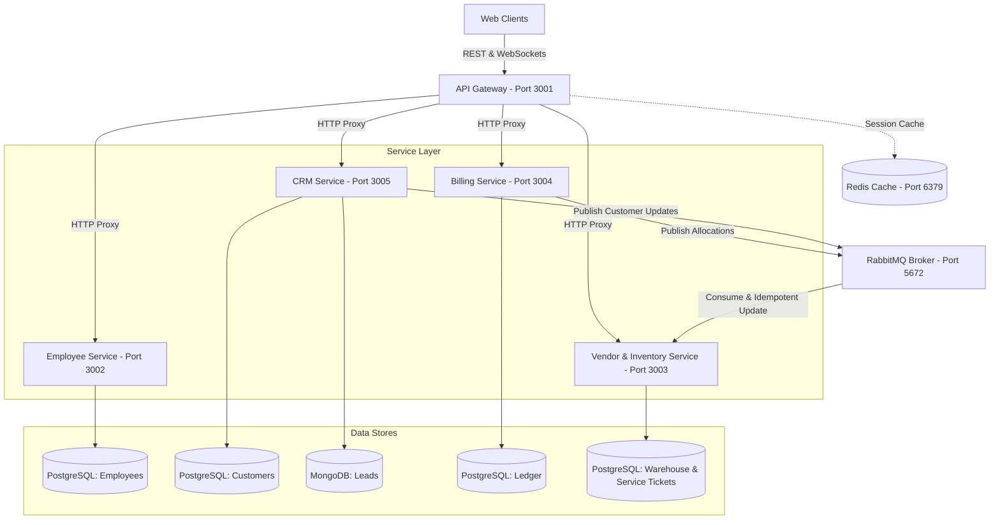
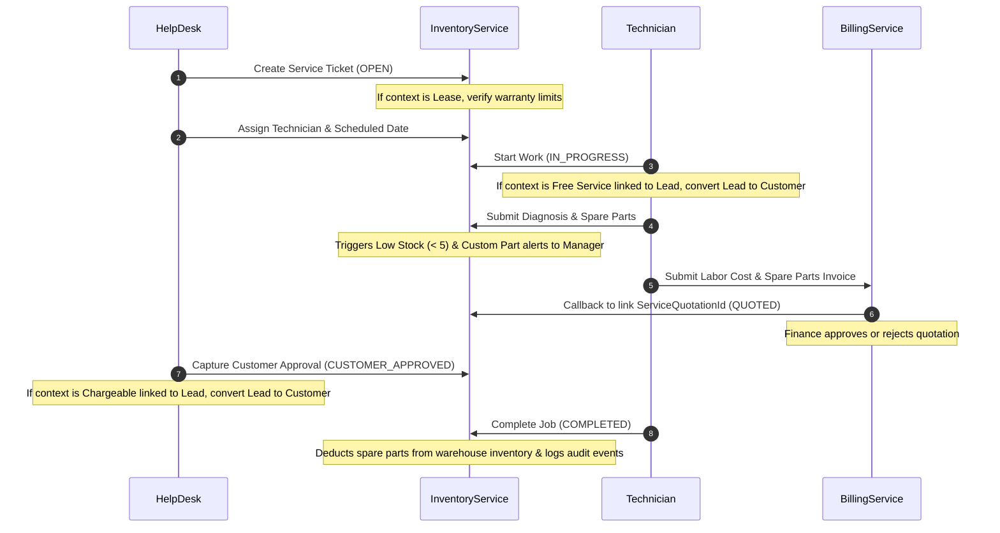
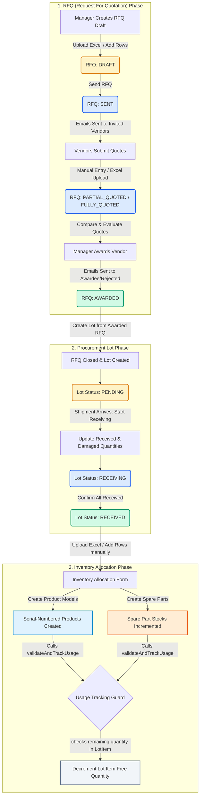
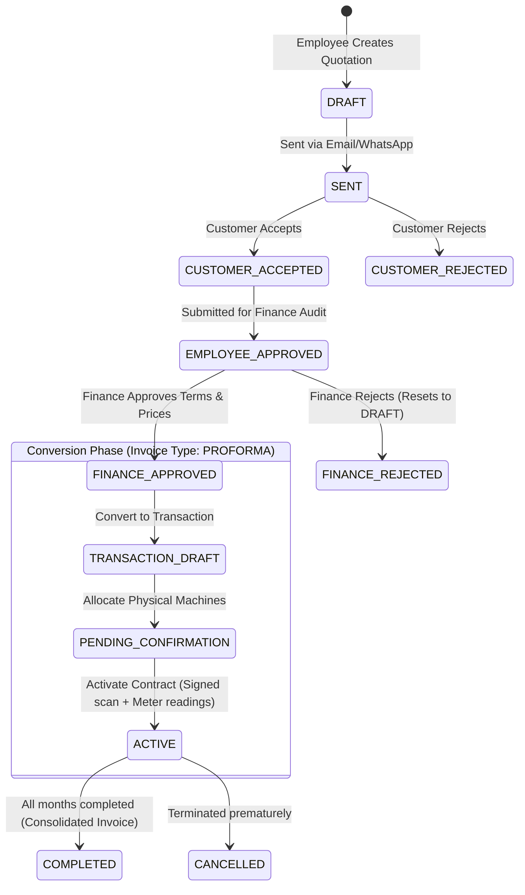
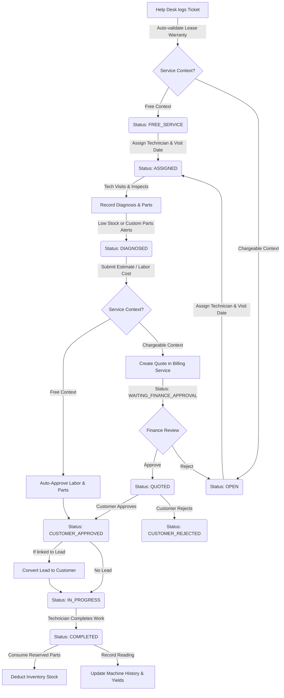

# Xerocare ERP — Complete Documentation

> Single-file merge of the project's maintained docs, for sharing as one file.
> Consolidated: 2026-07-08

**Contents:**

1. Project Overview & Quick Start
2. Frontend Client Guide
3. Backend Developer Guide (full technical reference — roles, all services/routes, DB schemas, events, cron jobs, env vars)
4. Procurement & Inventory Allocation Workflow
5. Quotation, Service Ticket & Contract Workflow

---

# PART 1 — PROJECT OVERVIEW & QUICK START

# Xerocare ERP

**Xerocare** is an enterprise-grade, microservices-based ERP and Asset Management System built with Node.js, TypeScript, Next.js, and PostgreSQL. It features robust role-based authentication, real-time event-driven workflows, and a cohesive financial ledger tracking system.

---

## 🌐 High-Level System Architecture

Xerocare's backend is implemented as a monorepo consisting of independent microservices proxied through a unified API Gateway, using **RabbitMQ** for event choreography and **Redis** for state caching.



---

## 🛠️ Microservices Monorepo Layout

- `backend/api_gateway/`: Handles client authentication, rate limiting, and proxies requests to sub-services.
- `backend/employee_service/`: Manages HR directories, payroll calculations, and token issuance.
- `backend/crm_service/`: Tracks client leads (MongoDB) and customer directories (PostgreSQL).
- `backend/billing_service/`: Manages service quotations, contract ledger entries, usage tracking, and invoice settlements.
- `backend/ven_inv_service/`: Manages warehouse spare parts, RFQ logs, machine serials, and the new **Service Management module**.
- `frontend/`: A responsive Next.js web application utilizing TailwindCSS/Vanilla CSS components.

---

## 🔧 Service Management Module

The newly implemented **Service Management module** manages the lifecycle of printer installations, preventive maintenance, breakdown repairs, and meter reading inspections.

### 👥 Role-Based Access Control (RBAC)

- **ADMIN / MANAGER**: Full administrative access over all service tickets, assignments, diagnostics, and approvals.
- **SERVICE_HELP_DESK**: Creates tickets, assigns tasks to technicians, schedules visit dates, and captures final client approvals.
- **SERVICE_TECHNICIAN**: Views assigned tickets, logs repair diagnoses, requests spare parts (both standard inventory and custom unregistered parts), creates quotations, starts jobs, and logs completion notes.

### 🔄 End-to-End Service Flow



### 📈 Customer Intelligence View

Available to help-desk workers and technicians directly within the ticket detail drawer:

- **Local Service Tickets**: Full history of past breakdowns, PMs, and repairs.
- **Contract & Invoice History**: Active leases, rentals, and payments grouped by contract types (`SALE`, `RENT`, `LEASE`, `SERVICE`) queried live from the `billing_service`.

---

## 🚀 Developer Onboarding & Quick Start

For detailed system mechanics, build settings, database schemas, complex business logics, and login flow references, please consult the master **[Developer Onboarding & Reference Guide](docs/DEVELOPER_GUIDE.md)**.

### ⏱️ Quick Start Commands

1. **Install workspace dependencies**:
   ```bash
   pnpm install
   ```
2. **Start Postgres, MongoDB, Redis & RabbitMQ**:
   ```bash
   docker-compose up -d postgres mongodb redis rabbitmq
   ```
3. **Run services in development mode**:
   ```bash
   pnpm dev
   ```
4. **Compile and build frontend/backend packages**:
   ```bash
   pnpm run build
   ```
5. **Run typechecks and lints**:
   ```bash
   pnpm run lint
   pnpm run typecheck
   ```

---

# PART 2 — FRONTEND CLIENT GUIDE

# Xerocare ERP - Frontend Client Application

This directory contains the Next.js frontend web application for the Xerocare ERP. It is structured using the App Router, styled with TailwindCSS and custom CSS components, and integrates with the API Gateway microservice.

---

## 📂 Directory Layout

```text
frontend/
├── app/                      # Next.js App Router Directories
│   ├── admin/                # Admin Panel (System management, server controls)
│   ├── adminlogin/           # Specialized Admin Login endpoint
│   ├── hr/                   # Human Resources Dashboard (Leaves, payroll logs)
│   ├── manager/              # Branch Manager Dashboard (RFQ approval, ticket cancel/assign)
│   ├── employee/             # Staff & Technician Portal (Service ticket actions, parts diagnosis)
│   ├── login/                # Standard Staff 2FA Login Page
│   ├── magic-login/          # Passwordless Magic Link verification entrypoint
│   ├── preview/              # Interactive quotation & settlement preview sheets
│   ├── globals.css           # Global CSS variables & layout tokens
│   ├── layout.tsx            # Main HTML layout scaffolding
│   └── page.tsx              # Public welcome & overview marketing page
├── components/               # Shareable React components & UI kits
│   └── ui/                   # Modular elements (buttons, badges, inputs)
├── hooks/                    # React custom hook helper scripts
├── lib/                      # Core utility scripts & API request clients
│   ├── api.ts                # Axios Client Instance (Logger, Auth interceptor)
│   ├── auth.ts               # Decoders, 2FA triggers, Magic Link verifiers
│   └── invoice.ts            # Invoice rendering helpers & details formatter
└── services/                 # API connection scripts mapped per backend module
```

---

## 🔒 Authentication & Role Protection Middleware

Frontend page security is enforced via a two-layer security framework:

### 1. Server-Side Route Guard (`middleware.ts`)

Next.js Edge Middleware runs on every page transition. It checks paths matching `/admin/:path*`, `/hr/:path*`, `/manager/:path*`, and `/employee/:path*`:

1. **Token Check**: Reads the `accessToken` cookie. If not present, redirects the user to `/login` (or `/adminlogin` for admin URLs).
2. **Role Validation**: Decodes the JWT access token payload:
   - If the user's role is not approved for that specific sub-folder (e.g., an `EMPLOYEE` attempting to access `/hr`), the middleware intercepts the navigation and redirects the user to their appropriate role home dashboard.

### 2. Client-Side Axios Interceptor (`lib/api.ts`)

The custom Axios client handles token injection and automated token refreshes without interrupting the user experience:

- **Authorization Header**: Automatically appends the JWT token to every HTTP request header:
  ```http
  Authorization: Bearer <accessToken>
  ```
- **401 Unauthorized Interception**: If the API Gateway responds with an HTTP status `401`:
  1. **Token Invalidation**: If the error code returned is `TOKEN_REVOKED` or `TOKEN_INVALID` (e.g., deleted session), the client immediately wipes `localStorage` and redirects the browser to the login page.
  2. **Automated Token Refresh**: If the token has simply expired, the interceptor pauses outgoing requests and triggers a background refresh query (`POST /e/auth/refresh`) using the HTTP-only refresh cookie.
     - **Success**: The new access token is saved in `localStorage`, and the client automatically retries all paused API requests.
     - **Failure**: If the refresh token has also expired or been revoked, the user's session is cleared and they are redirected to the login interface.

---

## 🛠️ Development & Build Commands

Ensure the root monorepo dependencies are installed and the backend databases are running before starting the frontend.

### Run Development Server

Launches Next.js in hot-reloading development mode on port `3000`:

```bash
pnpm dev
# or from root: pnpm --filter frontend dev
```

### Build for Production

Compiles files and optimizes styling sheets, writing output to `.next/`:

```bash
pnpm run build
# or from root: pnpm --filter frontend build
```

### Start Production Server

Launches the precompiled build:

```bash
pnpm run start
# or from root: pnpm --filter frontend start
```

---

# PART 3 — BACKEND DEVELOPER GUIDE

# Xerocare ERP — Backend Developer Guide

> **Written for:** A developer with zero prior exposure to this codebase.  
> **Coverage:** Every service, every API endpoint, every piece of business logic, the event bus, scheduled jobs, database schema, and environment variables.  
> **Last updated:** 2026-06-27

---

## Table of Contents

1. [System Overview](#1-system-overview)
2. [Technology Stack](#2-technology-stack)
3. [Roles & Permissions](#3-roles--permissions)
4. [Authentication & JWT](#4-authentication--jwt)
5. [Service: API Gateway (port 3001)](#5-service-api-gateway-port-3001)
6. [Service: Employee Service (port 3002)](#6-service-employee-service-port-3002)
7. [Service: Vendor & Inventory Service (port 3003)](#7-service-vendor--inventory-service-port-3003)
8. [Service: Billing Service (port 3004)](#8-service-billing-service-port-3004)
9. [Service: CRM Service (port 3005)](#9-service-crm-service-port-3005)
10. [Event Bus (RabbitMQ)](#10-event-bus-rabbitmq)
11. [Scheduled Jobs (Cron)](#11-scheduled-jobs-cron)
12. [Database Schemas](#12-database-schemas)
13. [Multi-Currency & Tax System](#13-multi-currency--tax-system)
14. [Service Module (Repair Tickets)](#14-service-module-repair-tickets)
15. [Environment Variables](#15-environment-variables)
16. [Inter-Service Communication Patterns](#16-inter-service-communication-patterns)

---

## 1. System Overview

Xerocare is a **printer leasing and service** ERP used across multiple Gulf countries (UAE/AED, Qatar/QAR). The backend is a **Node.js TypeScript microservices monorepo** managed with pnpm workspaces.

```
Browser / Mobile
       |
       v
+------------------+   port 3001
|   API Gateway    |<---- All external traffic enters here
+--------+---------+
         |  reverse-proxy (http-proxy-middleware)
    +----+------------------------------+
    |                                   |
    v                                   v
+----------+  +-----------------+  +----------+  +---------+
| Employee |  | Vendor &        |  | Billing  |  |   CRM   |
| Service  |  | Inventory Svc   |  | Service  |  | Service |
|  :3002   |  |    :3003        |  |  :3004   |  |  :3005  |
+----------+  +-----------------+  +----------+  +---------+
    |                |                   |             |
    +----------------+-------------------+-------------+
                     |
             RabbitMQ (domain_events topic exchange)
                     |
              Redis  &  PostgreSQL / MongoDB
```

**Path prefixes** at the gateway map to services:

| Prefix | Routes to        | Service                                      |
| ------ | ---------------- | -------------------------------------------- |
| `/e/`  | employee_service | Auth, Employees, Payroll, Leaves             |
| `/i/`  | ven_inv_service  | Products, Branches, Vendors, Service Tickets |
| `/b/`  | billing_service  | Invoices, Payments, Usage                    |
| `/c/`  | crm_service      | Customers, Leads                             |

The gateway **strips the prefix** (`^/e/` → `/`) before forwarding to the internal service.

---

## 2. Technology Stack

| Component       | Technology                                                             |
| --------------- | ---------------------------------------------------------------------- |
| Runtime         | Node.js (TypeScript)                                                   |
| Framework       | Express.js                                                             |
| ORM             | TypeORM (`synchronize: false` — schema managed via raw SQL on startup) |
| Primary DB      | PostgreSQL (separate DB per service)                                   |
| Document DB     | MongoDB (crm_service leads only)                                       |
| Cache           | Redis (rate limiting, customer name cache)                             |
| Message Bus     | RabbitMQ — `domain_events` topic exchange                              |
| File Storage    | Cloudflare R2 (employee ID proofs, product images, contract PDFs)      |
| PDF Generation  | Custom PDF generators in ven_inv_service                               |
| Scheduling      | `node-cron` + `setInterval`                                            |
| Package Manager | pnpm workspaces                                                        |
| Auth            | JWT — access token (short-lived) + refresh token (stored in DB)        |

---

## 3. Roles & Permissions

### Primary Roles (in `role` field of JWT)

| Role       | Description                                                       |
| ---------- | ----------------------------------------------------------------- |
| `ADMIN`    | Super-admin. Can do everything. One per system.                   |
| `HR`       | Human resources. Manages employees, leave applications.           |
| `MANAGER`  | Branch manager. Manages their own branch's operations.            |
| `FINANCE`  | Finance team. Approves/rejects quotations, handles billing.       |
| `EMPLOYEE` | Front-line sales or service staff. Role divided by `employeeJob`. |

### Employee Job Sub-Roles (in `employeeJob` field of JWT)

| Job              | Description                                     |
| ---------------- | ----------------------------------------------- |
| `SALES`          | Creates quotations for product sales            |
| `RENT_AND_LEASE` | Creates quotations for rental/lease contracts   |
| `TECHNICIAN`     | Handles service tickets, records meter readings |
| `CRM`            | Manages leads and customer data                 |
| `MANAGER`        | A job-level manager within the EMPLOYEE role    |

### Finance Job Sub-Roles (in `financeJob` field)

| Job                  | Description                       |
| -------------------- | --------------------------------- |
| `FINANCE_SALES`      | Finance for the sales department  |
| `FINANCE_RENT_LEASE` | Finance for rent/lease department |

### Service Module Roles (checked via `requireServiceRole` middleware at the gateway)

| Role                 | Description                                                       |
| -------------------- | ----------------------------------------------------------------- |
| `SERVICE_HELP_DESK`  | Creates tickets, assigns technicians, communicates with customers |
| `SERVICE_TECHNICIAN` | Diagnoses machines, records estimates, completes repair           |

> **Note:** `SERVICE_HELP_DESK` and `SERVICE_TECHNICIAN` are employee job sub-roles stored in `employeeJob`.

### MANAGER Role Inheritance

Every service's `requireRole`/`roleMiddleware` (`api_gateway`, `billing_service`, `crm_service`, `employee_service`, `ven_inv_service`) treats `MANAGER` as implicitly satisfying any route that allows `HR`, `FINANCE`, or `EMPLOYEE` — a manager is assumed to have branch-scoped authority over all of those roles' actions. This is a blanket rule applied in the middleware itself, **not** per-route: a route documented as `ADMIN, FINANCE` also silently admits `MANAGER` unless stated otherwise.

```ts
const MANAGER_INHERITED_ROLES = ['MANAGER', 'HR', 'FINANCE', 'EMPLOYEE'];
// requireRole(...allowedRoles) passes for MANAGER if allowedRoles ∩ MANAGER_INHERITED_ROLES is non-empty
```

Routes that must stay closed to managers (true global/cross-branch admin actions, e.g. `GET /invoices/sales/global-overview`) use `requireStrictRole` instead (currently only implemented in `api_gateway/src/middleware/roleMiddleware.ts`) — plain role-list check, no inheritance.

**How to apply when reading route tables below:** an "Auth Roles" column listing `HR`, `FINANCE`, and/or `EMPLOYEE` (in any combination, any service) implicitly also allows `MANAGER`, even where not written explicitly. `ADMIN`-only routes and anything behind `requireStrictRole` remain closed to managers.

---

## 4. Authentication & JWT

### Token Structure

All JWTs contain:

```json
{
  "userId": "uuid",
  "role": "ADMIN | HR | MANAGER | FINANCE | EMPLOYEE",
  "branchId": "uuid | null",
  "employeeJob": "SALES | TECHNICIAN | ...",
  "iat": 1234567890,
  "exp": 1234567890
}
```

### Two-Token System

- **Access Token**: Short-lived (minutes). Sent in `Authorization: Bearer <token>` header on every request.
- **Refresh Token**: Long-lived (days). Stored in a `refresh_tokens` DB table. Sent in a cookie. Used to get a new access token via `POST /e/auth/refresh`.

### Auth Flow

1. `POST /e/auth/login` — validates email + password, returns access token + sets refresh cookie
2. Every subsequent request passes the access token in the `Authorization` header
3. The `authMiddleware` in each service (and the gateway) verifies the access token signature and attaches `req.user`
4. When the access token expires (error code `TOKEN_EXPIRED`), the frontend calls `POST /e/auth/refresh` with the cookie → gets a new access token

### Magic Link Flow

1. `POST /e/auth/magic-link` — sends a one-click login link to the employee's email
2. `POST /e/auth/magic-link/verify` — verifies the token from the link, issues tokens

### OTP Flow

- `POST /e/auth/login` may trigger an OTP (if 2FA is enabled on the account)
- `POST /e/auth/login/verify` — submits the OTP to complete login

### Rate Limiting on Auth Endpoints

| Endpoint                       | Limiter            | Window | Max Attempts |
| ------------------------------ | ------------------ | ------ | ------------ |
| `POST /e/auth/login`           | `loginLimiter`     | 15 min | 10           |
| `POST /e/auth/login/verify`    | `otpVerifyLimiter` | 10 min | 10           |
| `POST /e/auth/forgot-password` | `otpSendLimiter`   | 10 min | 5            |
| `POST /e/auth/magic-link`      | `otpSendLimiter`   | 10 min | 5            |

Rate limit state is stored in Redis (`rl:login:*`, `rl:otp-send:*`, `rl:otp-verify:*`).

---

## 5. Service: API Gateway (port 3001)

**File:** `backend/api_gateway/src/app.ts`

The gateway is the **only public-facing entry point**. Its job is:

1. **Authentication** — verify JWT before forwarding most requests
2. **Rate limiting** — protect auth endpoints
3. **Reverse proxying** — forward requests to internal services
4. **Invoice aggregation** — certain billing routes are handled directly here to join data from multiple services

### CORS Policy

Allowed origins:

- `process.env.CLIENT_URL`
- Any `http://localhost:*` or `http://127.0.0.1:*`
- `https://xerocare.apps.mastrovia.com`

### Proxy Rules

```
GET/POST/etc /e/* → employee_service  (EMPLOYEE_SERVICE_URL)
GET/POST/etc /i/* → ven_inv_service   (VENDOR_INVENTORY_SERVICE_URL)
GET/POST/etc /b/* → billing_service   (BILLING_SERVICE_URL)
GET/POST/etc /c/* → crm_service       (CRM_SERVICE_URL)
```

Path rewrite strips the prefix: `/e/auth/login` → `/auth/login` on the employee service.

### Service-Level Middleware in Gateway

Some routes in `/i/service/*` have **additional role checks** applied at the gateway before forwarding:

| Route                                          | Gateway Middleware                                                |
| ---------------------------------------------- | ----------------------------------------------------------------- |
| `POST /i/service/tickets`                      | `requireServiceRole(['SERVICE_HELP_DESK'])`                       |
| `GET /i/service/tickets`                       | `requireServiceRole(['SERVICE_HELP_DESK', 'SERVICE_TECHNICIAN'])` |
| `POST /i/service/tickets/:id/diagnose`         | `requireServiceRole(['SERVICE_TECHNICIAN'])`                      |
| `POST /i/service/tickets/:id/quote`            | `requireServiceRole(['SERVICE_TECHNICIAN'])`                      |
| `POST /i/service/tickets/:id/customer-approve` | `requireServiceRole(['SERVICE_HELP_DESK'])`                       |
| `POST /i/service/tickets/:id/start`            | `requireServiceRole(['SERVICE_TECHNICIAN'])`                      |
| `POST /i/service/tickets/:id/complete`         | `requireServiceRole(['SERVICE_TECHNICIAN'])`                      |
| `POST /i/service/tickets/:id/cancel`           | ADMIN or MANAGER only                                             |
| `GET /i/inventory/scan`                        | `requireRole(ADMIN, FINANCE, MANAGER, EMPLOYEE)`                  |
| `GET /i/inventory/products/barcode-pdf`        | `requireRole(ADMIN, MANAGER)`                                     |
| `POST /b/service-quotation`                    | `requireServiceRole(['SERVICE_TECHNICIAN'])`                      |

### Invoice Aggregation (Handled Directly in Gateway)

The following billing routes are **NOT proxied**. They are handled directly in the gateway, which calls multiple downstream services to build enriched responses.

**File:** `backend/api_gateway/src/services/invoiceAggregationService.ts`

The aggregation service:

- Fetches invoice data from billing_service
- Enriches each invoice with: `employeeName` (from employee_service), `branchName` (from ven_inv_service), `customerName/phone/email/address` (from crm_service)
- Uses two-layer cache: in-memory Map (10 min TTL) + Redis (1 hour TTL for customer data)

**Gateway Invoice API Endpoints:**

| Method   | Path                                                     | Auth Roles                                               | Description                                                 |
| -------- | -------------------------------------------------------- | -------------------------------------------------------- | ----------------------------------------------------------- |
| `POST`   | `/b/invoices/`                                           | EMPLOYEE (SALES/RENT_AND_LEASE), MANAGER, ADMIN, FINANCE | Create a quotation                                          |
| `POST`   | `/b/invoices/quotation`                                  | EMPLOYEE (SALES/RENT_AND_LEASE), MANAGER, ADMIN, FINANCE | Create a quotation (alias)                                  |
| `POST`   | `/b/invoices/direct-sale`                                | EMPLOYEE (SALES/RENT_AND_LEASE), MANAGER, ADMIN, FINANCE | Create a direct final sale                                  |
| `PUT`    | `/b/invoices/:id`                                        | EMPLOYEE                                                 | Edit a draft quotation                                      |
| `PUT`    | `/b/invoices/:id/status`                                 | ADMIN, FINANCE, MANAGER, EMPLOYEE                        | Generic status change                                       |
| `POST`   | `/b/invoices/:id/employee-approve`                       | EMPLOYEE, MANAGER                                        | Submit quotation for Finance review                         |
| `POST`   | `/b/invoices/:id/finance-approve-quotation`              | ADMIN, FINANCE                                           | Finance approves quotation pricing                          |
| `POST`   | `/b/invoices/:id/convert-to-transaction`                 | EMPLOYEE, MANAGER                                        | Convert approved quotation to Proforma                      |
| `POST`   | `/b/invoices/:id/allocate-machines`                      | ADMIN, FINANCE, MANAGER, EMPLOYEE                        | Finance assigns inventory to contract                       |
| `POST`   | `/b/invoices/:id/activate-contract`                      | any authenticated                                        | Activate contract after machine allocation                  |
| `POST`   | `/b/invoices/:id/upload-confirmation`                    | any authenticated                                        | Upload signed contract document                             |
| `POST`   | `/b/invoices/:id/finance-reject`                         | ADMIN, FINANCE                                           | Finance rejects a quotation or transaction                  |
| `POST`   | `/b/invoices/allocations/replace`                        | ADMIN, FINANCE                                           | Swap a machine in an active contract                        |
| `POST`   | `/b/invoices/settlements/generate`                       | ADMIN, FINANCE                                           | Generate final settlement invoice                           |
| `POST`   | `/b/invoices/settlements/next-month`                     | ADMIN, FINANCE                                           | Create next month's rental billing invoice                  |
| `POST`   | `/b/invoices/:id/returns`                                | ADMIN, FINANCE, MANAGER, EMPLOYEE                        | Process a return / issue credit                             |
| `POST`   | `/b/invoices/quotation/template`                         | MANAGER, ADMIN                                           | Create a reusable quotation template                        |
| `GET`    | `/b/invoices/quotation/template`                         | MANAGER, ADMIN                                           | List all quotation templates                                |
| `GET`    | `/b/invoices/quotation/template/:id/assignments`         | MANAGER, ADMIN                                           | List who is assigned to a template                          |
| `POST`   | `/b/invoices/quotation/template/:id/assign`              | MANAGER, ADMIN                                           | Assign template to one or more employees                    |
| `POST`   | `/b/invoices/quotation/template/:id/retake-all`          | MANAGER, ADMIN                                           | Revoke all template assignments                             |
| `POST`   | `/b/invoices/quotation/:id/retake`                       | MANAGER, ADMIN                                           | Revoke single assignment                                    |
| `POST`   | `/b/invoices/quotation/:id/assign-customer`              | EMPLOYEE (SALES/RENT_AND_LEASE)                          | Link a customer to an assigned quotation                    |
| `GET`    | `/b/invoices/quotation/assigned`                         | EMPLOYEE                                                 | Get quotations currently assigned to me                     |
| `GET`    | `/b/invoices/stats`                                      | ADMIN, FINANCE, MANAGER, EMPLOYEE                        | Dashboard counts and revenue totals                         |
| `GET`    | `/b/invoices/my-invoices`                                | ADMIN, FINANCE, MANAGER, EMPLOYEE                        | Invoices created by the logged-in user                      |
| `GET`    | `/b/invoices/`                                           | ADMIN, FINANCE, MANAGER, EMPLOYEE                        | All invoices (ADMIN/FINANCE see all; others see own branch) |
| `GET`    | `/b/invoices/branch-invoices`                            | ADMIN, MANAGER, FINANCE, EMPLOYEE                        | Invoices for the caller's branch                            |
| `GET`    | `/b/invoices/pending-counts`                             | ADMIN, FINANCE, MANAGER                                  | Badge counts for items needing action                       |
| `GET`    | `/b/invoices/alerts`                                     | ADMIN, FINANCE                                           | Collection alerts for overdue bills                         |
| `GET`    | `/b/invoices/history`                                    | ADMIN, FINANCE, EMPLOYEE                                 | Historical invoice list                                     |
| `GET`    | `/b/invoices/completed-collections`                      | ADMIN, FINANCE                                           | Fully paid and settled collections                          |
| `GET`    | `/b/invoices/completed-collections/:contractId/download` | ADMIN, FINANCE                                           | Download PDF of a completed collection                      |
| `POST`   | `/b/invoices/completed-collections/:contractId/send`     | ADMIN, FINANCE                                           | Email completed collection PDF to customer                  |
| `GET`    | `/b/invoices/finance/report`                             | ADMIN, MANAGER, FINANCE                                  | Full financial report with date and type filters            |
| `GET`    | `/b/invoices/sales/global-overview`                      | ADMIN, FINANCE                                           | Company-wide sales chart data                               |
| `GET`    | `/b/invoices/sales/global-totals`                        | ADMIN, FINANCE                                           | Company-wide revenue totals                                 |
| `GET`    | `/b/invoices/sales/admin-stats`                          | ADMIN                                                    | Admin-only detailed sales analytics                         |
| `GET`    | `/b/invoices/sales/branch-finance-stats`                 | ADMIN, MANAGER, FINANCE                                  | Branch-level revenue breakdown                              |
| `POST`   | `/b/invoices/:id/notify/email`                           | any authenticated                                        | Send email notification about an invoice                    |
| `POST`   | `/b/invoices/:id/notify/whatsapp`                        | any authenticated                                        | Send WhatsApp notification                                  |
| `GET`    | `/b/invoices/:id`                                        | ADMIN, FINANCE, MANAGER, EMPLOYEE                        | Get one invoice (enriched with names)                       |
| `DELETE` | `/b/invoices/:id`                                        | MANAGER, ADMIN                                           | Delete an invoice or template                               |
| `GET`    | `/b/audit-logs/:entityId`                                | MANAGER, FINANCE, ADMIN                                  | Get the audit trail for a contract                          |

---

## 6. Service: Employee Service (port 3002)

**File:** `backend/employee_service/src/app.ts`  
**Database:** `EMPLOYEE_DATABASE_URL` (PostgreSQL)  
**Events consumed:** `branch.*` (to mirror branch data locally)  
**Events published:** `employee.created`, `employee.updated`, `employee.deleted`

This service owns all **HR functionality**: user accounts, authentication, leave management, and payroll.

### 6.1 Auth Routes — `/auth`

**File:** `backend/employee_service/src/routes/authRouter.ts`

| Method | Path                           | Auth                    | Description                                                        |
| ------ | ------------------------------ | ----------------------- | ------------------------------------------------------------------ |
| `POST` | `/auth/login`                  | public                  | Email + password login. Returns access token. Sets refresh cookie. |
| `POST` | `/auth/login/verify`           | public                  | Submit OTP if 2FA is active.                                       |
| `POST` | `/auth/refresh`                | public (refresh cookie) | Exchange refresh token cookie for a new access token.              |
| `POST` | `/auth/logout`                 | public                  | Delete the refresh token; clear the cookie.                        |
| `GET`  | `/auth/me`                     | any authenticated       | Returns the logged-in user's full profile.                         |
| `POST` | `/auth/change-password`        | any authenticated       | Change password (requires current password).                       |
| `POST` | `/auth/forgot-password`        | public                  | Send OTP to email for password reset initiation.                   |
| `POST` | `/auth/forgot-password/verify` | public                  | Submit OTP + new password to complete reset.                       |
| `POST` | `/auth/magic-link`             | public                  | Send a one-click magic link to employee's email.                   |
| `POST` | `/auth/magic-link/verify`      | public                  | Verify magic link token and issue tokens.                          |
| `POST` | `/auth/logout-other-devices`   | any authenticated       | Revoke all sessions except the current one.                        |
| `GET`  | `/auth/sessions`               | any authenticated       | List all active login sessions with IP and user-agent.             |
| `POST` | `/auth/sessions/logout`        | any authenticated       | Log out one specific session by session ID.                        |

**Auth Service Business Logic** (`backend/employee_service/src/services/authService.ts`):

- `login()`: Finds user by email (lowercased + trimmed), compares bcrypt hash. Returns user object; the controller generates the JWT.
- `refresh()`: Verifies refresh token signature, finds it in DB, deletes the old token (rotation), returns user object for new token issuance.
- `logout()`: Deletes the refresh token from the DB.
- `changePassword()`: Validates current password via bcrypt compare, hashes new password, saves.
- `resetPassword()`: Admin-initiated; no current password required.
- `logoutOtherDevices()`: Deletes all refresh tokens for the user EXCEPT the one provided as `currentRefreshToken`.
- `getSessions()`: Returns all active refresh token entries, marks the current session with `isCurrent: true`.
- `logoutSession()`: Deletes one specific session entry by session/token ID.

### 6.2 Admin Routes — `/admin`

| Method | Path            | Auth   | Description                                           |
| ------ | --------------- | ------ | ----------------------------------------------------- |
| `POST` | `/admin/login`  | public | Login as system admin (uses separate `admins` table). |
| `POST` | `/admin/logout` | public | Logout admin session.                                 |

### 6.3 Employee Routes — `/employee`

**File:** `backend/employee_service/src/routes/employeeRouter.ts`

| Method   | Path                                 | Auth Roles                            | Description                                                                                                   |
| -------- | ------------------------------------ | ------------------------------------- | ------------------------------------------------------------------------------------------------------------- |
| `POST`   | `/employee/create`                   | ADMIN, HR                             | Create a new employee. Accepts multipart/form-data with optional `profile_image` and `id_proof` file uploads. |
| `GET`    | `/employee/stats`                    | ADMIN, HR, MANAGER                    | HR dashboard statistics (counts by role, job, status, monthly growth).                                        |
| `GET`    | `/employee/branches`                 | ADMIN, HR, MANAGER                    | List all branches (mirrored from ven_inv_service).                                                            |
| `GET`    | `/employee/`                         | ADMIN, HR, MANAGER, EMPLOYEE, FINANCE | Paginated employee list with search, filter, and sort.                                                        |
| `GET`    | `/employee/:id`                      | ADMIN, HR, MANAGER                    | Get full details for one employee.                                                                            |
| `PUT`    | `/employee/:id`                      | ADMIN, HR, MANAGER                    | Update employee profile. Accepts file uploads.                                                                |
| `DELETE` | `/employee/:id`                      | ADMIN, HR                             | Soft-delete employee (sets status to INACTIVE).                                                               |
| `GET`    | `/employee/:id/id-proof`             | ADMIN, HR                             | Get a 5-minute pre-signed R2 URL to view the employee's ID proof document.                                    |
| `POST`   | `/employee/:id/resend-welcome-email` | ADMIN, HR                             | Generate new temp password and resend welcome email.                                                          |
| `GET`    | `/employee/public/:id`               | any authenticated                     | Public profile: name, email, role, branchId only. Used by billing_service.                                    |

**Employee Service Business Logic** (`backend/employee_service/src/services/employeeService.ts`):

- `addEmployee()`:
  1. Checks email uniqueness across both the `employees` and `admins` tables.
  2. Validates role constraints (cannot create another ADMIN; HR/MANAGER must supply `branchId`).
  3. Auto-generates a unique `display_id`: prefix character + zero-padded sequence number.
     - ADMIN → `A01`, HR → `H01`, MANAGER → `M01`, FINANCE → `F01`, EMPLOYEE → `E01`
     - The next number is determined by `COUNT(*) + 1` for that role.
  4. Generates a random plaintext password.
  5. Hashes it with bcrypt (10 salt rounds).
  6. Saves employee record to DB.
  7. Publishes `employee.created` event to RabbitMQ (includes `branchId` so ven_inv_service syncs manager assignment).
  8. Queues a welcome email via email worker (the plaintext password is included in the email).

- `updateEmployee()`:
  1. Validates the employee exists and is not DELETED.
  2. Validates role and job type constraints.
  3. Enforces `branchId` requirement for MANAGER and HR roles.
  4. Saves updates.
  5. Publishes `employee.updated` event (with updated `branchId`).

- `deleteEmployee()`:
  1. Sets `status = INACTIVE` (soft delete; record is preserved).
  2. Publishes `employee.deleted` event (causes ven_inv_service to clear any manager-branch assignment).

- `getAllEmployees()`:
  - Supports `page`, `limit`, `role`, `branchId`, `search`, `job`, `sortBy`, `sortOrder` query params.
  - Server-side full-text search across `first_name`, `last_name`, `email`.
  - Sort options: `name` (first + last), `branch` (branch name via JOIN), `salary`, `joined` (created_at). NULLS LAST for numeric/relation columns.
  - ADMIN can filter by any `branchId`; non-ADMIN callers are locked to their own `branchId` from the JWT.

- `getHRStats()`:
  - Aggregates counts by status, by role, by job category.
  - Monthly growth chart: counts new hires per month for the given year.
  - Collapses job/role combos into dashboard-friendly labels: `BRANCH_MANAGER`, `HR`, `SALES_STAFF`, `RENT_LEASE_STAFF`, `FINANCE_STAFF`, `SERVICE_STAFF`, etc.

- `getEmployeeIdProof()`:
  - Uses Cloudflare R2 to generate a pre-signed URL (5-minute expiry) for the stored ID proof file.

- `resendWelcomeEmail()`:
  - Generates a new random password, updates the bcrypt hash in DB, queues the welcome email.

### 6.4 Leave Application Routes — `/leave-applications`

| Method   | Path                              | Auth                                            | Description                                           |
| -------- | --------------------------------- | ----------------------------------------------- | ----------------------------------------------------- |
| `POST`   | `/leave-applications/`            | any authenticated                               | Submit a new leave request.                           |
| `GET`    | `/leave-applications/my`          | any authenticated                               | List own leave applications.                          |
| `DELETE` | `/leave-applications/:id`         | any authenticated                               | Cancel own pending leave (only if status is PENDING). |
| `GET`    | `/leave-applications/stats`       | ADMIN, HR                                       | Aggregate leave counts by type and status.            |
| `GET`    | `/leave-applications/`            | ADMIN, HR                                       | List all leave applications for the branch.           |
| `GET`    | `/leave-applications/:id`         | authenticated (ownership checked in controller) | Get one application.                                  |
| `PUT`    | `/leave-applications/:id/approve` | ADMIN, HR                                       | Approve a pending leave request.                      |
| `PUT`    | `/leave-applications/:id/reject`  | ADMIN, HR                                       | Reject a pending leave request.                       |

**Leave Types:** `ANNUAL`, `SICK`, `EMERGENCY`, `UNPAID`, `MATERNITY`, `PATERNITY`  
**Leave Statuses:** `PENDING`, `APPROVED`, `REJECTED`, `CANCELLED`

> `ADMIN, HR` rows above implicitly also allow `MANAGER` (see [MANAGER Role Inheritance](#manager-role-inheritance)). `GET /leave-applications/:id` additionally lets a manager view (not just the owner/HR/admin) any application from an employee in their own branch.

### 6.5 Payroll Routes — `/payroll`

| Method | Path                           | Auth              | Description                                         |
| ------ | ------------------------------ | ----------------- | --------------------------------------------------- |
| `GET`  | `/payroll/summary`             | any authenticated | Payroll summary for current user or managed branch. |
| `GET`  | `/payroll/stats`               | any authenticated | Payroll statistics (totals, averages).              |
| `GET`  | `/payroll/history/:employeeId` | any authenticated | Payroll history for one employee.                   |
| `POST` | `/payroll/`                    | any authenticated | Create a payroll record.                            |
| `PUT`  | `/payroll/:id`                 | any authenticated | Update a payroll record.                            |

**Payroll Statuses:** `PENDING`, `PROCESSED`, `PAID`

### 6.6 Notification Routes — `/notifications`

In-app notifications are created by other services via RabbitMQ and stored in the employee DB. These endpoints let employees fetch and mark their notifications.

- `GET /notifications/` — list my notifications (paginated)
- `PUT /notifications/:id/read` — mark one as read
- `PUT /notifications/read-all` — mark all as read

### 6.7 Branch Consumer

**File:** `backend/employee_service/src/events/consumers/branchConsumer.ts`

Listens to `branch.*` events on the `domain_events` exchange and mirrors branch data into a local `branches_mirror` table. This allows the employee service to display branch names without calling ven_inv_service.

### 6.8 Email Worker

**File:** `backend/employee_service/src/workers/emailWorker.ts`

A RabbitMQ consumer that processes queued email jobs. The queue receives messages published by billing_service (contract alerts, reminders) and employee_service itself (welcome emails, password resets). Uses `nodemailer` with SMTP configuration.

---

## 7. Service: Vendor & Inventory Service (port 3003)

**File:** `backend/ven_inv_service/src/app.ts`  
**Database:** `VENDOR_DATABASE_URL` (PostgreSQL)  
**Events consumed:** `employee.*` (to sync manager-to-branch assignments)  
**Events published:** `branch.*` (when branches are created or updated)

This is the **largest service**. It manages the physical side of the business: product catalog, branches, vendors, purchase orders, inventory, spare parts, and the full repair ticket lifecycle.

### Schema Management

All DDL runs in `connectWithRetry()` at startup via raw SQL (`CREATE TABLE IF NOT EXISTS`, `ALTER TABLE ... ADD COLUMN IF NOT EXISTS`). TypeORM entities mirror these columns but `synchronize: false` ensures TypeORM never auto-alters the DB.

### 7.1 Branch Routes — `/branch`

**File:** `backend/ven_inv_service/src/routes/branchRoutes.ts`

| Method   | Path                | Auth Roles         | Description                                                  |
| -------- | ------------------- | ------------------ | ------------------------------------------------------------ |
| `POST`   | `/branch/`          | ADMIN              | Create new branch (with currency/tax/address configuration). |
| `GET`    | `/branch/`          | ADMIN, HR, MANAGER | List all branches.                                           |
| `GET`    | `/branch/my-branch` | MANAGER            | Get the branch the logged-in manager manages.                |
| `GET`    | `/branch/:id`       | any authenticated  | Get one branch by ID.                                        |
| `PUT`    | `/branch/:id`       | ADMIN              | Update branch details (currency, tax, address, etc.).        |
| `DELETE` | `/branch/:id`       | ADMIN              | Delete a branch.                                             |

**Branch Entity Fields** (`backend/ven_inv_service/src/entities/branchEntity.ts`):

```
id             UUID PRIMARY KEY
name           VARCHAR
address        VARCHAR
location       VARCHAR
manager_id     UUID nullable, FK → employee_managers.employee_id
started_date   DATE
status         ENUM (ACTIVE | INACTIVE | DELETED)

-- Multi-currency (added via startup SQL):
country_code   VARCHAR(2)  -- ISO 3166-1 alpha-2 (e.g. "AE", "QA")
currency_code  VARCHAR(3)  -- ISO 4217 (e.g. "AED", "QAR")
currency_symbol VARCHAR(10) -- e.g. "د.إ"
currency_name  VARCHAR(100) -- e.g. "UAE Dirham"

-- Tax:
has_tax        BOOLEAN DEFAULT FALSE
tax_name       VARCHAR(50) nullable  -- e.g. "VAT"
tax_percent    DECIMAL(5,2) nullable -- e.g. 5.00
tax_registration_number VARCHAR(50) nullable  -- TRN for UAE

-- Address detail:
city           VARCHAR(100) nullable
state          VARCHAR(100) nullable
postal_code    VARCHAR(20) nullable

created_at     TIMESTAMP
updated_at     TIMESTAMP
```

**Branch Service Logic:**

- On create: saves all fields, publishes `branch.created` event via RabbitMQ so employee_service mirrors the branch locally.
- On update: saves changes, publishes `branch.updated` event.
- Manager assignment is **driven by employee events**, not set directly via the branch API.

**Manager Sync** (`backend/ven_inv_service/src/events/consumers/employeeConsumer.ts`):

When an `employee.*` RabbitMQ event arrives:

1. `employee.deleted` event → clears `branches.manager_id` for this employee ID; deletes from `employee_managers` table.
2. If employee `role !== 'MANAGER'` OR `status === 'INACTIVE'` → same cleanup as deleted.
3. If employee `role === 'MANAGER'` AND `status === 'ACTIVE'`:
   - Upserts into `employee_managers` table (keyed by `employee_id`).
   - Clears this manager from any previously assigned branch first (handles re-assignments).
   - If event has `branchId`: sets `branches.manager_id = employeeId` for that branch.
   - If no `branchId` in event: manager record exists but no branch is assigned.

### 7.2 Vendor Routes — `/vendors`

| Method   | Path                            | Auth Roles         | Description                                                   |
| -------- | ------------------------------- | ------------------ | ------------------------------------------------------------- |
| `POST`   | `/vendors/`                     | ADMIN, MANAGER     | Add a new supplier/vendor.                                    |
| `GET`    | `/vendors/`                     | ADMIN, HR, MANAGER | List all vendors.                                             |
| `GET`    | `/vendors/stats`                | ADMIN, MANAGER     | Vendor aggregate statistics.                                  |
| `GET`    | `/vendors/:id`                  | ADMIN, HR, MANAGER | Get one vendor's full details.                                |
| `PATCH`  | `/vendors/:id`                  | ADMIN, MANAGER     | Update vendor information.                                    |
| `DELETE` | `/vendors/:id`                  | ADMIN, MANAGER     | Remove a vendor.                                              |
| `POST`   | `/vendors/:id/request-products` | ADMIN, MANAGER     | Create a product request to a vendor (initiates procurement). |
| `GET`    | `/vendors/:id/requests`         | ADMIN, MANAGER     | List all product requests to a vendor.                        |

**Vendors are branch-scoped:** each vendor has a `branch_id` (nullable = legacy/global vendor, admin-only until assigned). Name/email uniqueness is enforced **per branch**, not globally, so two branches may register the same real-world vendor as separate rows.

- `createVendor`: a `MANAGER` always creates the vendor in their own branch (`req.user.branchId`); an `ADMIN` may pass `branchId` in the body or omit it to create a global vendor.
- `updateVendor`: only `ADMIN` may change `branchId` (moves a vendor to another branch) — the field is stripped from the request body for any other role.
- Purchasing (`purchaseService`) is restricted to the vendor's own branch: a manager attempting to buy from another branch's vendor gets `403 This vendor belongs to another branch`. Admins (no `branchId` passed) skip this guard.
- `findActive`/`findByIdActive` join the `branch` relation so vendor lists/detail views can show which branch owns the vendor.

### 7.3 Product Routes — `/products`

| Method   | Path                     | Auth Roles                        | Description                                     |
| -------- | ------------------------ | --------------------------------- | ----------------------------------------------- |
| `POST`   | `/products/`             | ADMIN, MANAGER                    | Add a product with optional image upload to R2. |
| `GET`    | `/products/`             | ADMIN, MANAGER, EMPLOYEE, FINANCE | List all products.                              |
| `GET`    | `/products/:id`          | ADMIN, MANAGER, EMPLOYEE, FINANCE | Get one product.                                |
| `PUT`    | `/products/:id`          | ADMIN, MANAGER                    | Update a product with optional image upload.    |
| `DELETE` | `/products/:id`          | ADMIN, MANAGER                    | Remove a product.                               |
| `POST`   | `/products/bulk`         | ADMIN, MANAGER                    | Bulk-create products from a JSON array.         |
| `POST`   | `/products/upload-image` | ADMIN, MANAGER                    | Upload a product image to R2; returns the URL.  |

**Key Product Fields:**

- `serial_no` — unique machine serial number
- `barcode_id` — auto-set to `XC-P-{serial_no}` on startup migration
- `ownership` — `RENT | LEASE | SALE | EXTERNAL`
- `product_status` — `AVAILABLE | RENTED | SOLD | LEASED | RETURNED | EXTERNAL`
- `warranty`, `warranty_start_date`, `warranty_end_date`, `warranty_max_pages`
- `meter_reading` — cumulative page count at latest known reading
- `customer_id` — UUID of currently assigned customer (null = available)
- `consumables` — JSONB: list of installed consumables (toner, drum) with installed date and meter reading
- `max_discount_amount` — maximum discount allowed on any quotation for this specific machine

### 7.4 Model Routes — `/models`

Models represent printer model definitions (e.g., "Xerox WorkCentre 7845"). Products are physical instances of models.

| Method   | Path          | Auth Roles                        | Description      |
| -------- | ------------- | --------------------------------- | ---------------- |
| `POST`   | `/models/`    | ADMIN, MANAGER                    | Create a model.  |
| `GET`    | `/models/`    | ADMIN, MANAGER, EMPLOYEE, FINANCE | List all models. |
| `GET`    | `/models/:id` | ADMIN, MANAGER, EMPLOYEE, FINANCE | Get one model.   |
| `PUT`    | `/models/:id` | ADMIN, MANAGER                    | Update model.    |
| `DELETE` | `/models/:id` | ADMIN, MANAGER                    | Delete model.    |

**Model Fields:**

- `model_name`, `brand_id`, `description`
- `print_colour` — `BLACK_WHITE | COLOUR`
- `maxDiscountableAmount` — max discount allowed on any quotation for this model type

### 7.5 Brand Routes — `/brands`

| Method   | Path          | Auth Roles                        | Description                     |
| -------- | ------------- | --------------------------------- | ------------------------------- |
| `POST`   | `/brands/`    | ADMIN, MANAGER                    | Create a brand (e.g., "Xerox"). |
| `GET`    | `/brands/`    | ADMIN, MANAGER, EMPLOYEE, FINANCE | List brands.                    |
| `GET`    | `/brands/:id` | ADMIN, MANAGER                    | Get one brand.                  |
| `PUT`    | `/brands/:id` | ADMIN, MANAGER                    | Update brand.                   |
| `DELETE` | `/brands/:id` | ADMIN, MANAGER                    | Delete brand.                   |

### 7.6 Warehouse Routes — `/warehouses`

| Method   | Path              | Auth Roles        | Description                  |
| -------- | ----------------- | ----------------- | ---------------------------- |
| `POST`   | `/warehouses/`    | ADMIN, MANAGER    | Create a warehouse location. |
| `GET`    | `/warehouses/`    | any authenticated | List warehouses.             |
| `GET`    | `/warehouses/:id` | any authenticated | Get one warehouse.           |
| `PUT`    | `/warehouses/:id` | ADMIN, MANAGER    | Update warehouse.            |
| `DELETE` | `/warehouses/:id` | ADMIN, MANAGER    | Delete warehouse.            |

### 7.7 Inventory Routes — `/inventory`

| Method | Path                                 | Auth Roles                        | Description                                                 |
| ------ | ------------------------------------ | --------------------------------- | ----------------------------------------------------------- |
| `GET`  | `/inventory/scan`                    | ADMIN, FINANCE, MANAGER, EMPLOYEE | Look up a product or spare part by barcode.                 |
| `GET`  | `/inventory/products/barcode-pdf`    | ADMIN, MANAGER                    | Generate a printable PDF with barcodes for all products.    |
| `GET`  | `/inventory/spare-parts/barcode-pdf` | ADMIN, MANAGER                    | Generate a printable PDF with barcodes for all spare parts. |
| `GET`  | `/inventory/`                        | ADMIN                             | Global inventory view across all branches and warehouses.   |
| `GET`  | `/inventory/branch`                  | MANAGER                           | Inventory for the manager's own branch only.                |
| `GET`  | `/inventory/warehouse`               | any authenticated                 | Inventory for a specific warehouse.                         |
| `GET`  | `/inventory/stats`                   | ADMIN, MANAGER                    | Aggregate inventory statistics.                             |
| `POST` | `/inventory/returns/process`         | ADMIN, MANAGER, SALES             | Process an inventory return.                                |

**Barcode Scan Logic:**

- Accepts `barcodeId` query param.
- Checks `products.barcode_id` (format: `XC-P-{serial_no}`) first.
- Falls back to `spare_parts.barcode_id` (format: `XC-S-{item_code}`).
- Returns the full product or spare-part record with current status and location.

### 7.8 Spare Part Routes — `/spare-parts`

| Method   | Path                     | Auth Roles                        | Description                                                          |
| -------- | ------------------------ | --------------------------------- | -------------------------------------------------------------------- |
| `POST`   | `/spare-parts/bulk`      | MANAGER, ADMIN                    | Bulk import spare parts from JSON.                                   |
| `POST`   | `/spare-parts/add`       | MANAGER, ADMIN                    | Add a single spare part.                                             |
| `GET`    | `/spare-parts/`          | MANAGER, ADMIN, EMPLOYEE, FINANCE | List all spare parts.                                                |
| `GET`    | `/spare-parts/:id`       | MANAGER, ADMIN, EMPLOYEE, FINANCE | Get one spare part.                                                  |
| `GET`    | `/spare-parts/:id/stock` | any authenticated                 | Get current available stock (total minus reserved/consumed/damaged). |
| `PUT`    | `/spare-parts/:id`       | MANAGER, ADMIN                    | Update spare part details.                                           |
| `DELETE` | `/spare-parts/:id`       | MANAGER, ADMIN                    | Delete spare part.                                                   |

**Spare Part Fields:**

- `item_code`, `part_name`, `sku`, `barcode_id` (format: `XC-S-{item_code}`)
- `quantity` (total physical stock)
- `reserved_quantity` (allocated for ongoing repairs, not yet consumed)
- `consumed_quantity` (used in completed repairs)
- `damaged_quantity` (written off as damaged)
- Available stock = `quantity − reserved_quantity − consumed_quantity − damaged_quantity`
- `unit_price`, `tax_rate`, `max_discount_amount`, `max_discountable_amount`

### 7.9 Lot Routes — `/lots`

A **Lot** represents a bulk shipment of goods received from a vendor. Each lot groups multiple products and spare parts received together.

| Method  | Path                            | Auth              | Description                                                 |
| ------- | ------------------------------- | ----------------- | ----------------------------------------------------------- |
| `POST`  | `/lots/`                        | any authenticated | Create a lot (can be linked to an RFQ or created manually). |
| `POST`  | `/lots/upload`                  | any authenticated | Upload an Excel file to bulk-create lot items.              |
| `GET`   | `/lots/`                        | any authenticated | List all lots.                                              |
| `GET`   | `/lots/check-number/:lotNumber` | any authenticated | Check if a lot number is already taken.                     |
| `GET`   | `/lots/stats/summary`           | any authenticated | Lot count and total value summary.                          |
| `GET`   | `/lots/:id`                     | any authenticated | Get one lot with all its items.                             |
| `GET`   | `/lots/:id/export`              | any authenticated | Export the lot to an Excel file.                            |
| `GET`   | `/lots/:id/export-products`     | any authenticated | Export only the product items as Excel.                     |
| `GET`   | `/lots/:id/export-spareparts`   | any authenticated | Export only the spare part items as Excel.                  |
| `PATCH` | `/lots/:id/receive`             | any authenticated | Update receiving quantities (supports partial receipt).     |
| `POST`  | `/lots/:id/confirm`             | any authenticated | Confirm lot as fully received; creates inventory records.   |

**Lot Fields:**

- `lot_number`, `vendor_id`, `rfq_id` (optional), `branch_id`
- `currency_code`, `exchange_rate_snapshot` — currency and exchange rate locked at lot creation time
- `status`: `PENDING | RECEIVED | PARTIAL`

**Lot Item Fields** (`lot_items` table): `mpn`, `hs_code` (customs Harmonized System code, carried over from the originating RFQ item when a lot is created from an awarded RFQ), `compatible_models`, `unit_price`, `selling_price`, `total_price`, `model_ids`.

### 7.10 RFQ Routes — `/rfq`

An **RFQ (Request for Quotation)** is sent to multiple vendors to get competitive pricing.

| Method | Path                                      | Auth Roles         | Description                                         |
| ------ | ----------------------------------------- | ------------------ | --------------------------------------------------- |
| `POST` | `/rfq/`                                   | ADMIN, MANAGER     | Create an RFQ with items and invited vendors.       |
| `POST` | `/rfq/upload-items`                       | ADMIN, MANAGER     | Upload an Excel file to populate RFQ items.         |
| `GET`  | `/rfq/`                                   | ADMIN, MANAGER, HR | List all RFQs.                                      |
| `GET`  | `/rfq/:id`                                | ADMIN, MANAGER     | Get one RFQ with all vendor quotes.                 |
| `POST` | `/rfq/:id/send`                           | ADMIN, MANAGER     | Email the RFQ to all invited vendors.               |
| `GET`  | `/rfq/:id/download-excel`                 | ADMIN, MANAGER     | Download RFQ as an Excel template for vendors.      |
| `GET`  | `/rfq/:id/quote/excel/:vendorId/download` | ADMIN, MANAGER     | Download a specific vendor's quote as Excel.        |
| `POST` | `/rfq/:id/quote/manual`                   | ADMIN, MANAGER     | Manually enter a vendor's quoted prices.            |
| `POST` | `/rfq/:id/quote/excel/:vendorId`          | ADMIN, MANAGER     | Upload a vendor's quote from Excel.                 |
| `GET`  | `/rfq/:id/comparison`                     | ADMIN, MANAGER     | Side-by-side price comparison of all vendor quotes. |
| `POST` | `/rfq/:id/award/:vendorId`                | ADMIN, MANAGER     | Award the contract to the chosen vendor.            |
| `POST` | `/rfq/:id/create-lot`                     | ADMIN, MANAGER     | Create a purchase Lot from the awarded RFQ.         |

**RFQ Vendor Quote Currency Logic:**

- A vendor quotes in their own currency (`vendor_currency_code`, `vendor_amount`).
- The system converts to the branch's currency using the current rate from the `exchange_rates` table via the shared `getExchangeRate()` util (`backend/ven_inv_service/src/utils/exchangeRate.ts` — also used by `stockTransferService`).
- The rate is **locked at quote time** (`exchange_rate_snapshot`, `exchange_rate_fetched_at`) so future rate changes never affect historical price comparisons. Quote-time conversion is best-effort (a failed live fetch still saves the quote, unconverted).
- **Awarding is stricter:** `awardVendor` re-fetches a fresh rate at award time and **hard-fails with `503`** if no rate is available — the award-time snapshot is the authoritative rate for the downstream lot/purchase/inventory currency values, so an unconverted award is not allowed.
- **Out-of-stock exclusion:** vendor items with `stock_status = OUT_OF_STOCK` are quoted at `0` and are excluded from "lowest price" / "cheapest vendor" comparisons (both per-item in `getComparison` and vendor-level `isCheapest`), and a vendor who marked every requested item out of stock can never be flagged cheapest.
- Comparisons use the branch-currency converted amount when available (`convertedUnitPrice` / `branch_converted_amount`), falling back to the raw quoted amount otherwise.

### 7.11 Purchase Routes — `/purchases`

Purchases are financial records tracking payments made to vendors for lots.

| Method  | Path                      | Auth              | Description                                                       |
| ------- | ------------------------- | ----------------- | ----------------------------------------------------------------- |
| `GET`   | `/purchases/`             | any authenticated | List all purchases.                                               |
| `GET`   | `/purchases/lot/:lotId`   | any authenticated | Get the purchase record for a specific lot.                       |
| `GET`   | `/purchases/:id`          | any authenticated | Get one purchase.                                                 |
| `POST`  | `/purchases/:id/payments` | any authenticated | Record a payment made to a vendor, with an optional receipt file. |
| `POST`  | `/purchases/:id/costs`    | any authenticated | Record additional costs (shipping, duties, etc.).                 |
| `PATCH` | `/purchases/:id`          | any authenticated | Update purchase details.                                          |

**Payment receipt upload:** `POST /purchases/:id/payments` accepts a multipart field named `receipt` (`uploadReceiptFile` middleware — `multer-S3` straight to the R2 bucket, key `receipts/{timestamp}-{originalname}`, 10MB limit, image/\* or `application/pdf` only). The resulting object URL is stored on `purchase_payments.attachment_url`.

### 7.12 Background Workers in ven_inv_service

Four RabbitMQ consumers run as background workers:

| Worker                            | Queue                        | Purpose                                                                                             |
| --------------------------------- | ---------------------------- | --------------------------------------------------------------------------------------------------- |
| `startEmployeeConsumer`           | `veninv.employee.events`     | Syncs manager-to-branch assignments from `employee.*` events                                        |
| `startProductStatusConsumer`      | `veninv.product.status`      | Updates `products.product_status` and `products.ownership` when billing activates/returns contracts |
| `startProductAllocationConsumer`  | `veninv.product.allocation`  | Handles inventory reservation when billing allocates machines                                       |
| `startSparePartReductionConsumer` | `veninv.sparepart.reduction` | Reduces `spare_parts.quantity` when a service ticket consumes parts                                 |

**DLQ Monitor** (`dlqMonitorService.ts`): Polls the dead-letter queue every 5 minutes. Messages that fail 3 times are logged and discarded to prevent queue buildup.

**Preventative Maintenance Scheduler** (`preventativeMaintenanceJob.ts`): Fetches active rent machine allocations from `billing_service` over HTTP (`GET {BILLING_SERVICE_URL}/invoices/allocations/active-rent` — `product_allocations`/`invoices` live in billing's own database, not ven_inv's, so this can no longer be a local join), then scans `products.nextScheduledMaintenanceDate` and auto-creates service tickets for machines due for maintenance.

---

## 8. Service: Billing Service (port 3004)

**File:** `backend/billing_service/src/app.ts`  
**Primary DB:** `BILLING_DATABASE_URL` (PostgreSQL)  
**Also accesses:** `VENDOR_DATABASE_URL` (for exchange rates and branch currency info)

This service is the **financial engine**. It manages the full lifecycle of a deal from quotation to contract to final settlement.

### 8.1 The Invoice/Contract Lifecycle

Every deal starts as a **Quotation** and progresses through these stages:

```
DRAFT (type: QUOTATION)
  |
  | employee submits for review
  v
EMPLOYEE_APPROVED
  |
  | finance reviews
  v
FINANCE_APPROVED  (or FINANCE_REJECTED --> back to employee)
  |
  | employee converts to proforma (creates new PROFORMA record)
  v
PROFORMA / DRAFT
  |
  | finance allocates machines (Step 1)
  v
PROFORMA / PENDING_CONFIRMATION
  |
  | customer signs + finance activates (Step 2)
  v
ACTIVE_CONTRACT (type: PROFORMA, contractStatus: ACTIVE)
  |
  | monthly usage is recorded
  |
  | billing period ends
  v
INVOICED (type: FINAL invoice generated)
  |
  | payment received
  v
PAID
```

For **direct sales** (no quotation flow): creates `type = FINAL`, `status = PAID` immediately.

### 8.2 Invoice Entity Fields

Key fields on the `invoices` table:

```
id                          UUID PRIMARY KEY
invoiceNumber               VARCHAR UNIQUE (auto-generated)
branchId                    UUID
customerId                  UUID
createdBy                   UUID (employee)

-- Type & Status:
type                        ENUM (QUOTATION | PROFORMA | FINAL)
status                      ENUM (TEMPLATE | ASSIGNED | DRAFT | SENT |
                                  CUSTOMER_ACCEPTED | CUSTOMER_REJECTED |
                                  EMPLOYEE_APPROVED | WAITING_FINANCE_APPROVAL |
                                  FINANCE_APPROVED | FINANCE_REJECTED |
                                  ACTIVE_CONTRACT | INVOICED | PAID |
                                  EXPIRED | CANCELLED | RETAKEN | SUPERSEDED)
saleType                    ENUM (SALE | PRODUCT_SALE | SPAREPART_SALE | RENT | LEASE)
contractStatus              ENUM (PENDING_CONFIRMATION | ACTIVE | COMPLETED)

-- Pricing:
totalAmount                 DECIMAL
grossAmount                 DECIMAL
discountAmount              DECIMAL
discountPercent             DECIMAL
advanceAmount               DECIMAL
monthlyRent                 DECIMAL
monthlyLeaseAmount          DECIMAL
totalLeaseAmount            DECIMAL
monthlyEmiAmount            DECIMAL
billingCycleInDays          INTEGER
rentType                    ENUM (FIXED_LIMIT | FIXED_COMBO | CPC | CPC_COMBO)
rentPeriod                  ENUM (MONTHLY | QUARTERLY | HALF_YEARLY | YEARLY | CUSTOM)
leaseType                   ENUM (FSM)
leaseTenureMonths           INTEGER

-- Dates:
effectiveFrom               DATE
effectiveTo                 DATE
expiryDate                  TIMESTAMP
validityDays                INTEGER

-- Meter Readings (initial values at contract start):
bwA4Count                   INTEGER
bwA3Count                   INTEGER
colorA4Count                INTEGER
colorA3Count                INTEGER

-- Security Deposit:
securityDepositAmount       DECIMAL
securityDepositMode         VARCHAR
securityDepositReference    VARCHAR
securityDepositDate         DATE

-- Approval Chain:
employeeApprovedBy          UUID
employeeApprovedAt          TIMESTAMP
financeApprovedBy           UUID
financeApprovedAt           TIMESTAMP
contractConfirmationUrl     TEXT (R2 URL of signed document)

-- Multi-Currency:
currencyCode                VARCHAR(3)
exchangeRateSnapshot        DECIMAL(18,6)
taxName                     VARCHAR
taxPercent                  DECIMAL
taxAmount                   DECIMAL
taxRegistrationNumber       VARCHAR

-- Service Integration:
billType                    ENUM (STANDARD | SERVICE)
serviceTicketId             UUID nullable
layoutId                    UUID nullable
```

### 8.3 Billing Invoice Routes — `/invoices`

**File:** `backend/billing_service/src/routes/invoiceRoutes.ts`

| Method   | Path                                                   | Auth                                             | Description                                                                                                                                                                          |
| -------- | ------------------------------------------------------ | ------------------------------------------------ | ------------------------------------------------------------------------------------------------------------------------------------------------------------------------------------ |
| `POST`   | `/invoices/quotation`                                  | EMPLOYEE (SALES/RENT_AND_LEASE), ADMIN, MANAGER  | Create a new quotation.                                                                                                                                                              |
| `POST`   | `/invoices/direct-sale`                                | ADMIN, MANAGER, FINANCE, EMPLOYEE                | Create a final invoice bypassing the quotation flow.                                                                                                                                 |
| `PUT`    | `/invoices/quotation/:id`                              | EMPLOYEE                                         | Edit a draft quotation before submission.                                                                                                                                            |
| `POST`   | `/invoices/quotation/template`                         | MANAGER, ADMIN                                   | Create a reusable quotation template.                                                                                                                                                |
| `GET`    | `/invoices/quotation/template`                         | MANAGER, ADMIN                                   | List all templates.                                                                                                                                                                  |
| `GET`    | `/invoices/quotation/template/:id/assignments`         | MANAGER, ADMIN                                   | List which employees this template is assigned to.                                                                                                                                   |
| `POST`   | `/invoices/quotation/template/:id/assign`              | MANAGER, ADMIN                                   | Assign template to one or more employees.                                                                                                                                            |
| `POST`   | `/invoices/quotation/template/:id/retake-all`          | MANAGER, ADMIN                                   | Revoke all template assignments.                                                                                                                                                     |
| `POST`   | `/invoices/quotation/:id/retake`                       | MANAGER, ADMIN                                   | Revoke single template assignment.                                                                                                                                                   |
| `POST`   | `/invoices/quotation/:id/assign-customer`              | EMPLOYEE (SALES/RENT_AND_LEASE)                  | Link a customer to an assigned quotation.                                                                                                                                            |
| `GET`    | `/invoices/quotation/assigned`                         | EMPLOYEE                                         | Get quotations currently assigned to me.                                                                                                                                             |
| `GET`    | `/invoices/:id/download-premium`                       | any authenticated                                | Download premium-formatted invoice PDF.                                                                                                                                              |
| `POST`   | `/invoices/:id/employee-approve`                       | EMPLOYEE                                         | Submit quotation for Finance review.                                                                                                                                                 |
| `POST`   | `/invoices/:id/request-validity-extension`             | EMPLOYEE                                         | Request Finance to extend quotation validity.                                                                                                                                        |
| `POST`   | `/invoices/:id/reassign-customer`                      | EMPLOYEE, MANAGER, ADMIN                         | Change the customer on a quotation.                                                                                                                                                  |
| `POST`   | `/invoices/:id/allocate-machines`                      | any authenticated                                | Finance assigns inventory items to this transaction.                                                                                                                                 |
| `POST`   | `/invoices/:id/activate-contract`                      | any authenticated                                | Activate contract after machine allocation.                                                                                                                                          |
| `POST`   | `/invoices/:id/upload-confirmation`                    | any authenticated                                | Upload signed contract document to R2.                                                                                                                                               |
| `POST`   | `/invoices/:id/finance-reject`                         | ADMIN, FINANCE, MANAGER                          | Finance rejects the quotation or transaction.                                                                                                                                        |
| `POST`   | `/invoices/:id/finance-approve-quotation`              | ADMIN, FINANCE, MANAGER                          | Finance approves quotation pricing.                                                                                                                                                  |
| `POST`   | `/invoices/:id/convert-to-transaction`                 | any authenticated                                | Employee converts approved quotation to Proforma.                                                                                                                                    |
| `PUT`    | `/invoices/:id/approve`                                | any authenticated                                | Record customer deposit + advance to FINANCE_APPROVED.                                                                                                                               |
| `PUT`    | `/invoices/:id/status`                                 | any authenticated                                | Generic status change.                                                                                                                                                               |
| `POST`   | `/invoices/:id/payments`                               | any authenticated                                | Record a payment transaction on an invoice.                                                                                                                                          |
| `GET`    | `/invoices/:id/ledger`                                 | any authenticated                                | Get the full payment ledger for an invoice.                                                                                                                                          |
| `GET`    | `/invoices/my-invoices`                                | any authenticated                                | Invoices created by calling user.                                                                                                                                                    |
| `GET`    | `/invoices/`                                           | any authenticated                                | All invoices.                                                                                                                                                                        |
| `GET`    | `/invoices/stats`                                      | any authenticated                                | Dashboard invoice statistics.                                                                                                                                                        |
| `GET`    | `/invoices/stats/available-years`                      | any authenticated                                | Years for which invoice data exists.                                                                                                                                                 |
| `GET`    | `/invoices/sales/admin-stats`                          | ADMIN                                            | Admin-level sales analytics.                                                                                                                                                         |
| `GET`    | `/invoices/sales/branch-overview`                      | any authenticated                                | Branch-level sales chart data.                                                                                                                                                       |
| `GET`    | `/invoices/sales/branch-totals`                        | any authenticated                                | Branch-level revenue totals.                                                                                                                                                         |
| `GET`    | `/invoices/sales/branch-finance-stats`                 | any authenticated                                | Branch financial health breakdown.                                                                                                                                                   |
| `GET`    | `/invoices/sales/global-overview`                      | ADMIN, FINANCE (strict — no MANAGER inheritance) | Company-wide sales chart.                                                                                                                                                            |
| `GET`    | `/invoices/sales/global-totals`                        | ADMIN, FINANCE (strict — no MANAGER inheritance) | Company-wide revenue totals.                                                                                                                                                         |
| `POST`   | `/invoices/settlements/generate`                       | ADMIN, FINANCE                                   | Generate final consolidated invoice for a contract.                                                                                                                                  |
| `POST`   | `/invoices/settlements/next-month`                     | ADMIN, FINANCE                                   | Create the next billing period invoice for a rent/lease contract.                                                                                                                    |
| `POST`   | `/invoices/settlements/consolidate`                    | ADMIN, FINANCE                                   | Merge multiple billing invoices into one consolidated invoice.                                                                                                                       |
| `GET`    | `/invoices/pending-counts`                             | any authenticated                                | Counts of items awaiting action (for badge notifications).                                                                                                                           |
| `GET`    | `/invoices/alerts`                                     | ADMIN, FINANCE                                   | Overdue collection alerts.                                                                                                                                                           |
| `GET`    | `/invoices/completed-collections`                      | ADMIN, FINANCE                                   | Paid/settled contract records.                                                                                                                                                       |
| `POST`   | `/invoices/allocations/replace`                        | ADMIN, FINANCE                                   | Swap a machine in an active contract.                                                                                                                                                |
| `GET`    | `/invoices/completed-collections/:contractId/download` | ADMIN, FINANCE                                   | Download consolidated PDF of a completed contract.                                                                                                                                   |
| `POST`   | `/invoices/completed-collections/:contractId/send`     | ADMIN, FINANCE                                   | Email the completed contract PDF to the customer.                                                                                                                                    |
| `POST`   | `/invoices/:id/returns`                                | ADMIN, MANAGER, FINANCE, EMPLOYEE                | Record a return and issue a credit note.                                                                                                                                             |
| `GET`    | `/invoices/branch-invoices`                            | any authenticated                                | Invoices for the caller's branch.                                                                                                                                                    |
| `GET`    | `/invoices/history`                                    | ADMIN, FINANCE, EMPLOYEE                         | Invoice audit/change history.                                                                                                                                                        |
| `GET`    | `/invoices/finance/report`                             | ADMIN, MANAGER, FINANCE                          | Financial report (filterable by date range and sale type).                                                                                                                           |
| `PUT`    | `/invoices/:id/usage`                                  | ADMIN, FINANCE, MANAGER, TECHNICIAN              | Update meter readings on a FINAL invoice.                                                                                                                                            |
| `POST`   | `/invoices/:id/notify/email`                           | any authenticated                                | Send an email notification about this invoice.                                                                                                                                       |
| `POST`   | `/invoices/:id/notify/whatsapp`                        | any authenticated                                | Send a WhatsApp notification about this invoice.                                                                                                                                     |
| `GET`    | `/invoices/:contractId/allocations`                    | any authenticated                                | List machines currently allocated to a contract.                                                                                                                                     |
| `GET`    | `/invoices/:id/respond`                                | **public** (no auth)                             | Customer accepts or rejects a quotation via the email link.                                                                                                                          |
| `GET`    | `/invoices/:id`                                        | any authenticated                                | Get one invoice.                                                                                                                                                                     |
| `DELETE` | `/invoices/:id`                                        | MANAGER, ADMIN                                   | Delete an invoice or template.                                                                                                                                                       |
| `GET`    | `/invoices/audit-logs/:id`                             | any authenticated                                | Get the full audit trail for an invoice/contract.                                                                                                                                    |
| `POST`   | `/invoices/service-quotation`                          | **public** (internal callback)                   | Called by ven_inv_service to create a billing invoice for a service estimate.                                                                                                        |
| `GET`    | `/invoices/contract/serial/:serialNumber`              | any                                              | Find the active contract for a machine by serial number.                                                                                                                             |
| `GET`    | `/invoices/customer/:customerId/history`               | any                                              | Billing history for a customer.                                                                                                                                                      |
| `GET`    | `/invoices/machine/:productId/billing-context`         | any                                              | Get the active contract context for a machine.                                                                                                                                       |
| `PATCH`  | `/invoices/:id/revise-estimate`                        | any authenticated                                | Revise service estimate cost on an invoice.                                                                                                                                          |
| `POST`   | `/invoices/:id/finance-extend-validity`                | any authenticated                                | Finance extends the validity period of a quotation.                                                                                                                                  |
| `GET`    | `/invoices/allocations/active-rent`                    | **public** (internal service-to-service)         | Active rent machine allocations (contractId, productId, serialNumber, branchId, customerId) across all contracts — consumed by ven_inv_service's preventative maintenance scheduler. |

**Key Billing Business Logic:**

**`createQuotation()`:**

1. Validates discount limits: for each item, calls ven_inv_service (`GET /products/:id` and `GET /spare-parts/:id`) to check `max_discount_amount`. Rejects if the requested discount exceeds the limit.
2. Validates pricing model rules:
   - `FIXED_LIMIT` / `FIXED_COMBO` rent types: cannot have slab ranges.
   - `CPC` / `CPC_COMBO` rent types: cannot have a flat monthly rent.
   - `CUSTOM` rent period: requires `billingCycleInDays > 0`.
3. Creates `InvoiceItem` records: one `PRODUCT` type per machine, one `PRICING_RULE` type per pricing configuration.
4. Auto-appends an open-ended slab range (`maxTo+1 → 9999999`) to prevent billing gaps.
5. Sets `expiryDate = today + validityDays` (default: 30 days).
6. Logs creation to audit trail.

**`allocateMachines()` (Step 1 of contract activation):**

1. Requires invoice `type === PROFORMA`.
2. Validates every allocatable item has a `productId` supplied.
3. For each machine: fetches from ven_inv_service to confirm existence and availability.
4. Creates `ProductAllocation` records linking the contract to specific machine serial numbers.
5. Sets invoice to `contractStatus = PENDING_CONFIRMATION`.
6. Publishes product status events via RabbitMQ to mark machines as reserved in inventory.

**`activateContract()` (Step 2 of contract activation):**

1. Requires `contractStatus === PENDING_CONFIRMATION`.
2. Records security deposit details if provided.
3. For each machine: records initial B&W + Color meter readings in the `ProductAllocation` record.
4. For `SALE` type: sets `type = FINAL`, `status = PAID` immediately (sale is complete).
5. For `RENT` / `LEASE`: sets `contractStatus = ACTIVE`, calculates `effectiveTo` based on rent period.
6. Publishes product status updates (SALE → `SOLD`, RENT → `RENTED`, LEASE → `LEASED`).
7. Sends in-app notifications to the deal creator, branch manager, and finance team.

**`generateConsolidatedFinalInvoice()`:**

1. Validates that all expected monthly usage records have been submitted.
2. Sums across all usage records: total BW/Color page counts, total monthly rent, total excess charges, total discounts.
3. Converts the contract from `PROFORMA` to `FINAL` type.
4. For RENT: marks `ProductAllocation` records as `RETURNED` and publishes product status updates back to `AVAILABLE`.

**`employeeApprove()`:** Moves invoice to `EMPLOYEE_APPROVED`. Notifies all FINANCE-role employees in the same branch. Also notifies the submitting employee (confirmation).

**`financeApproveQuotation()`:** Moves to `FINANCE_APPROVED`. Notifies the submitting employee and branch manager. For service quotations (`billType = 'SERVICE'`), sends a callback HTTP request to ven_inv_service to advance the service ticket status.

**`customerRespond()`:** Public endpoint (no auth). The customer clicks accept/reject from their email/WhatsApp link. On accept: sends in-app notification to the employee who created the quotation AND to the branch manager.

**`convertToTransaction()`:** Converts a `FINANCE_APPROVED` quotation into a `PROFORMA` type invoice with `DRAFT` status. This is the point where finance can allocate machines. Notifies the branch manager.

**`employeeApprove() (quota approval by employee)`:** Moves invoice from `DRAFT` to `EMPLOYEE_APPROVED`. Sends notifications to all finance employees in the branch.

### 8.4 Usage Routes — `/usage`

| Method | Path                          | Auth                                  | Description                                                                           |
| ------ | ----------------------------- | ------------------------------------- | ------------------------------------------------------------------------------------- |
| `POST` | `/usage/`                     | ADMIN, FINANCE, EMPLOYEE (TECHNICIAN) | Create a usage record for a billing period. Accepts optional meter image file upload. |
| `PUT`  | `/usage/:id`                  | FINANCE                               | Correct/update an existing usage record.                                              |
| `GET`  | `/usage/contract/:contractId` | any authenticated                     | Get the full usage history for a contract.                                            |
| `POST` | `/usage/:id/send-invoice`     | FINANCE                               | Trigger sending the monthly invoice email to the customer.                            |

**Usage Record Logic:**

- Stores monthly meter readings: `bwA4Count`, `bwA3Count`, `colorA4Count`, `colorA3Count`.
- Calculates `exceededCharge`:
  - For `FIXED_LIMIT`: pages over the included limit × per-page excess rate.
  - For `CPC`: uses slab pricing tables — the page count falls into a slab range, and the slab rate applies.
- Calculates `monthlyRent` and `discountAmount` for this period.
- Optionally uploads a meter reading photo to R2 as evidence.

### 8.5 Payment Routes — `/payments`

| Method | Path                           | Auth                              | Description                                                       |
| ------ | ------------------------------ | --------------------------------- | ----------------------------------------------------------------- |
| `POST` | `/payments/record`             | FINANCE, ADMIN, MANAGER, EMPLOYEE | Record a payment received from a customer.                        |
| `GET`  | `/payments/:invoiceId`         | any authenticated                 | List all payment transactions for an invoice.                     |
| `GET`  | `/payments/summary/:invoiceId` | any authenticated                 | Get account summary (total due, total paid, outstanding balance). |

**Payment Logic:**

- Each payment creates a `PaymentTransaction` record (amount, mode, reference number, date, recorded by).
- Updates `InvoiceLedger` (running total of `totalPaid` and `balanceAmount`).
- When `balanceAmount` reaches zero, the invoice status is automatically set to `PAID`.

### 8.6 Opening Balance Routes — `/opening-balance`

Used for **migrating pre-existing contracts** into the system. When Xerocare onboards a client who already has a running contract elsewhere, the historical state is entered here.

| Method   | Path                                    | Auth                              | Description                      |
| -------- | --------------------------------------- | --------------------------------- | -------------------------------- |
| `POST`   | `/opening-balance/`                     | ADMIN, MANAGER, FINANCE, EMPLOYEE | Create an opening balance entry. |
| `GET`    | `/opening-balance/`                     | any authenticated                 | List all entries.                |
| `GET`    | `/opening-balance/:id`                  | any authenticated                 | Get one entry.                   |
| `GET`    | `/opening-balance/customer/:customerId` | any authenticated                 | All entries for one customer.    |
| `PUT`    | `/opening-balance/:id`                  | ADMIN, MANAGER, FINANCE, EMPLOYEE | Update an entry.                 |
| `DELETE` | `/opening-balance/:id`                  | ADMIN, MANAGER, FINANCE, EMPLOYEE | Delete an entry.                 |

**Opening Balance Fields:**

- `entryNumber`, `customerId`, `branchId`, `invoiceId` (optional linked invoice)
- `balanceType`: `RENT_CONTRACT | LEASE_CONTRACT | SALE | OTHER`
- `totalContractMonths`, `monthsCompleted`, `monthsRemaining`
- `monthlyBillingAmount`, `remainingContractValue`
- `nextPaymentDueDate`, `billingCycleInDays`
- `isFullySettled` — true when `monthsCompleted >= totalContractMonths`

The `rentLeaseDueReminderJob` cron automatically advances `nextPaymentDueDate` and decrements `monthsRemaining` at each billing cycle.

---

## 9. Service: CRM Service (port 3005)

**File:** `backend/crm_service/src/app.ts`  
**Primary DB:** `CRM_DATABASE_URL` (PostgreSQL for customers)  
**Document DB:** MongoDB (for leads)  
**Events published:** `customer.updated` (triggers cache invalidation in api_gateway)

### 9.1 Customer Routes — `/customers`

| Method   | Path             | Auth Roles                        | Description                                   |
| -------- | ---------------- | --------------------------------- | --------------------------------------------- |
| `POST`   | `/customers/`    | ADMIN, EMPLOYEE                   | Create a new customer.                        |
| `GET`    | `/customers/`    | ADMIN, EMPLOYEE, FINANCE, MANAGER | List all customers. Filterable by `branchId`. |
| `GET`    | `/customers/:id` | ADMIN, EMPLOYEE, FINANCE, MANAGER | Get one customer.                             |
| `PUT`    | `/customers/:id` | ADMIN, EMPLOYEE                   | Update customer details.                      |
| `DELETE` | `/customers/:id` | ADMIN                             | Soft-delete a customer.                       |

**Customer Entity Fields:**

```
id            UUID PRIMARY KEY
name          VARCHAR
email         VARCHAR UNIQUE
phone         VARCHAR
address       TEXT
company_name  VARCHAR
tax_number    VARCHAR
branch_id     UUID
status        VARCHAR (ACTIVE | INACTIVE)
created_at    TIMESTAMP
updated_at    TIMESTAMP
```

**Customer Update Event:** When a customer's `name` changes, the service publishes `customer.updated` on RabbitMQ. The api_gateway consumer (`startCustomerConsumer`) updates the Redis cache key `customer:{id}:name` so invoice aggregation reflects the new name immediately without a new API call.

### 9.2 Lead Routes — `/leads`

Leads are potential customers stored in MongoDB (flexible document schema).

| Method   | Path                 | Auth Roles      | Description                                                                                                                                          |
| -------- | -------------------- | --------------- | ---------------------------------------------------------------------------------------------------------------------------------------------------- |
| `POST`   | `/leads/`            | EMPLOYEE, ADMIN | Record a new lead.                                                                                                                                   |
| `GET`    | `/leads/`            | EMPLOYEE, ADMIN | List all leads.                                                                                                                                      |
| `GET`    | `/leads/:id`         | EMPLOYEE, ADMIN | Get one lead.                                                                                                                                        |
| `PUT`    | `/leads/:id`         | EMPLOYEE, ADMIN | Update lead details (status, notes, contact info).                                                                                                   |
| `DELETE` | `/leads/:id`         | EMPLOYEE, ADMIN | Remove a lead.                                                                                                                                       |
| `POST`   | `/leads/:id/convert` | EMPLOYEE, ADMIN | **Convert lead to customer.** Creates a `Customer` record in PostgreSQL from the lead's data. Sets `lead.status = CONVERTED` and `lead.convertedAt`. |

**Lead Model Fields (MongoDB):**

```js
{
  _id: ObjectId,
  name: String,
  email: String,
  phone: String,
  company: String,
  source: String,         // "website" | "referral" | "cold-call" | ...
  status: String,         // NEW | CONTACTED | QUALIFIED | LOST | CONVERTED
  notes: String,
  assignedTo: String,     // employee UUID
  branchId: String,
  convertedAt: Date,
  createdAt: Date,
  updatedAt: Date
}
```

---

## 10. Event Bus (RabbitMQ)

All services communicate asynchronously via RabbitMQ using a **topic exchange** named `domain_events`.

### Exchange Configuration

```
Exchange: domain_events
Type:     topic
Durable:  true
```

### All Published Events

| Service          | Routing Key                  | Payload Summary                                        | Consumers                            |
| ---------------- | ---------------------------- | ------------------------------------------------------ | ------------------------------------ |
| employee_service | `employee.created`           | `{ employeeId, email, role, status, name, branchId }`  | ven_inv_service                      |
| employee_service | `employee.updated`           | `{ employeeId, email, role, status, name, branchId }`  | ven_inv_service                      |
| employee_service | `employee.deleted`           | `{ employeeId }`                                       | ven_inv_service                      |
| ven_inv_service  | `branch.created`             | `{ id, name, address, status, ... }`                   | employee_service                     |
| ven_inv_service  | `branch.updated`             | `{ id, name, ... }`                                    | employee_service                     |
| billing_service  | `contract.expired`           | `{ contractId, invoiceNumber, customerId, expiredAt }` | (legacy, notifications)              |
| billing_service  | `notification.email.request` | `{ recipient, subject, body, templateData }`           | employee_service email worker        |
| billing_service  | `notification.inapp.request` | `{ recipientId, title, message, type, referenceId }`   | employee_service notification worker |
| billing_service  | `inventory.product.status`   | `{ productId, newStatus, ownership, customerId }`      | ven_inv_service product worker       |
| billing_service  | `inventory.product.allocate` | `{ productId, contractId, serialNumber }`              | ven_inv_service allocation worker    |
| billing_service  | `inventory.sparepart.reduce` | `{ sparePartId, quantity }`                            | ven_inv_service spare part worker    |
| crm_service      | `customer.updated`           | `{ id, name }`                                         | api_gateway                          |

### Consumer Queues

| Service          | Queue Name                     | Bindings                     |
| ---------------- | ------------------------------ | ---------------------------- |
| ven_inv_service  | `veninv.employee.events`       | `employee.*`                 |
| ven_inv_service  | `veninv.product.status`        | `inventory.product.status`   |
| ven_inv_service  | `veninv.product.allocation`    | `inventory.product.allocate` |
| ven_inv_service  | `veninv.sparepart.reduction`   | `inventory.sparepart.reduce` |
| employee_service | `email.jobs`                   | `notification.email.request` |
| employee_service | `notification.jobs`            | `notification.inapp.request` |
| api_gateway      | `api_gateway_customer_updates` | `customer.updated`           |

### Dead Letter Queue (DLQ)

ven_inv_service runs a DLQ monitor that polls every 5 minutes. Messages that fail 3 consecutive times are logged and discarded to prevent the queue from stalling.

---

## 11. Scheduled Jobs (Cron)

### Billing Service Jobs

**File:** `backend/billing_service/src/services/cron.ts`

#### Contract Expiry Scheduler

Triggered by `startContractExpiryScheduler()` — runs once on startup, then every 24 hours via `setInterval`.

**`expireContractsJob()`** — runs three queries:

1. Contracts expiring in exactly **30 days**: sends a WARNING email to the customer + in-app notification to the branch manager.
2. Contracts expiring in exactly **7 days**: sends a CRITICAL_WARNING email + in-app notification.
3. Contracts with `effectiveTo` in the **past**: sets status to `EXPIRED`, sends an EXPIRY email, creates in-app notification, publishes `contract.expired` event on RabbitMQ.

**`serviceContractExpiryJob()`** — checks LEASE contracts:

- Queries `ProductAllocation` records for LEASE type.
- Compares cumulative page count against `maxCopyLimit`.
- If limit exceeded: emails branch manager with a copy overage alert.

#### Reminder Cron Jobs

Triggered by `startReminderCronJobs()` — uses `node-cron`.

**`saleInvoiceReminderJob()`** — schedule: `0 9 1 * *` (9 AM on the 1st of every month):

- Finds all SALE invoices with outstanding balance and no payment in the last 30 days.
- Emails the branch manager listing the overdue invoices with total outstanding amounts.

**`rentLeaseDueReminderJob()`** — schedule: `0 9 * * *` (9 AM every day):

- Finds active RENT/LEASE contracts where `billingPeriodEnd` is 2 days away.
- Sends a billing reminder email directly to the customer.
- Sends an in-app notification to the branch manager.
- Also iterates opening balance entries: decrements `monthsRemaining`, increments `monthsCompleted`, advances `nextPaymentDueDate` by `billingCycleInDays`. Sets `isFullySettled = true` when `monthsRemaining` reaches 0.

#### Exchange Rate Cron Job

**File:** `backend/billing_service/src/services/exchangeRateCron.ts`

`startExchangeRateCron()` — schedule: `0 0 * * *` (midnight daily) + runs immediately on startup.

**`runExchangeRateCron()`** steps:

1. Opens a direct `pg.Client` connection to `VENDOR_DATABASE_URL`.
2. Queries `SELECT DISTINCT currency_code FROM branches WHERE status = 'ACTIVE'` to get all branch currencies.
3. Fetches `https://api.exchangerate-api.com/v4/latest/USD` — returns rates for 160+ currencies against USD.
4. For every pair of branch currencies `(A, B)`:
   - Cross-rate: `rate(A→B) = usdRates[B] / usdRates[A]`
5. Also stores `USD→X` and `X→USD` pairs for scenarios where vendors quote in USD.
6. Upserts everything into the `exchange_rates` table with:
   ```sql
   INSERT ... ON CONFLICT (from_currency, to_currency) DO UPDATE SET rate = ..., fetched_at = ...
   ```

### ven_inv_service Preventative Maintenance Job

**`preventativeMaintenanceJob.ts`**: Fetches active rent allocations from billing_service's internal `GET /invoices/allocations/active-rent` endpoint (cross-service HTTP call — the underlying `product_allocations`/`invoices` tables live in billing's own database), then scans `products.nextScheduledMaintenanceDate`. For any machine whose date has arrived or passed without an existing open ticket, auto-creates a `SERVICE` type ticket with `serviceContext = 'PREVENTATIVE_MAINTENANCE'`.

---

## 12. Database Schemas

### employee_service (EMPLOYEE_DATABASE_URL)

**Table: `employees`**

```sql
id            UUID PRIMARY KEY
display_id    VARCHAR UNIQUE        -- e.g. "E01", "M03"
first_name    VARCHAR
last_name     VARCHAR
email         VARCHAR UNIQUE
password_hash VARCHAR
role          employees_role_enum   -- ADMIN|HR|MANAGER|FINANCE|EMPLOYEE
employee_job  employees_job_enum    -- SALES|RENT_AND_LEASE|TECHNICIAN|CRM|MANAGER
finance_job   employees_finance_job_enum
salary        NUMERIC
branch_id     UUID nullable
status        employees_status_enum -- ACTIVE|INACTIVE|DELETED
profile_image_url TEXT
id_proof_key  TEXT                  -- R2 object key
expire_date   DATE                  -- contract expiry for contract employees
created_at    TIMESTAMP
updated_at    TIMESTAMP
```

**Table: `refresh_tokens`**

```sql
id            UUID PRIMARY KEY
refresh_token TEXT UNIQUE
employee_id   UUID nullable FK
admin_id      UUID nullable FK
ip_address    VARCHAR
user_agent    TEXT
created_at    TIMESTAMP
expires_at    TIMESTAMP
```

**Table: `leave_applications`**

```sql
id            UUID PRIMARY KEY
employee_id   UUID FK
type          leave_type_enum
start_date    DATE
end_date      DATE
reason        TEXT
status        leave_status_enum  -- PENDING|APPROVED|REJECTED|CANCELLED
reviewed_by   UUID nullable
reviewed_at   TIMESTAMP nullable
created_at    TIMESTAMP
updated_at    TIMESTAMP
```

**Table: `payroll`**

```sql
id            UUID PRIMARY KEY
employee_id   UUID FK
period_start  DATE
period_end    DATE
base_salary   NUMERIC
deductions    NUMERIC
net_salary    NUMERIC
status        payroll_status_enum -- PENDING|PROCESSED|PAID
processed_by  UUID nullable
created_at    TIMESTAMP
updated_at    TIMESTAMP
```

**Table: `notifications`**

```sql
id              UUID PRIMARY KEY
recipient_id    UUID FK (employee)
title           VARCHAR
message         TEXT
type            VARCHAR
reference_id    UUID nullable
reference_type  VARCHAR nullable
is_read         BOOLEAN DEFAULT FALSE
created_at      TIMESTAMP
```

**Table: `admins`**

```sql
id            UUID PRIMARY KEY
email         VARCHAR UNIQUE
password_hash VARCHAR
name          VARCHAR
created_at    TIMESTAMP
```

### ven_inv_service (VENDOR_DATABASE_URL)

**Table: `branches`** — see Section 7.1 for full schema.

**Table: `employee_managers`**

```sql
id          UUID PRIMARY KEY
employee_id UUID UNIQUE
email       VARCHAR
name        VARCHAR
status      VARCHAR
created_at  TIMESTAMP
updated_at  TIMESTAMP
```

**Table: `exchange_rates`**

```sql
id              UUID PRIMARY KEY
from_currency   VARCHAR(3)
to_currency     VARCHAR(3)
rate            DECIMAL(18,6)
fetched_at      TIMESTAMP
UNIQUE(from_currency, to_currency)
```

**Table: `vendors`**

```sql
id                 UUID PRIMARY KEY
name               VARCHAR            -- unique per branch (see composite indexes below)
email              VARCHAR            -- unique per branch
branch_id          UUID nullable      -- NULL = legacy/global vendor, admin-only
phone              VARCHAR nullable
type               VARCHAR            -- Supplier | Distributor | Service
contact_person     VARCHAR nullable
total_orders       INTEGER DEFAULT 0
purchase_value     DECIMAL(12,2) DEFAULT 0
outstanding_amount DECIMAL(12,2) DEFAULT 0
status             VARCHAR            -- ACTIVE | INACTIVE | DELETED
currency           VARCHAR(10) DEFAULT 'QAR'
country_code       VARCHAR(2) nullable
country_name       VARCHAR(100) nullable
bank_accounts      JSONB nullable     -- [{bankName, accountHolderName, accountNumber, routingNumber, swiftCode, iban, address, isPrimary}]
created_at         TIMESTAMP
updated_at         TIMESTAMP

-- Composite unique indexes (replace the old global-unique name/email constraints):
UNIQUE (COALESCE(branch_id::text, 'GLOBAL'), name)   -- uq_vendors_branch_name
UNIQUE (COALESCE(branch_id::text, 'GLOBAL'), email)  -- uq_vendors_branch_email
```

**Table: `products`**

```sql
id                    UUID PRIMARY KEY
serial_no             VARCHAR UNIQUE
barcode_id            VARCHAR UNIQUE    -- XC-P-{serial_no}
model_id              UUID FK
brand_id              UUID FK
warehouse_id          UUID FK nullable
product_status        products_product_status_enum
ownership             products_ownership_enum
print_colour          VARCHAR
warranty              VARCHAR nullable
warranty_start_date   TIMESTAMP nullable
warranty_end_date     TIMESTAMP nullable
warranty_max_pages    INTEGER nullable
meter_reading         INTEGER nullable
customer_id           UUID nullable
consumables           JSONB nullable
max_discount_amount   NUMERIC nullable
created_at            TIMESTAMP
updated_at            TIMESTAMP
```

**Table: `spare_parts`**

```sql
id                      UUID PRIMARY KEY
item_code               VARCHAR
part_name               VARCHAR
sku                     VARCHAR
barcode_id              VARCHAR UNIQUE   -- XC-S-{item_code}
quantity                INTEGER
reserved_quantity        INTEGER DEFAULT 0
consumed_quantity        INTEGER DEFAULT 0
damaged_quantity         INTEGER DEFAULT 0
unit_price               NUMERIC
tax_rate                 NUMERIC nullable
max_discount_amount      NUMERIC nullable
max_discountable_amount  DECIMAL nullable
created_at               TIMESTAMP
updated_at               TIMESTAMP
```

**Table: `lots`**

```sql
id                    UUID PRIMARY KEY
lot_number            VARCHAR UNIQUE
vendor_id             UUID FK
rfq_id                UUID nullable
branch_id             UUID
status                VARCHAR            -- PENDING|RECEIVED|PARTIAL
currency_code         VARCHAR(3) nullable
exchange_rate_snapshot DECIMAL(18,6) nullable
created_at            TIMESTAMP
updated_at            TIMESTAMP
```

**Table: `rfq_vendors`**

```sql
id                       UUID PRIMARY KEY
rfq_id                   UUID FK
vendor_id                UUID FK
status                   rfq_vendor_status_enum  -- INVITED|QUOTED|REJECTED|AWARDED
total_quoted_amount      DECIMAL nullable
quoted_at                TIMESTAMP nullable
vendor_currency_code     VARCHAR(3) nullable
vendor_amount            DECIMAL nullable
branch_currency_code     VARCHAR(3) nullable
branch_converted_amount  DECIMAL nullable
exchange_rate_snapshot   DECIMAL(18,6) nullable
exchange_rate_fetched_at TIMESTAMP nullable
created_at               TIMESTAMP
UNIQUE(rfq_id, vendor_id)
```

**Service Module Tables** (full DDL runs at startup in `db.ts`):

```
service_tickets              -- main repair ticket record
service_ticket_items         -- parts/materials listed on ticket
service_diagnoses            -- technician's diagnosis report
service_estimates            -- cost estimate (parts + labour)
service_estimate_items       -- line items in the estimate
service_estimate_revisions   -- revised estimates (after finance rejection)
service_reports              -- completion report
machine_service_history      -- per-machine lifetime stats (single record per machine)
service_part_usage_logs      -- consumable parts used in repair
inventory_reservations       -- spare parts reserved for ongoing tickets
consumable_yield_history     -- toner/drum yield tracking per machine
service_ticket_activities    -- activity log/comments on ticket
service_contracts            -- FSMA/SMA/AMC service contracts
```

### billing_service (BILLING_DATABASE_URL)

**Table: `invoices`** — see Section 8.2 for all fields.

**Table: `invoice_items`**

```sql
id                   UUID PRIMARY KEY
invoice_id           UUID FK
itemType             item_type_enum      -- PRODUCT|PRICING_RULE|SPARE_PART
description          VARCHAR
quantity             INTEGER
unitPrice            DECIMAL
modelId              UUID nullable
productId            UUID nullable
sparePartId          UUID nullable
bwIncludedLimit      INTEGER nullable
colorIncludedLimit   INTEGER nullable
combinedIncludedLimit INTEGER nullable
bwExcessRate         DECIMAL nullable
colorExcessRate      DECIMAL nullable
combinedExcessRate   DECIMAL nullable
bwSlabRanges         JSONB nullable      -- [{from, to, rate}]
colorSlabRanges      JSONB nullable
comboSlabRanges      JSONB nullable
initialBwA4          INTEGER nullable
initialBwA3          INTEGER nullable
initialColorA4       INTEGER nullable
initialColorA3       INTEGER nullable
discountAmount       DECIMAL nullable
```

**Table: `product_allocations`**

```sql
id              UUID PRIMARY KEY
contractId      UUID FK
modelId         UUID nullable
productId       UUID nullable
serialNumber    VARCHAR nullable
status          allocation_status_enum  -- ALLOCATED|RETURNED
initialBwA4     INTEGER nullable
initialBwA3     INTEGER nullable
initialColorA4  INTEGER nullable
initialColorA3  INTEGER nullable
currentBwA4     INTEGER nullable
currentBwA3     INTEGER nullable
currentColorA4  INTEGER nullable
currentColorA3  INTEGER nullable
```

**Table: `usage_records`**

```sql
id                  UUID PRIMARY KEY
contractId          UUID FK
bwA4Count           INTEGER
bwA3Count           INTEGER
colorA4Count        INTEGER
colorA3Count        INTEGER
exceededCharge      DECIMAL
monthlyRent         DECIMAL
discountAmount      DECIMAL
billingPeriodStart  DATE
billingPeriodEnd    DATE
reportedBy          usage_reported_by_enum  -- CUSTOMER|EMPLOYEE
meterImageUrl       TEXT nullable
remarks             TEXT nullable
created_at          TIMESTAMP
```

**Table: `payment_transactions`**

```sql
id                UUID PRIMARY KEY
invoiceId         UUID FK
contractId        UUID nullable
amount            DECIMAL
mode              VARCHAR       -- CASH|CHEQUE|BANK_TRANSFER|CARD|...
reference         VARCHAR nullable
transactionDate   DATE
currencyCode      VARCHAR(3) nullable
recordedBy        UUID
created_at        TIMESTAMP
```

**Table: `invoice_ledger`**

```sql
id              UUID PRIMARY KEY
invoiceId       UUID UNIQUE FK
totalAmount     DECIMAL
totalPaid       DECIMAL
balanceAmount   DECIMAL
updated_at      TIMESTAMP
```

**Table: `audit_logs`**

```sql
id            UUID PRIMARY KEY
entityId      UUID
action        VARCHAR
performedBy   VARCHAR
description   TEXT
oldStatus     VARCHAR nullable
newStatus     VARCHAR nullable
created_at    TIMESTAMP
```

**Table: `opening_balance_entries`**

```sql
id                     UUID PRIMARY KEY
entryNumber            VARCHAR
customerId             UUID
branchId               UUID
invoiceId              UUID nullable
balanceType            balance_type_enum
totalContractMonths    INTEGER
monthsCompleted        INTEGER DEFAULT 0
monthsRemaining        INTEGER
monthlyBillingAmount   DECIMAL
remainingContractValue DECIMAL
nextPaymentDueDate     DATE
billingCycleInDays     INTEGER
isFullySettled         BOOLEAN DEFAULT FALSE
created_at             TIMESTAMP
updated_at             TIMESTAMP
```

**Table: `quotation_template_assignments`**

```sql
id           UUID PRIMARY KEY
templateId   UUID FK
employeeId   UUID
assignedBy   UUID
assigned_at  TIMESTAMP
status       VARCHAR
```

### crm_service (CRM_DATABASE_URL + MongoDB)

**PostgreSQL Table: `customers`**

```sql
id           UUID PRIMARY KEY
name         VARCHAR
email        VARCHAR UNIQUE
phone        VARCHAR
address      TEXT
company_name VARCHAR nullable
tax_number   VARCHAR nullable
branch_id    UUID
status       VARCHAR  -- ACTIVE|INACTIVE
created_at   TIMESTAMP
updated_at   TIMESTAMP
```

**MongoDB Collection: `leads`**

```js
{
  _id:         ObjectId,
  name:        String,
  email:       String,
  phone:       String,
  company:     String,
  source:      String,   // website|referral|cold-call|...
  status:      String,   // NEW|CONTACTED|QUALIFIED|LOST|CONVERTED
  notes:       String,
  assignedTo:  String,   // employee UUID
  branchId:    String,
  convertedAt: Date,
  createdAt:   Date,
  updatedAt:   Date
}
```

---

## 13. Multi-Currency & Tax System

**Context:** Xerocare operates in UAE (AED) and Qatar (QAR). Each branch operates in its own currency and may have a different tax regime.

### Branch Currency Configuration

When creating or updating a branch (`POST /i/branch/`), the admin sets:

| Field                     | Description        | Example           |
| ------------------------- | ------------------ | ----------------- |
| `country_code`            | ISO 3166-1 alpha-2 | `AE`              |
| `currency_code`           | ISO 4217           | `AED`             |
| `currency_symbol`         | Display symbol     | `د.إ`             |
| `currency_name`           | Full name          | `UAE Dirham`      |
| `has_tax`                 | Boolean flag       | `true`            |
| `tax_name`                | Tax label          | `VAT`             |
| `tax_percent`             | Rate               | `5.00`            |
| `tax_registration_number` | TRN / tax ID       | `100123456700003` |

### Exchange Rate System

The billing_service runs a **daily midnight cron** (`exchangeRateCron.ts`):

1. Queries `VENDOR_DATABASE_URL` for all distinct `currency_code` values from ACTIVE branches.
2. Fetches from `https://api.exchangerate-api.com/v4/latest/USD` (returns rates for 160+ currencies against USD as base).
3. Calculates cross-rates for every pair: `rate(A→B) = usdRates[B] / usdRates[A]`.
4. Also computes `USD→X` and `X→USD` pairs.
5. Upserts into the `exchange_rates` table with `ON CONFLICT (from_currency, to_currency) DO UPDATE`.

**Rate Locking:** When a vendor submits a quote on an RFQ, the rate at that moment is stored in `rfq_vendors.exchange_rate_snapshot`. This rate is **never recalculated** — it represents what the rate was when the vendor quoted, enabling consistent historical price comparisons.

### Currency Display Standard (Gulf ERP Format)

Format: `{CURRENCY_CODE} {amount}` with 2 decimal places and comma thousands separator.

```
AED 1,234.56
QAR 0.50
USD 10,000.00
```

Rules:

- Always show 2 decimal places (never round to whole numbers)
- Always show the ISO currency code (3 letters) before the amount
- No compact notation (not "AED 1.2K" or "AED 1M")
- Comma as thousands separator

### Tax on Invoices

When creating a quotation or direct sale:

1. The billing service fetches the branch's currency and tax config from ven_inv_service.
2. `taxName`, `taxPercent`, `taxRegistrationNumber` are copied onto the invoice record at creation time.
3. `taxAmount = totalAmount × (taxPercent / 100)`.
4. Invoice PDFs display the TRN and itemized tax amounts in a separate line.

---

## 14. Service Module (Repair Tickets)

The service module handles all **printer repair and maintenance** workflows.

### Service Ticket Lifecycle

```
OPEN  (ticket created by help desk)
  |
  | POST /tickets/:id/assign
  v
ASSIGNED
  |
  | POST /tickets/:id/diagnose
  v
DIAGNOSED
  |
  | POST /tickets/:id/quote  (technician submits estimate + parts list)
  v
ESTIMATE_RECORDED
  |
  | POST /tickets/:id/estimates/submit  (sent to finance)
  v
WAITING_FINANCE_APPROVAL
  |
  +----[FINANCE_REJECTED]----> technician revises --> re-submit
  |
  | estimates/:id/approve-finance
  v
FINANCE_APPROVED
  |
  | POST /tickets/:id/customer-approve or reject
  v
CUSTOMER_APPROVED  (or CUSTOMER_REJECTED --> ticket stalls/closes)
  |
  | POST /tickets/:id/start
  v
IN_PROGRESS
  |
  | POST /tickets/:id/complete
  v
COMPLETED
```

Special status paths:

- `FREE_SERVICE` — no charge (warranty or contract coverage; skips estimate/approval)
- `CANCELLED` — ticket cancelled by admin/manager

### Service Contexts

Determines how/whether the customer is billed:

| Context                | Description                                                    |
| ---------------------- | -------------------------------------------------------------- |
| `RENT`                 | Machine is on a rent contract; service is included in the rent |
| `LEASE_UNDER_WARRANTY` | Machine in lease warranty period; free                         |
| `WARRANTY`             | Under manufacturer's warranty; free                            |
| `FSMA`                 | Full Service Maintenance Agreement; all-inclusive              |
| `SMA`                  | Service Maintenance Agreement; parts covered, labour charged   |
| `AMC`                  | Annual Maintenance Contract; scheduled maintenance only        |
| `CHARGEABLE`           | Customer pays for all parts + labour                           |
| `LEASE_EXPIRED`        | Lease expired; now charged as per chargeable rates             |
| `EXTERNAL_MACHINE`     | Machine not purchased from Xerocare                            |

### Service Job Types

| Type              | Description                                  |
| ----------------- | -------------------------------------------- |
| `ONSITE`          | Technician travels to customer location      |
| `BRING_TO_CENTRE` | Customer brings machine to Xerocare workshop |
| `WARRANTY_ONSITE` | Warranty-covered onsite visit                |

### Service Contract Types

| Type   | Description                                                     |
| ------ | --------------------------------------------------------------- |
| `FSMA` | Full Service Maintenance Agreement — everything covered         |
| `SMA`  | Service Maintenance Agreement — parts covered, labour extra     |
| `AMC`  | Annual Maintenance Contract — preventative maintenance schedule |

### Service Routes — `/service`

| Method   | Path                                                        | Gateway Role                          | Description                                                                                                        |
| -------- | ----------------------------------------------------------- | ------------------------------------- | ------------------------------------------------------------------------------------------------------------------ |
| `POST`   | `/service/tickets`                                          | SERVICE_HELP_DESK                     | Create ticket. Required: customerId, productId (machine), serialNumber, serviceContext, issueDescription, jobType. |
| `GET`    | `/service/tickets`                                          | SERVICE_HELP_DESK, SERVICE_TECHNICIAN | List tickets. Filter by status, technician, branch.                                                                |
| `GET`    | `/service/tickets/:id`                                      | any service role                      | Full ticket with diagnosis, estimates, and activity log.                                                           |
| `PUT`    | `/service/tickets/:id`                                      | SERVICE_HELP_DESK                     | Update basic ticket info.                                                                                          |
| `POST`   | `/service/tickets/:id/assign`                               | SERVICE_HELP_DESK                     | Assign a technician to the ticket.                                                                                 |
| `POST`   | `/service/tickets/:id/start-diagnosis`                      | SERVICE_TECHNICIAN                    | Mark diagnosis as started.                                                                                         |
| `POST`   | `/service/tickets/:id/diagnose`                             | SERVICE_TECHNICIAN                    | Submit diagnosis: problem found, root cause, meter reading.                                                        |
| `GET`    | `/service/tickets/:id/estimates`                            | any service role                      | List estimates for a ticket.                                                                                       |
| `POST`   | `/service/tickets/:id/estimates`                            | SERVICE_TECHNICIAN                    | Create a cost estimate (spare parts list + labour cost).                                                           |
| `POST`   | `/service/tickets/:id/estimates/submit`                     | SERVICE_TECHNICIAN                    | Submit estimate to Finance for approval.                                                                           |
| `POST`   | `/service/estimates/:estimateId/approve-finance`            | FINANCE                               | Finance approves the estimate.                                                                                     |
| `POST`   | `/service/estimates/:estimateId/reject-finance`             | FINANCE                               | Finance rejects the estimate.                                                                                      |
| `POST`   | `/service/estimates/:estimateId/approve-customer`           | SERVICE_HELP_DESK                     | Record customer approval.                                                                                          |
| `POST`   | `/service/estimates/:estimateId/reject-customer`            | SERVICE_HELP_DESK                     | Record customer rejection.                                                                                         |
| `POST`   | `/service/tickets/:id/estimates/revisions`                  | SERVICE_TECHNICIAN                    | Create a revised estimate after rejection.                                                                         |
| `POST`   | `/service/estimates/revisions/:revisionId/approve-finance`  | FINANCE                               | Finance approves revision.                                                                                         |
| `POST`   | `/service/estimates/revisions/:revisionId/approve-customer` | SERVICE_HELP_DESK                     | Customer approves revision.                                                                                        |
| `POST`   | `/service/tickets/:id/start`                                | SERVICE_TECHNICIAN                    | Start repair (move to IN_PROGRESS).                                                                                |
| `POST`   | `/service/tickets/:id/complete`                             | SERVICE_TECHNICIAN                    | Mark repair complete. Records parts used, labour time, resolution.                                                 |
| `POST`   | `/service/tickets/:id/cancel`                               | ADMIN, MANAGER                        | Cancel ticket.                                                                                                     |
| `POST`   | `/service/tickets/:id/customer-approve`                     | SERVICE_HELP_DESK                     | Record customer approval of quotation.                                                                             |
| `POST`   | `/service/tickets/:id/customer-reject`                      | SERVICE_HELP_DESK                     | Record customer rejection.                                                                                         |
| `POST`   | `/service/tickets/:id/quote`                                | SERVICE_TECHNICIAN                    | Submit final quotation to customer.                                                                                |
| `PATCH`  | `/service/tickets/:id/quotation-link`                       | SERVICE_HELP_DESK                     | Attach quotation document URL to ticket.                                                                           |
| `PATCH`  | `/service/tickets/:id/finance-approved`                     | internal (billing callback)           | Mark ticket as finance-approved (called by billing_service).                                                       |
| `PATCH`  | `/service/tickets/:id/finance-rejected`                     | internal (billing callback)           | Mark ticket as finance-rejected (called by billing_service).                                                       |
| `POST`   | `/service/tickets/:id/extend-validity`                      | SERVICE_HELP_DESK                     | Extend quotation validity.                                                                                         |
| `PATCH`  | `/service/tickets/:id/revise-estimate`                      | SERVICE_TECHNICIAN                    | Submit a revised estimate.                                                                                         |
| `GET`    | `/service/tickets/:id/revisions`                            | any service role                      | Get all estimate revisions.                                                                                        |
| `GET`    | `/service/tickets/:id/quotation-pdf`                        | any service role or FINANCE           | Download quotation PDF.                                                                                            |
| `GET`    | `/service/tickets/:id/completion-bill-pdf`                  | any service role or FINANCE           | Download completion bill PDF.                                                                                      |
| `POST`   | `/service/tickets/:id/send-quotation`                       | SERVICE_HELP_DESK, FINANCE            | Email/WhatsApp quotation to customer.                                                                              |
| `POST`   | `/service/tickets/:id/send-completion-bill`                 | SERVICE_TECHNICIAN, SERVICE_HELP_DESK | Send completion bill to customer.                                                                                  |
| `GET`    | `/service/tickets/:id/report`                               | any service role, FINANCE             | Generate PDF service report.                                                                                       |
| `GET`    | `/service/machine/:productId/history`                       | any service role                      | Full repair history for a machine.                                                                                 |
| `GET`    | `/service/technicians`                                      | SERVICE_HELP_DESK, SERVICE_TECHNICIAN | List available technicians.                                                                                        |
| `GET`    | `/service/technicians/:technicianId/performance`            | SERVICE_HELP_DESK, MANAGER, ADMIN     | Technician KPIs (tickets closed, avg time, etc.).                                                                  |
| `GET`    | `/service/customers/:customerId/history`                    | SERVICE_HELP_DESK                     | Full service history for a customer.                                                                               |
| `GET`    | `/service/machines/:serialNumber/lifetime-cost`             | any service role                      | Total cost of ownership for a machine.                                                                             |
| `GET`    | `/service/machines/:serialNumber/context`                   | any service role                      | Current contract/warranty context for a machine.                                                                   |
| `GET`    | `/service/machines/:serialNumber/yield-history`             | any service role                      | Toner/drum yield history for a machine.                                                                            |
| `GET`    | `/service/finance/dashboard`                                | FINANCE, MANAGER, ADMIN               | Finance dashboard for service revenue.                                                                             |
| `POST`   | `/service/spare-parts/:id/mark-damaged`                     | SERVICE_TECHNICIAN, ADMIN             | Write off a spare part as damaged.                                                                                 |
| `POST`   | `/service/contracts`                                        | SERVICE_HELP_DESK                     | Create a service contract (FSMA/SMA/AMC).                                                                          |
| `GET`    | `/service/contracts`                                        | SERVICE_HELP_DESK, SERVICE_TECHNICIAN | List service contracts.                                                                                            |
| `GET`    | `/service/contracts/:id`                                    | SERVICE_HELP_DESK, SERVICE_TECHNICIAN | Get one service contract.                                                                                          |
| `PUT`    | `/service/contracts/:id`                                    | SERVICE_HELP_DESK                     | Update service contract.                                                                                           |
| `DELETE` | `/service/contracts/:id`                                    | SERVICE_HELP_DESK                     | Delete service contract.                                                                                           |

### Service Finance Integration Flow

When a technician submits a cost estimate for a `CHARGEABLE` (or `SMA`-labour) ticket:

1. **ven_inv_service** calls `POST /b/invoices/service-quotation` on billing_service with the estimate details.
2. billing_service creates an invoice with `billType = 'SERVICE'` and `serviceTicketId` linking it to the ticket.
3. Finance reviews the invoice via `POST /b/invoices/:id/finance-approve-quotation`.
4. billing_service sends a callback to ven_inv_service at `PATCH /i/service/tickets/:id/finance-approved`.
5. This advances the ticket's status in ven_inv_service to `FINANCE_APPROVED`.
6. On rejection, `PATCH /i/service/tickets/:id/finance-rejected` is called instead.

### Machine Service History

**Table: `machine_service_history`** — one record per machine, updated on every completed ticket.

```sql
productId              UUID UNIQUE
serialNumber           VARCHAR
totalServiceVisits     INTEGER
totalPreventativeVisits INTEGER
lastServiceDate        TIMESTAMP
nextScheduledMaintenanceDate TIMESTAMP
totalPartsSpend        DECIMAL
totalLabourSpend       DECIMAL
totalLifetimeCost      DECIMAL
```

Used for cost-of-ownership analysis and the `/machines/:serialNumber/lifetime-cost` endpoint.

### Consumable Yield Tracking

**Table: `consumable_yield_history`** — tracks toner/drum cartridge lifespan per machine.

Each row represents one cartridge's life:

```sql
productId               UUID
consumableType          VARCHAR   -- TONER_BLACK | TONER_COLOR | DRUM
installedDate           TIMESTAMP
installedMeterReading   INTEGER
replacedDate            TIMESTAMP nullable
replacedMeterReading    INTEGER nullable
yieldPages              INTEGER   -- replacedMeterReading - installedMeterReading
```

Used to predict toner consumption rates and plan preventative maintenance.

---

## 15. Environment Variables

### API Gateway (port 3001)

| Variable                       | Description                      |
| ------------------------------ | -------------------------------- |
| `API_GATEWAY_PORT`             | Port (default: 3001)             |
| `CLIENT_URL`                   | Frontend URL for CORS allowlist  |
| `EMPLOYEE_SERVICE_URL`         | Internal URL of employee_service |
| `VENDOR_INVENTORY_SERVICE_URL` | Internal URL of ven_inv_service  |
| `BILLING_SERVICE_URL`          | Internal URL of billing_service  |
| `CRM_SERVICE_URL`              | Internal URL of crm_service      |
| `ACCESS_SECRET`                | JWT signing secret               |
| `REDIS_URL`                    | Redis connection string          |
| `RABBITMQ_URL`                 | RabbitMQ connection string       |

### Employee Service (port 3002)

| Variable                | Description                                |
| ----------------------- | ------------------------------------------ |
| `EMPLOYEE_PORT`         | Port (default: 3002)                       |
| `EMPLOYEE_DATABASE_URL` | PostgreSQL connection string               |
| `ACCESS_SECRET`         | JWT access token secret                    |
| `REFRESH_SECRET`        | JWT refresh token secret                   |
| `REDIS_URL`             | Redis connection string                    |
| `RABBITMQ_URL`          | RabbitMQ connection string                 |
| `R2_ACCOUNT_ID`         | Cloudflare R2 account ID                   |
| `R2_ACCESS_KEY_ID`      | R2 access key                              |
| `R2_SECRET_ACCESS_KEY`  | R2 secret key                              |
| `R2_BUCKET_NAME`        | R2 bucket for ID proofs and profile images |
| `SMTP_HOST`             | Email server host                          |
| `SMTP_PORT`             | Email server port                          |
| `SMTP_USER`             | Email username                             |
| `SMTP_PASS`             | Email password                             |
| `FROM_EMAIL`            | Sender email address                       |
| `WHATSAPP_API_URL`      | WhatsApp Business API base URL             |
| `WHATSAPP_API_TOKEN`    | WhatsApp API auth token                    |

### Vendor & Inventory Service (port 3003)

| Variable               | Description                  |
| ---------------------- | ---------------------------- |
| `PORT`                 | Port (default: 3003)         |
| `VENDOR_DATABASE_URL`  | PostgreSQL connection string |
| `ACCESS_SECRET`        | JWT access token secret      |
| `RABBITMQ_URL`         | RabbitMQ connection string   |
| `R2_ACCOUNT_ID`        | Cloudflare R2 account ID     |
| `R2_ACCESS_KEY_ID`     | R2 access key                |
| `R2_SECRET_ACCESS_KEY` | R2 secret key                |
| `R2_BUCKET_NAME`       | R2 bucket for product images |

### Billing Service (port 3004)

| Variable                       | Description                                           |
| ------------------------------ | ----------------------------------------------------- |
| `PORT`                         | Port (default: 3004)                                  |
| `BILLING_DATABASE_URL`         | PostgreSQL connection string                          |
| `VENDOR_DATABASE_URL`          | Vendor DB (read for exchange rates + branch config)   |
| `ACCESS_SECRET`                | JWT access token secret                               |
| `RABBITMQ_URL`                 | RabbitMQ connection string                            |
| `REDIS_URL`                    | Redis connection string                               |
| `INVENTORY_SERVICE_URL`        | Internal URL of ven_inv_service (discount validation) |
| `VENDOR_INVENTORY_SERVICE_URL` | Internal URL of ven_inv_service (service callbacks)   |
| `CRM_SERVICE_URL`              | Internal URL of crm_service                           |
| `EMPLOYEE_SERVICE_URL`         | Internal URL of employee_service                      |
| `R2_ACCOUNT_ID`                | Cloudflare R2 account ID                              |
| `R2_ACCESS_KEY_ID`             | R2 access key                                         |
| `R2_SECRET_ACCESS_KEY`         | R2 secret key                                         |
| `R2_BUCKET_NAME`               | R2 bucket (contract confirmation documents)           |

### CRM Service (port 3005)

| Variable           | Description                           |
| ------------------ | ------------------------------------- |
| `CRM_PORT`         | Port (default: 3005)                  |
| `CRM_DATABASE_URL` | PostgreSQL connection string          |
| `MONGODB_URL`      | MongoDB connection string (for leads) |
| `ACCESS_SECRET`    | JWT access token secret               |
| `RABBITMQ_URL`     | RabbitMQ connection string            |

---

## 16. Inter-Service Communication Patterns

### Pattern 1: HTTP Reverse Proxy (Client → Gateway → Services)

All client requests enter through the API Gateway. The gateway verifies auth (via `authMiddleware`), applies rate limiting, then forwards via `http-proxy-middleware`. Proxy timeout is 60 seconds. On timeout: returns 502 Bad Gateway.

### Pattern 2: Direct HTTP Calls (Service → Service)

Used when a service needs a **synchronous response** from another service.

| Caller          | Callee                                                             | When                                             | How Auth Works                                                               |
| --------------- | ------------------------------------------------------------------ | ------------------------------------------------ | ---------------------------------------------------------------------------- |
| api_gateway     | billing_service + employee_service + ven_inv_service + crm_service | Invoice aggregation (parallel `axios.get` calls) | Passes the original client's Bearer token through                            |
| billing_service | ven_inv_service                                                    | Discount validation at quotation creation        | Generates a short-lived (1-min) internal admin JWT via `jsonwebtoken.sign()` |
| billing_service | ven_inv_service                                                    | Machine validation during allocation             | Same internal admin JWT                                                      |
| billing_service | ven_inv_service                                                    | Service ticket status callbacks                  | Same internal admin JWT                                                      |
| billing_service | crm_service                                                        | Customer name for notifications                  | Same internal admin JWT                                                      |
| billing_service | employee_service                                                   | Finance staff list for notifications             | Same internal admin JWT                                                      |
| billing_service | employee_service                                                   | Branch manager lookup                            | Same internal admin JWT                                                      |

### Pattern 3: RabbitMQ Events (Async)

Used for **eventual consistency** updates where the caller does not need an immediate response:

- Employee lifecycle → ven_inv_service manager sync
- Branch changes → employee_service local mirror
- Billing activations → ven_inv_service product status changes
- Service completions → ven_inv_service spare part consumption
- Customer renames → api_gateway Redis cache invalidation

### Pattern 4: Redis Caching (api_gateway)

| Cache key                         | TTL        | Layer   | Contents                 |
| --------------------------------- | ---------- | ------- | ------------------------ |
| `customer:{id}:name`              | 1 hour     | Redis   | Customer display name    |
| `customer:{id}:phone`             | 1 hour     | Redis   | Customer phone           |
| `customer:{id}:email`             | 1 hour     | Redis   | Customer email           |
| `customer:{id}:address`           | 1 hour     | Redis   | Customer address         |
| Employee name map (in-memory Map) | 10 min     | Process | `employeeId → name`      |
| Branch name map (in-memory Map)   | 10 min     | Process | `branchId → name`        |
| Rate limit counters               | per-window | Redis   | `rl:login:*`, `rl:otp-*` |

Cache invalidation: crm_service publishes `customer.updated` → api_gateway consumer updates Redis.

### Pattern 5: Schema Migrations (No Migration Files)

All services use TypeORM with `synchronize: false`. Schema changes are applied via **raw SQL in the service startup block** (`connectWithRetry` or `runPreMigrations` function):

```typescript
// Adding a new column (idempotent):
await queryRunner.query(`ALTER TABLE branches ADD COLUMN IF NOT EXISTS currency_code VARCHAR(3)`);

// Creating a new table:
await queryRunner.query(`
  CREATE TABLE IF NOT EXISTS exchange_rates (
    id UUID PRIMARY KEY DEFAULT gen_random_uuid(),
    from_currency VARCHAR(3) NOT NULL,
    to_currency VARCHAR(3) NOT NULL,
    rate DECIMAL(18,6) NOT NULL,
    fetched_at TIMESTAMP DEFAULT NOW(),
    UNIQUE(from_currency, to_currency)
  )
`);
```

**Rule:** When adding a column to an entity TypeScript class, you MUST also add the corresponding `ALTER TABLE ... ADD COLUMN IF NOT EXISTS` SQL to the startup block. Both changes must be made together — the entity decorator alone does nothing to the DB schema with `synchronize: false`.

---

_End of Xerocare ERP Backend Developer Guide._

---

# PART 4 — PROCUREMENT & INVENTORY ALLOCATION WORKFLOW

# Procurement & Inventory Allocation Workflow Documentation

This document explains the end-to-end workflow of requesting products and spare parts, tracking quotes, creating procurement lots, receiving shipments, and allocating items to inventory.

---

## 1. Workflow Architecture Overview

The procurement process follows a structured sequence: **RFQ $\rightarrow$ Lot $\rightarrow$ Inventory**. The diagram below demonstrates how data transitions through states and how various services interact:



---

## 2. Phase 1: Request for Quotation (RFQ)

The RFQ phase handles sourcing from multiple vendors. It is managed by `rfqService.ts` in the `ven_inv_service` backend.

> **Vendors are branch-scoped.** Each vendor belongs to a branch (a manager can only invite/purchase from their own branch's vendors); an admin can create a global vendor or assign one to any branch. Vendor name/email only need to be unique within a branch, so two branches may register the same real-world supplier as separate vendor records.

### A. RFQ Creation

1. **Manual Creation**: The branch manager creates an RFQ via the dashboard, adding individual products or spare parts.
2. **Bulk Upload via Excel**: The manager uploads an Excel spreadsheet containing requested items.
   - Backend maps items to system `Model` records (for products) or `SparePart` records (for spare parts).
   - If a spare part is not registered, it is captured as a "custom" item name.
3. **Draft Status**: The RFQ is saved with status `DRAFT`.

### B. Inviting Vendors & Sending RFQ

- When the manager clicks **"Send RFQ"**, the backend transitions the status to `SENT`.
- An Excel template response spreadsheet (`RFQ_Template_[rfqId].xlsx`) is dynamically generated by `ExcelJS` containing all item descriptions, expected quantities, and ID fields.
- A background email job is published via RabbitMQ/Email Workers, sending the invitation and response spreadsheet to all selected vendor email addresses.

### C. Quoting Phase

- Vendors return their quotes (specifying unit price, stock status, available quantity, estimated shipment date, and notes).
- Managers input these quotes in the system:
  - **Manual Entry**: Inputting values directly into the dashboard.
  - **Excel Import**: Uploading the populated response template returned by the vendor.
- **Quoting Status**: The RFQ status moves to `PARTIAL_QUOTED` when the first quote is saved, and `FULLY_QUOTED` when all invited vendors have responded or been rejected.

### D. Quote Comparison & Awarding

- The system provides a **Comparison View** which calculates:
  - The lowest unit price for each item.
  - Percentage price difference between vendors.
  - The cheapest vendor overall based on total quoted amount.
- **Cross-currency comparison**: a vendor may quote in their own currency. Quotes are converted to the purchasing branch's currency (rate looked up/cached in the `exchange_rates` table, snapshotted onto the quote as `exchange_rate_snapshot`) and comparison is done on the branch-currency amount.
- **Out-of-stock exclusion**: item lines and vendors marked `OUT_OF_STOCK` are excluded from "lowest price"/"cheapest vendor" — an out-of-stock quote is priced at 0 and must never appear to "win" against a vendor who can actually deliver.
- The manager awards the RFQ to a single vendor.
- **Awarding Logic**:
  - The awarded vendor's status is set to `AWARDED`.
  - A fresh vendor→branch exchange rate is fetched and snapshotted at award time — this becomes the authoritative rate for the lot/purchase/inventory values created from this RFQ. If no rate can be fetched, the award is **rejected (`503`)** rather than proceeding unconverted.
  - All other invited vendors' statuses are set to `REJECTED`.
  - Automated emails are dispatched to all vendors notifying them of the decision.
  - The RFQ status updates to `AWARDED`.

---

## 3. Phase 2: Procurement Lot & Financials

Once a vendor is awarded, the RFQ must be converted into a procurement Lot to track receiving and landing costs.

### A. Lot Conversion

- The manager initiates **"Create Lot"** from the awarded RFQ.
- **Lot Creation Backend Execution (`createLotFromRfq`)**:
  1. Verifies the RFQ status is strictly `AWARDED`.
  2. Generates a unique lot number (`LOT-YYYYMM-RANDOM`).
  3. Creates a `Lot` record with status `PENDING` linked to the awarded vendor. All item amounts and the lot `totalAmount` are converted into the branch's currency at the award-time exchange rate snapshot (`currencyCode`/`exchangeRateSnapshot` on the lot); everything downstream (`Purchase`, inventory purchase prices) is in branch currency from this point on.
  4. Translates each quoted RFQ item into a `LotItem` record (saving expected quantities and contract prices, plus `hsCode` carried over from the RFQ item for customs declarations).
  5. **Auto-registers Spare Parts**: If a spare part in the RFQ does not exist in the master spare parts table, the backend automatically creates a new master `SparePart` record (with `quantity = 0`) to establish its SKU and identity.
  6. Creates a companion `Purchase` record in the database for financial tracking.
  7. Updates the RFQ status to `CLOSED`.

### B. Financial Tracking (`Purchase` Entity)

- Each Lot has a 1-to-1 relationship with a `Purchase` record.
- Managers can edit the `Purchase` record to add landing/logistics costs:
  - _Documentation Fee_
  - _Labour Cost_
  - _Handling Fee_
  - _Transportation Cost_
  - _Shipping Cost_
  - _Groundfield Cost_
- The total purchase expense is automatically calculated as:
  $$\text{Total Cost} = \text{Item Pricing Total} + \text{Sum of Additional Costs}$$
- Recording a vendor payment (`POST /purchases/:id/payments`) optionally accepts a receipt/proof-of-payment file (image or PDF, uploaded to R2), stored as `attachment_url` on the payment record.

### C. Lot Receiving Workflow

When the physical shipment arrives at the warehouse, it goes through an audit:

1. **Start Receiving**: The manager transitions the Lot status to `RECEIVING` in the UI.
2. **Quantity Audit**: For each item in the Lot, the manager inputs:
   - `Received Quantity`: The actual number of functional units received.
   - `Damaged Quantity`: The number of broken/defective units received.
   - _Constraint_: $\text{Received} + \text{Damaged} \le \text{Expected Quantity}$.
3. **Quantities Confirmation**:
   - The manager saves the received figures. Damaged quantities are automatically duplicated to `returnedQuantity` for return/refund processing.
   - The manager confirms the reception, transitioning the status to `RECEIVED`.
   - **Crucial Guard**: Once a Lot's status is `RECEIVED`, the quantities are locked and cannot be edited. It is now unlocked for inventory allocation.

---

## 4. Phase 3: Inventory Allocation

Items from a `RECEIVED` lot must be added to active inventory before they can be sold, leased, or used in servicing.

### A. Products (Serial-Numbered Models)

Products represent individual physical assets (e.g., photocopier machines) that are tracked by unique manufacturer serial numbers.

1. **Allocation Entry**: The user navigates to the products page, filtering by the received `lotId`.
2. **Bulk Form Generation**: The UI displays rows for each expected model unit based on the lot's received count.
3. **Form Input**: For each machine, the user inputs a unique `serial_no`, name, warehouse allocation, sales pricing details, manufacture date (MFD), print colour, and warranty.
4. **Backend Guard (`addProduct` / `bulkCreateProducts`)**:
   - Checks that the referenced `lot_id` exists and its status is `RECEIVED`.
   - Executes **Usage Validation**: Calls `validateAndTrackUsage` on the lot:
     - Calculates $\text{Remaining Free Qty} = \text{Received Quantity} - \text{Used Quantity}$.
     - Checks if requested quantity exceeds remaining.
     - Increments the `usedQuantity` counter on the `LotItem` to prevent double-allocating units.
   - Registers the individual `Product` record in the database.
   - Calls `syncModelQuantities(model_id)` to re-calculate aggregate stock levels.

### B. Spare Parts (Consumables & Parts)

Spare parts are tracked by SKUs and count aggregates rather than individual serial numbers.

1. **Allocation Entry**: User navigates to the spare parts page, filtering by the `lotId`.
2. **Bulk Form Generation**: The UI loads all spare parts registered during the lot creation.
3. **Form Input**: Autofills brand, part name, compatible models, and SKU from the lot item. User selects the warehouse and specifies the stock quantity to add (pre-filled with the lot's unallocated quantity).
4. **Backend Guard (`addSingleSparePart`)**:
   - Verifies the lot status is `RECEIVED`.
   - Checks if a spare part matching the SKU already exists in that lot.
   - Calls `validateAndTrackUsage` on the lot to ensure quantity matches the remaining received lot balance, incrementing `usedQuantity` on the `LotItem`.
   - If the spare part already exists in active inventory, it increments the stock level (`quantity`).
   - If not, it registers the new `SparePart` master record with the designated stock level.

---

## 5. Database Schema Reference

The tables and fields driving this workflow include:

```
  +------------------+         +------------------+         +------------------+
  |       Rfq        |1       *|     RfqItem      |1       *|   RfqVendorItem  |
  |------------------|---------|------------------|---------|------------------|
  | id (PK)          |         | id (PK)          |         | id (PK)          |
  | rfq_number       |         | item_type        |         | unit_price       |
  | status           |         | model_id         |         | total_price      |
  | branch_id        |         | spare_part_id    |         | stock_status     |
  | awarded_vendor_id|         | quantity         |         | available_qty    |
  +------------------+         +------------------+         +------------------+
           | 1                                                       | *
           |                                                         |
           | 1                                                       | 1
  +------------------+         +------------------+         +------------------+
  |    RfqVendor     |1       *|    RfqVendorItem |         |    RfqVendor     |
  |------------------|---------|------------------|---------|------------------|
  | id (PK)          |         | (Listed above)   |         | id (PK)          |
  | status           |         +------------------+         | status           |
  | total_amount     |                                      +------------------+
  +------------------+
           | (Convert)
           v
  +------------------+         +------------------+         +------------------+
  |       Lot        |1       *|     LotItem      |1       1|     Product      |
  |------------------|---------|------------------|---------|------------------|
  | id (PK)          |         | id (PK)          |         | id (PK)          |
  | lotNumber        |         | itemType         |         | serial_no        |
  | status           |         | expectedQuantity |         | lot_id (FK)      |
  | totalAmount      |         | receivedQuantity |         | model_id (FK)    |
  +------------------+         | damagedQuantity  |         +------------------+
           | 1                 | usedQuantity     |                  | * (validate)
           |                   +------------------+                  v
           | 1                                              +------------------+
  +------------------+                                      |    SparePart     |
  |     Purchase     |                                      |------------------|
  |------------------|                                      | id (PK)          |
  | id (PK)          |                                      | sku              |
  | purchaseAmount   |                                      | quantity (stock) |
  | shippingCost     |                                      | lot_id (FK)      |
  | totalAmount      |                                      +------------------+
  +------------------+
```

---

## 6. Critical Business Rules & Guards

1. **Lot Receiving Guard**: Inventory cannot be created for any items belonging to a lot unless the lot status is exactly `RECEIVED`. Attempting to add items prior to this returns an HTTP 400 error:
   > _"Inventory cannot be created until the lot is received. Please confirm the lot reception first."_
2. **Double-Allocation Prevention**: The field `usedQuantity` on `LotItem` records how many units have been allocated to inventory. The validation formula enforced is:
   $$\text{Remaining Received} = \text{receivedQuantity} - \text{usedQuantity}$$
   Any allocation request where $\text{requested\_qty} > \text{Remaining Received}$ is rejected with:
   > _"Lot quantity exceeded. Remaining (Received): X, Requested: Y"_
3. **RFQ Quoting Rules**: An RFQ can only transition to `AWARDED` if it has been quoted by the vendor. Upon awarding, all other vendors are automatically marked `REJECTED`.
4. **Financial Ledger Integrity**: When a lot is converted, a matching `Purchase` record is automatically initialized with $0$ additional fees. It acts as the financial anchor for accounts payable.

---

# PART 5 — QUOTATION, SERVICE TICKET & CONTRACT WORKFLOW

# Xerocare: Service Workflow & Contract Agreement Integration

This document provides a comprehensive, end-to-end explanation of how **Service Tickets**, **Quotations (Sales, Rentals, Leases)**, and **Agreement Contracts (AMC, FSMA, SMA, Warranties)** integrate and function across Xerocare's microservices.

---

## 1. System Architecture & Cross-Service Data Flows

Xerocare's operations are divided among distinct microservices that communicate using both synchronous HTTP REST endpoints (via the API Gateway) and asynchronous event publishing (via RabbitMQ):

```
                       +---------------------------------------+
                       |              API GATEWAY              |
                       +---------------------------------------+
                        /                  |                  \
                       /                   |                   \
       +--------------v----+      +--------v---------+      +---v--------------+
       |    CRM Service    |      | Billing Service  |      | Ven-Inv Service  |
       +-------------------+      +------------------+      +------------------+
       | Customers & Leads |      | Invoices, Quotes |      | Products, Lots,  |
       |                   |      | Contracts, Usage |      | Service Tickets  |
       +-------------------+      +------------------+      +------------------+
                 ^                          ^                         ^
                 |                          |                         |
                 +--------------------------+-------------------------+
                                   RabbitMQ Event Bus
```

### Microservice Roles in the Workflow:

1. **CRM Service (`crm_service`)**: Stores customer accounts and marketing leads. Converts hot leads into customers dynamically during the quotation or service approval pipeline.
2. **Billing Service (`billing_service`)**: The financial engine. Manages Quotations, Proforma Invoices (Contracts), and Final Invoices. Processes usage records, counts billing cycles, collects caution deposits, and stores initial/current meter readings.
3. **Vendor & Inventory Service (`ven_inv_service`)**: Manages physical warehouses, purchase lots, spare parts catalog, and individual machines (identified by manufacturer serial numbers). It also drives the **Service Ticket** lifecycle, including technician logs, field diagnostics, and part replacements.
4. **API Gateway (`api_gateway`)**: Exposes public and employee routes, handles authentication, branch isolation (RBAC), and aggregates data across services.

---

## 2. Quotation Creation & Conversion Workflow (Sale, Lease, Rent)

The transaction pipeline starts with an employee drafting a price estimate (Quotation) for a customer or a CRM lead.

### A. Quotation Types & Business Rules

| Sale Type                          | Billing Model     | Configuration Requirements                                                                                                                        | Finance & Ledger Impact                                                                                                        |
| :--------------------------------- | :---------------- | :------------------------------------------------------------------------------------------------------------------------------------------------ | :----------------------------------------------------------------------------------------------------------------------------- |
| **Direct Sale** / **Product Sale** | One-time Payment  | Specific product serial numbers assigned. Items mapped to catalog.                                                                                | Converted directly to `InvoiceType.FINAL` in `PAID` status. Updates physical item ownership status to `SALE`.                  |
| **Rental (`RENT`)**                | Recurrent Billing | Rent Type (`FIXED_LIMIT`, `FIXED_COMBO`, `FIXED_FLAT`, `CPC`, `CPC_COMBO`), Rent Period (Monthly, Custom Days), monthly rent, and advance amount. | Created as `InvoiceType.QUOTATION`. Converted to `PROFORMA` (Contract). Emits RabbitMQ event to update item status to `RENT`.  |
| **Lease (`LEASE`)**                | tenure-Based      | Lease Type (`EMI`, `FSM`), monthly lease/EMI/FSM charging, tenure (months), and advance amount.                                                   | Created as `InvoiceType.QUOTATION`. Converted to `PROFORMA` (Contract). Emits RabbitMQ event to update item status to `LEASE`. |

#### Rent Type Details:

- **Fixed Rent Models** (`FIXED_LIMIT`, `FIXED_COMBO`, `FIXED_FLAT`): Cannot contain slab ranges (graduated pricing per copy). They include a base copy limit; prints exceeding this limit are billed at a flat excess rate.
- **CPC Models** (`CPC`, `CPC_COMBO`): Cost-Per-Copy models. Monthly base rent is strictly $0$ (or not set), and pricing is calculated solely on actual print count using slab ranges.

### B. Lead-to-Customer Integration

- If a quotation is created for a prospect who is not yet a customer:
  1. A lead is registered in the **CRM Service** (`POST /leads`).
  2. During the checkout process or upon customer acceptance of the quote, the UI triggers `POST /leads/:id/convert`.
  3. The CRM service validates the lead data, writes a new `Customer` record, flags the lead as `CONVERTED` in MongoDB, and returns the new customer UUID to bind to the quotation.

### C. Step-by-Step Status Transitions (Draft to Active Contract)



#### The Conversion Phase in Detail:

1.  **Convert to Transaction**: The employee triggers `POST /invoices/:id/convert-to-transaction`. The system verifies the quotation's validity date (`effectiveTo`). The invoice type changes from `QUOTATION` to `PROFORMA`, and status resets to `DRAFT` to begin machine allocation.
2.  **Machine Allocation**:
    - **Endpoint**: `POST /invoices/:id/allocate-machines` (Finance/Managers).
    - **Action**: The user maps the contract lines to specific physical machine IDs in the warehouse. The Billing Service calls the Vendor Inventory Service to check if the machines are `AVAILABLE`.
    - The system creates `ProductAllocation` records, updates the invoice status to `FINANCE_APPROVED`, sets `contractStatus` to `PENDING_CONFIRMATION`, and broadcasts a RabbitMQ event to reserve the physical assets.
3.  **Contract Activation**:
    - **Endpoint**: `POST /invoices/:id/activate-contract` (Finance/Managers).
    - **Action**:
      - **Contract Document**: Requires uploading a signed PDF contract confirmation (`contractConfirmationUrl`).
      - **Caution Deposit**: Optionally records the security deposit (`amount`, `mode`, `reference`, `receivedDate`).
      - **Initial Meter Readings**: For Rent/Lease, the initial Black & White/Color meter counts are recorded directly in `ProductAllocation` to establish the baseline.
    - Upon confirmation, `contractStatus` transitions to `ACTIVE`, and recurring billing schedules are initialized.

---

## 3. Service Agreement Contracts & Context Warranty Rules

When a client's machine malfunctions, they request support. The system determines whether parts and labor are chargeable or covered under a contract by checking the **Service Context** (`ServiceContext`).

### A. Service Context Classifications

| Service Context        | Type           | Description                        | Coverage Rules                                                                           |
| :--------------------- | :------------- | :--------------------------------- | :--------------------------------------------------------------------------------------- |
| `RENT`                 | **Free**       | Rented devices                     | All maintenance, parts, consumables, and labor are fully covered under the monthly rent. |
| `LEASE_UNDER_WARRANTY` | **Free**       | Leased devices                     | Subject to warranty limits (time-based and copy-count based).                            |
| `WARRANTY`             | **Free**       | Sold devices under warranty        | Covered under standard product sale warranty.                                            |
| `FSMA`                 | **Free**       | Full Service Maintenance Agreement | Service contract covering all spare parts, consumables (toner), and labor.               |
| `SMA`                  | **Free**       | Service Maintenance Agreement      | Custom coverage rules (e.g., covers labor, but parts are chargeable).                    |
| `AMC`                  | **Free**       | Annual Maintenance Contract        | Periodic maintenance agreement covering visits and labor. Parts are chargeable.          |
| `LEASE_EXPIRED`        | **Chargeable** | Leased devices                     | Warranty expired (tenure or copy limit exceeded). No active contract exists.             |
| `CHARGEABLE`           | **Chargeable** | Ad-hoc service                     | No active contract or warranty. Customer pays list price for parts and labor.            |

### B. Auto-Validation Logic

When a service ticket is created, the system queries the Billing Service (`GET /invoices/contract/serial/:serialNumber`) and runs the following checks:

#### 1. Lease/Warranty Tenure Check

The warranty expiration date is calculated based on the lease commencement date:

$$\text{Contract Expiry} = \text{effectiveFrom} + \text{leaseTenureMonths}$$

If $\text{Current Date} \le \text{Contract Expiry}$, the time-based warranty check passes.

#### 2. Copy Volume Check

The system aggregates the machine's lifetime meter readings (Black & White + Color) and compares it with the lease copy limit:

$$\text{Current Copies} = \text{bwA4} + \text{bwA3} + \text{colorA4} + \text{colorA3}$$

If $\text{Current Copies} \le \text{maxCopyLimit}$, the volume-based check passes.

#### 3. Resolution Context

- If **both** checks pass, the ticket status is set to `LEASE_UNDER_WARRANTY` (Free).
- If **either** check fails, the system looks up active service contract records (`ServiceContract` table) linked to the device's product ID. If found, it maps it to `FSMA`, `SMA`, or `AMC`.
- If no active contract is found, the context is demoted to `LEASE_EXPIRED` or `CHARGEABLE`.

---

## 4. End-to-End Service Ticket Workflow

The service workflow ensures that customer machines are diagnosed, parts are reserved, approvals are obtained, and repairs are completed with inventory and billing synchronized.



### Phase 1: Creation & Assignment

1.  **Help Desk Logging**: The Help Desk agent creates the service ticket. The system auto-calculates the `branchId` and `serviceContext`.
2.  **Initial Status**:
    - Free tickets (`RENT`, `LEASE_UNDER_WARRANTY`, `FSMA`, `SMA`, `WARRANTY`) are set to `FREE_SERVICE`.
    - Chargeable tickets (`CHARGEABLE`, `LEASE_EXPIRED`) are set to `OPEN`.
3.  **Technician Assignment**: The agent assigns a `SERVICE_TECHNICIAN` and schedules the visit date (`scheduledVisitDate`). The status moves to `ASSIGNED`, and the technician receives an in-app notification.

### Phase 2: On-Site Diagnosis & Alerts

1.  **Technician Visit**: The technician inspects the machine and enters `problemFound`, `rootCause`, and `technicianNotes`. The status transitions to `DIAGNOSED`.
2.  **Item Request**: The technician requests necessary parts (consumables or spare parts) from the warehouse:
    - `SPARE_PART`: Cataloged inventory items. If stock $\le 5$, the Branch Manager receives a **Low Stock Warning**.
    - `CUSTOM`: Non-cataloged items. Triggers an alert requiring Manager review.
3.  **Pricing Policy**:
    - For **Free** contexts, unit prices for requested items are automatically forced to $0$ and flagged as `isFree = true`. The parts are immediately placed in a `RESERVED` status in the inventory database (`InventoryReservation` table) to prevent stock allocation to other jobs.

### Phase 3: Estimation & Approvals

1.  **Estimate Submission**:
    - **Free Contexts**: The estimate is automatically approved by the system and transitions directly to `CUSTOMER_APPROVED`.
    - **Chargeable Contexts**: The technician inputs labor costs and submits the estimate. The system calls the Billing Service (`POST /service-quotation`) to create a quotation in `WAITING_FINANCE_APPROVAL` status. The service ticket status matches.
2.  **Finance Audit**: The Finance team reviews the quotation on the billing dashboard:
    - _Approve_: Updates ticket status to `QUOTED`.
    - _Reject_: Resets ticket status to `OPEN` for correction.
3.  **Customer Review**: The customer reviews the quotation:
    - _Accept_: Ticket status moves to `CUSTOMER_APPROVED`, and the system reserves the requested parts in inventory.
    - _Reject_: Ticket status moves to `CUSTOMER_REJECTED`.

### Phase 4: Repair & Completion

1.  **Repair In-Progress**: The technician starts the repair, moving the status to `IN_PROGRESS` (recording `repairStartedAt`).
2.  **Job Completion**: Once the machine is operational, the technician enters `workPerformed`, `resolutionDetails`, customer remarks (digital signatures are no longer required, falling back to a default signed state). The status updates to `COMPLETED`, and the system automatically generates a monthly sequential Service Completion Bill (e.g. `SCB-YYYYMM-XXXX`) saved to `completion_bill_number`.
3.  **Document Sharing & Delivery**: Employees can access both the Service Quotation PDF (once approved by finance/recorded) and the Service Completion Bill PDF (once completed) from the ticket list and details view. They can download the documents directly and share them with the customer via Email and WhatsApp (configured dynamically in the sharing modal).
4.  **Inventory & Stock Sync**:
    - Upon completion, the system transitions reservations from `RESERVED` to `CONSUMED`.
    - It decrements the physical stock levels in the master `SparePart` repository by the quantities used.
5.  **History Logging**:
    - The system creates a `MachineServiceHistory` record to track the machine's lifetime costs (parts cost + labor cost).
    - If a consumable (e.g., toner or drum) was replaced, a `ConsumableYieldHistory` record is written to track print yields between replacements.

---

## 5. Summary of Key Database Entities

### Service Ticket (`service_tickets` table)

- `ticketNumber` (e.g., `ST-YYYYMM-XXXX`): The unique customer-facing ticket identifier.
- `serviceContext`: Enum (`RENT`, `LEASE_UNDER_WARRANTY`, `LEASE_EXPIRED`, `FSMA`, `SMA`, `AMC`, `CHARGEABLE`, `WARRANTY`).
- `status`: Enum (`OPEN`, `FREE_SERVICE`, `ASSIGNED`, `DIAGNOSED`, `WAITING_FINANCE_APPROVAL`, `QUOTED`, `CUSTOMER_APPROVED`, `CUSTOMER_REJECTED`, `IN_PROGRESS`, `COMPLETED`, `CANCELLED`).
- `contractReferenceId`: Foreign key to `ServiceContract` or `Invoice` (Proforma).
- `completion_bill_number`: Sequential completed bill identifier (format: `SCB-YYYYMM-XXXX`).

### Service Ticket Item (`service_ticket_items` table)

- `itemSource`: Enum (`SPARE_PART`, `CUSTOM`).
- `sparePartId`: Link to master `SparePart` catalog.
- `quantity`, `unitPrice`, `totalPrice`: Cost details ($0$ if `isFree` is true).
- `isFree`: Boolean flag determining if the item is covered.

### Product Allocation (`product_allocations` table)

- `contractId`: Link to active contract (`Invoice` in `PROFORMA` type).
- `productId`: Link to physical machine in inventory.
- `initialBwA4`, `initialColorA4`, etc.: Baseline meter readings when contract started.
- `currentBwA4`, `currentColorA4`, etc.: Last recorded meter readings.
