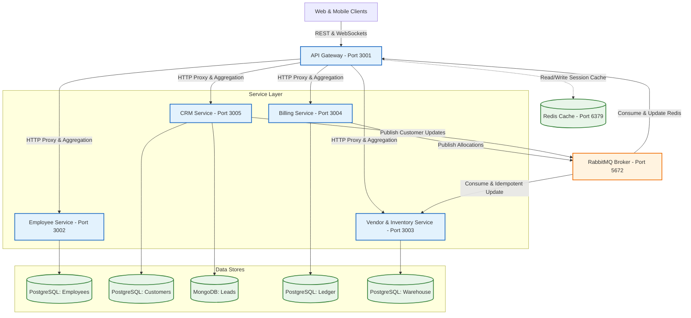

# Xerocare Backend Monorepo - Comprehensive System Reference

This document compiles the complete architectural guidelines, database schemas, business logic models, security mechanisms, event flows, and API routes for the entire Xerocare backend.

---

# SECTION 1: GLOBAL ARCHITECTURE & SYSTEM TOPOLOGY

Xerocare's backend is structured as a microservices monorepo. It contains five distinct Node.js/TypeScript Express services communicating via synchronous REST APIs and asynchronous event-driven queues (RabbitMQ), with Redis acting as a shared cache layer for specific service metrics and data aggregation.



## 1. Directory Structure

The backend source code resides under the `/backend/` path of the workspace:

- `api_gateway/`: Routing, rate limiting, and invoice aggregation controller.
- `employee_service/`: Authentication, HR, leave requests, and payroll calculations.
- `crm_service/`: Sales leads management (MongoDB) and customer directories (PostgreSQL).
- `billing_service/`: Ledger tracking, quoting, contract adjustments, and pricing calculations.
- `ven_inv_service/`: RFQ logistics, purchase logs, lot receipt, and serial allocations.

---

## 2. Databases & Caching Strategy

The services isolate state using separate databases. This prevents schema lockups and ensures database scalability:

- **Employee DB (PostgreSQL via TypeORM)**: Employees, Branch Offices, Leave Applications, Payroll sheets, active login sessions.
- **CRM SQL DB (PostgreSQL via TypeORM)**: Official customer names, phone, email, and address info.
- **CRM NoSQL DB (MongoDB via Mongoose)**: Raw sales leads, pipeline history, conversion records.
- **Billing DB (PostgreSQL via TypeORM)**: Quotations, Invoices, Usage meters, Payment ledger books, product allocations, templates.
- **Inventory DB (PostgreSQL via TypeORM)**: Products (machines with serials), Spare parts, Warehouses, Lots, RFQs, Vendors.
- **Shared Cache (Redis)**: Active session tokens, customer name/contact cache, model stock counters.

---

## 3. RabbitMQ Event Flows

Services publish events to RabbitMQ exchanges. Consumers in other services process these messages asynchronously.

### A. Customer Data Synchronization

- **Exchange**: `crm.customer.events` (Topic)
- **Routing Key**: `customer.updated`
- **Flow**:
  1. An employee updates a customer profile via `crm_service` (`CustomerService.updateCustomer`).
  2. `crm_service` publishes `publishCustomerUpdated({ id, name })`.
  3. `api_gateway` consumes this event and updates its local Redis cache (`customer:{id}:name`) so subsequent invoice aggregates do not need to perform HTTP requests to `crm_service`.

### B. Inventory Allocations & Reduction

- **Exchange**: `inventory.events` (Topic)
- **Flow**:
  1. An invoice is converted to an active transaction in `billing_service`.
  2. `billing_service` publishes events:
     - `inventory.product.allocate`: Payload containing invoice items and barcode serials.
     - `inventory.sparepart.reduce`: Payload containing spare part IDs and quantities to deduct.
  3. `ven_inv_service` workers consume these events:
     - `productAllocationWorker`: Tracks items in the transactional database. It logs processed IDs in the `processed_invoice_items` table to ensure **idempotency** (preventing duplicate item allocations if RabbitMQ retries the delivery).
     - `sparePartReductionWorker`: Deducts physical quantities in the warehouse and updates stock levels in Postgres and Redis caches.
     - `productStatusUpdateWorker`: Watches invoice billing conversions to change physical machine status flags (e.g. from `IN_STOCK` to `LEASED` or `SALE` or `RETURNED`).

---

# SECTION 2: API GATEWAY SERVICE

The API Gateway is the single entry point for all frontend client communications. It routes requests, rate limits sensitive auth endpoints, decrypts and validates JWT tokens, and executes aggregate service calls.

## 1. Proxy Routing Strategy

The Gateway maps prefix paths directly to internal microservices using Axios-based proxying:

```text
/e/*  ---->  Employee & Auth Service (Port 3002)
/i/*  ---->  Vendor & Inventory Service (Port 3003)
/c/*  ---->  CRM & Leads Service (Port 3005)
/b/*  ---->  Billing & Contracts Service (Port 3004) *
```

_\* Note: `/b/invoices/_`and`/b/direct-sale` routes are intercepted and processed locally by the Gateway for invoice aggregation.\*

## 2. Security Middlewares

- **Auth Rate Limiter**: Maximum of **5 login/OTP requests per 15 minutes** for `/e/auth/login`, `/e/auth/login/verify`, and `/e/auth/magic-link`.
- **General Rate Limiter**: Maximum of **100 requests per 15 minutes** for all other API gateways.
- **JWT Access Token Middleware**: Reads the `Authorization` header, verifies the access token against the shared `ACCESS_SECRET` environment variable, and attaches the payload (`userId`, `role`, `branchId`) to `req.user`.

## 3. Invoice Aggregation Engine

To show cohesive invoice views in the frontend, the Gateway intercepts all invoice-related routes and runs `invoiceAggregationService.ts` to fetch and combine raw invoice data from `billing_service` with relational metadata:

- **Caching**: Customer metadata is cached in Redis using keys `customer:{id}:name`, `customer:{id}:phone`, etc. with a **1-hour TTL**.
- **Aggregation**: Combines billing database details with creator/approver names (Employee Service), branch names (Inventory Service), and customer profiles (CRM Service).

---

# SECTION 3: EMPLOYEE SERVICE & AUTH SECURITY GATE

The Employee & Auth Service manages staff accounts, access permissions, multi-device sessions, 2FA OTPs, Magic Links, branch office registries, leaves of absence, and monthly payroll accounting.

## 1. PostgreSQL Schema (Postgres Entity Mapping)

### `Employee` Entity

- `id` (UUID, PK)
- `display_id` (varchar(20), unique, null) - HR-assigned public display serial.
- `email` (varchar(255), unique)
- `first_name` & `last_name` (varchar(255))
- `password_hash` (varchar(255)) - Hashed via bcrypt.
- `role` (Enum) - `ADMIN`, `HR`, `MANAGER`, `EMPLOYEE`, `FINANCE`.
- `employee_job` (Enum, nullable) - `SALES`, `RENT_LEASE`, `TECHNICIAN`, `ADMINISTRATIVE`, `ACCOUNTING`.
- `finance_job` (Enum, nullable) - `RECEIVABLE`, `PAYABLE`, `TAXATION`, `AUDITING`.
- `salary` (numeric(12,2)) - Monthly salary scale.
- `profile_image_url` & `id_proof_key` (varchar(500), nullable) - Document links.
- `status` (Enum) - `ACTIVE`, `INACTIVE`, `DELETED`.
- `branch_id` (UUID, nullable) -> Links to `Branch` entity.

### Other Entities

- `Branch`: `id`, `name`, `location`, `code` (varchar(20)).
- `LeaveApplication`: `id`, `employeeId`, `startDate`, `endDate`, `reason`, `status` (`PENDING`, `APPROVED`, `REJECTED`).
- `Payroll`: `id`, `employeeId`, `month`, `year`, `baseSalary`, `allowances`, `deductions`, `netSalary` (calculated).

## 2. Authentication & Sessions Workflows

### A. Two-Step Login with OTP (2FA)

1. **Credentials verification**: The user hits `POST /auth/login`. The server verifies the password hash via bcrypt. If valid, the server calls `OtpService.sendOtp(email, OtpPurpose.LOGIN)`.
2. **OTP Delivery**: Generates a secure 6-digit number, stores it in Redis with a 5-minute TTL, and fires an email with the verification code.
3. **Verification & Tokens**: The user hits `POST /auth/login/verify`. If the submitted OTP matches the Redis value, `issueTokens` is called to generate access JWT and refresh JWT cookies.

### B. Multi-Device Active Sessions

The system records all active refresh tokens in a tracking table in Postgres. Each record maps:

- `id` (UUID)
- `userId` (UUID)
- `deviceType`, `osName`, `browserName` (Parsed from client `User-Agent` headers).
- `ipAddress`
- `lastActiveAt` (Timestamp)

**Session Security Features**:

- **Get Active Sessions** (`GET /auth/sessions`): Lists all devices and locations currently logged in.
- **Remote Session Logout** (`POST /auth/sessions/logout`): Deletes a specific session ID row, immediately invalidating that refresh token.
- **Logout Other Devices** (`POST /auth/logout-other-devices`): Deletes all active session records for the user except the one containing the current request's refresh token.

## 3. Employee Service API Endpoints

| Endpoint                        | Method   | Roles                | Purpose                                                         |
| :------------------------------ | :------- | :------------------- | :-------------------------------------------------------------- |
| `/auth/login`                   | `POST`   | Public               | Initiates password login; triggers sending login OTP.           |
| `/auth/login/verify`            | `POST`   | Public               | Submits login OTP; receives access token & sets refresh cookie. |
| `/auth/refresh`                 | `POST`   | Public               | Submits refresh token cookie to get a new access token.         |
| `/auth/logout`                  | `POST`   | Public               | Clears cookies and deletes active session key from the DB.      |
| `/auth/me`                      | `GET`    | All                  | Returns profile of currently authenticated user.                |
| `/auth/change-password`         | `POST`   | All                  | Updates password (requires current password check).             |
| `/auth/forgot-password`         | `POST`   | Public               | Starts recovery; triggers OTP to reset password.                |
| `/auth/forgot-password/verify`  | `POST`   | Public               | Submits recovery OTP and sets a new password.                   |
| `/auth/magic-link`              | `POST`   | Public               | Dispatches magic login link to email.                           |
| `/auth/magic-link/verify`       | `POST`   | Public               | Validates clicked token and creates session.                    |
| `/auth/logout-other-devices`    | `POST`   | All                  | Revokes all sessions except current one.                        |
| `/auth/sessions`                | `GET`    | All                  | Lists active devices and browser sessions.                      |
| `/auth/sessions/logout`         | `POST`   | All                  | Forces remote logout of a specific session ID.                  |
| `/employees/create`             | `POST`   | `ADMIN`, `HR`        | Creates employee record and uploads profile files.              |
| `/employees/:id/id-proof`       | `GET`    | `ADMIN`, `HR`        | Fetches scan of ID card.                                        |
| `/employees/:id`                | `DELETE` | `ADMIN`, `HR`        | Moves employee status to `DELETED`.                             |
| `/employees/:id/resend-welcome` | `POST`   | `ADMIN`, `HR`        | Resends welcome invite and resets setup token.                  |
| `/employees/stats`              | `GET`    | `ADMIN`, `HR`, `MGR` | Summary stats (count, departments, active).                     |
| `/employees/branches`           | `GET`    | `ADMIN`, `HR`, `MGR` | Returns list of all branch offices.                             |
| `/employees/`                   | `GET`    | `ADMIN`, `HR`, `MGR` | Lists all active employees.                                     |
| `/employees/:id`                | `GET`    | `ADMIN`, `HR`, `MGR` | Full detail lookup of a staff member.                           |
| `/employees/:id`                | `PUT`    | `ADMIN`, `HR`, `MGR` | Updates staff details, salary, role, or branch.                 |

---

# SECTION 4: CRM LEADS & CUSTOMER PIPELINE

The CRM Service tracks potential sales leads (MongoDB) and manages the active directory of official customers (PostgreSQL).

## 1. Schema Layouts

### A. MongoDB Schema: Potential Leads (`Lead` model)

- `name` (String, required)
- `email` (String) & `phone` (String)
- `source` (String, default: `'Website'`) - Initial lead source.
- `location` (String) - City/district location.
- `status` (Enum) - `new`, `contacted`, `qualified`, `converted`, `lost`.
- `metadata` (Mixed object) - Custom details.
- `isCustomer` (Boolean, default: `false`)
- `customerId` (String, nullable) - Links to Postgres `Customer` ID after conversion.
- `assignedTo` (String, UUID) - Sales employee responsible.
- `branch_id` (String, UUID) - Associates the lead with a local office branch.
- `isDeleted` (Boolean, default: `false`) - Soft delete flag.

### B. PostgreSQL Schema: Customers (`Customer` entity)

- `id` (UUID, PK)
- `name` (varchar(255), required)
- `email` (varchar(255)) & `phone` (varchar(255))
- `location` (varchar(255)) & `address` (text)
- `isActive` (boolean, default: `true`)
- `branch_id` (UUID)

## 2. Lead-to-Customer Conversion Pipeline

Executed in `leadService.ts` (`convertLeadToCustomer`):

1. **Verification**: Checks if lead has already been converted.
2. **Location Constraint**: Validates that a physical address or `location` is specified. If missing, throws a 400 bad request error.
3. **Email Check**: Queries PostgreSQL to ensure the customer email does not already exist. If it exists, throws a 409 conflict.
4. **PostgreSQL Creation**: Creates a new `Customer` record inside PostgreSQL.
5. **MongoDB Update**: Updates the Mongoose record: sets `status = 'converted'`, `isCustomer = true`, and links `customerId = customer.id`.

## 3. CRM Service API Endpoints

| Endpoint             | Method   | Roles                                     | Purpose                                                        |
| :------------------- | :------- | :---------------------------------------- | :------------------------------------------------------------- |
| `/customers`         | `POST`   | `ADMIN`, `EMPLOYEE`                       | Adds a new customer directly into PostgreSQL.                  |
| `/customers`         | `GET`    | `ADMIN`, `EMPLOYEE`, `FINANCE`, `MANAGER` | Fetches all customers, optionally filtered by `branch_id`.     |
| `/customers/:id`     | `GET`    | `ADMIN`, `EMPLOYEE`, `FINANCE`, `MANAGER` | Looks up customer details and addresses by ID.                 |
| `/customers/:id`     | `PUT`    | `ADMIN`, `EMPLOYEE`                       | Updates customer profile (triggers RabbitMQ sync events).      |
| `/customers/:id`     | `DELETE` | `ADMIN`                                   | Deletes a customer profile from PostgreSQL.                    |
| `/leads`             | `POST`   | `ADMIN`, `EMPLOYEE`                       | Records a new sales lead in MongoDB.                           |
| `/leads`             | `GET`    | `ADMIN`, `EMPLOYEE`                       | Lists pipeline leads. Regular employees only see branch leads. |
| `/leads/:id`         | `GET`    | `ADMIN`, `EMPLOYEE`                       | Looks up a specific lead details. Enforces branch security.    |
| `/leads/:id`         | `PUT`    | `ADMIN`, `EMPLOYEE`                       | Updates lead contacts or notes. Enforces branch security.      |
| `/leads/:id`         | `DELETE` | `ADMIN`, `EMPLOYEE`                       | Soft-deletes a lead by setting `isDeleted = true`.             |
| `/leads/:id/convert` | `POST`   | `ADMIN`, `EMPLOYEE`                       | Executes the Lead-to-Customer conversion workflow.             |

---

# SECTION 5: BILLING SERVICE & PRICING LEDGER

The Billing Service manages estimations (Quotations), templates, lease contracts, equipment allocations, and usage readings.

## 1. Database Schema (TypeORM Entities)

### `Invoice` Entity

Tracks quotations, final bills, and active lease contract rates:

- `id` (UUID, PK)
- `invoiceNumber` (varchar(50), unique)
- `customerId` (UUID)
- `status` (Enum) - `DRAFT`, `SENT`, `ACCEPTED`, `REJECTED`, `EXPIRED`, `WAITING_FINANCE_APPROVAL`, `FINANCE_APPROVED`, `ACTIVE_CONTRACT`, `INVOICED`, `PAID`, `CANCELLED`.
- `billType` (Enum) - `SALE`, `RENT`, `LEASE`.
- `rentType` (Enum) - `FIXED_LIMIT`, `FIXED_COMBO`, `FIXED_FLAT`, `CPC`, `CPC_COMBO`.
- `monthlyRent` (numeric(12,2)) - Monthly base price.
- `discountPercent` (numeric(5,2)) - Applied discount.
- `effectiveFrom` & `effectiveTo` (timestamp) - Contract date window.
- `contractProofUrl` (varchar(500), nullable) - Scanned signed contract copy.
- `branchId` (UUID) & `createdBy` (UUID)

### `InvoiceItem` Entity

- `id` (UUID, PK)
- `invoiceId` (UUID)
- `itemType` (Enum) - `PRODUCT` or `SPARE_PART`.
- `modelId` (UUID) / `sparePartId` (UUID)
- `quantity` (int)
- `unitPrice` & `sellingPrice` (numeric)
- `bwIncludedLimit` & `colorIncludedLimit` (int) - Included copies.
- `bwExcessRate` & `colorExcessRate` (numeric) - Flat rates for excess copies.
- `bwSlabRanges` & `colorSlabRanges` (JSONB) - Dynamic rates matching brackets: `[{ "from": 0, "to": 1000, "rate": 0.05 }]`

## 2. Pricing Calculations & Sizing (The A3 Double-Count Rule)

All calculations are executed in `billingCalculationService.ts` based on physical copy sizes:

- **Effective B&W Copies**: `effectiveBw = bwA4 + (bwA3 * 2)`
- **Effective Color Copies**: `effectiveColor = colorA4 + (colorA3 * 2)`
- **Total Usage Copies**: `totalUsage = effectiveBw + effectiveColor`

### Rental Rate Formulas

1. **`FIXED_LIMIT`**: Base monthly rent includes limits. Excess copies are charged via slabs or flat rates:
   - `excessBw = Math.max(0, effectiveBw + extraBwA4 - bwIncludedLimit)`
   - `excessColor = Math.max(0, effectiveColor + extraColorA4 - colorIncludedLimit)`
   - `grossAmount = baseRent + (excessBw * bwRate) + (excessColor * colorRate)`
2. **`FIXED_COMBO`**: Base rent includes a single combined limit for B&W + Color. Excess copy charges apply beyond the combined limit.
3. **`FIXED_FLAT`**: Flat monthly lease cost, ignoring usage:
   - `grossAmount = monthlyRent`
4. **`CPC` (Cost Per Copy)**: No base rent. Every printed copy is charged:
   - `grossAmount = (effectiveBw * bwRate) + (effectiveColor * colorRate)`
5. **`CPC_COMBO`**: No base rent. Total copies combined are charged based on combo slabs.

## 3. Quotation-to-Contract Activation Lifecycle

1. **Quotation Creation**: Sales agents create quotations (status: `DRAFT`).
2. **Finance Review**: Submitting quotes triggers `WAITING_FINANCE_APPROVAL`. Finance reviews rates and updates status to `FINANCE_APPROVED`.
3. **Client Acceptance**: Client response transitions state to `ACCEPTED`.
4. **Allocation & Verification**: Employee clicks "Convert to Transaction" -> maps status to `CONVERTED`. Clerk selects active equipment serial numbers, uploads the scanned signed contract, and submits advance deposit payments into `PaymentLedger`.
5. **Activation**: Activating the contract updates status to `ACTIVE_CONTRACT` and emits `inventory.product.allocate` via RabbitMQ to mark physical machines as `LEASED` in the Inventory DB.

## 4. Billing Service API Endpoints

| Endpoint                                      | Method | Roles              | Purpose                                                    |
| :-------------------------------------------- | :----- | :----------------- | :--------------------------------------------------------- |
| `/quotation`                                  | `POST` | `EMPLOYEE`         | Creates a price estimate quotation (status: `DRAFT`).      |
| `/direct-sale`                                | `POST` | `EMPLOYEE`         | Bypasses the quotation flow; directly sells equipment.     |
| `/quotation/:id`                              | `PUT`  | `EMPLOYEE`         | Modifies quotation details.                                |
| `/quotation/template`                         | `POST` | `ADMIN`, `MANAGER` | Creates a reusable quotation template.                     |
| `/quotation/template`                         | `GET`  | `ADMIN`, `MANAGER` | Returns list of quotation templates.                       |
| `/quotation/template/:id/assign`              | `POST` | `ADMIN`, `MANAGER` | Assigns a quotation template to a sales employee.          |
| `/quotation/:id/assign-customer`              | `POST` | `EMPLOYEE`         | Sales agent links a customer to an assigned template.      |
| `/quotation/assigned`                         | `GET`  | `EMPLOYEE`         | Lists templates currently assigned to the agent.           |
| `/quotation/:id/download-premium`             | `GET`  | All                | Generates professional Quotation PDF.                      |
| `/:id/download-premium`                       | `GET`  | All                | Generates invoice billing PDF.                             |
| `/:id/employee-approve`                       | `POST` | `EMPLOYEE`         | Sends quote to Finance for rate review.                    |
| `/:id/request-validity-extension`             | `POST` | `EMPLOYEE`         | Requests validity extension for an expired quotation.      |
| `/:id/finance-approve-quotation`              | `POST` | `FINANCE`, `ADMIN` | Finance team approves pricing.                             |
| `/:id/finance-reject`                         | `POST` | `FINANCE`, `ADMIN` | Rejects quote; resets status to `DRAFT` with reason.       |
| `/:id/convert-to-transaction`                 | `POST` | All                | Converts approved quotation to transaction.                |
| `/:id/allocate-machines`                      | `POST` | All                | Assigns specific physical machine IDs to the quote items.  |
| `/:id/upload-confirmation`                    | `POST` | All                | Uploads a scan of the signed contract (multipart file).    |
| `/:id/approve`                                | `POST` | All                | Submits deposit / advance payments.                        |
| `/:id/activate-contract`                      | `POST` | All                | Activates contract; publishes stock allocation events.     |
| `/allocations/replace`                        | `POST` | `ADMIN`, `FINANCE` | Swaps out an allocated machine for a customer.             |
| `/:contractId/allocations`                    | `GET`  | All                | Returns machine serial numbers linked to a contract.       |
| `/settlements/generate`                       | `POST` | `ADMIN`, `FINANCE` | Generates final invoice billing settlements.               |
| `/settlements/next-month`                     | `POST` | `ADMIN`, `FINANCE` | Generates next month billing records for active contracts. |
| `/settlements/consolidate`                    | `POST` | `ADMIN`, `FINANCE` | Consolidates multiple monthly usage bills.                 |
| `/completed-collections/:contractId/download` | `GET`  | `ADMIN`, `FINANCE` | Downloads consolidated invoice PDF.                        |
| `/completed-collections/:contractId/send`     | `POST` | `ADMIN`, `FINANCE` | Emails consolidated invoice PDF to the customer.           |
| `/:id/returns`                                | `POST` | All                | Processes return credits or refunds on items.              |
| `/:id/usage`                                  | `PUT`  | `ADMIN`, `FINANCE` | Submits monthly meter usage numbers.                       |

---

# SECTION 6: VENDOR, INVENTORY & RFQ LOGISTICS

The Vendor & Inventory Service manages warehouse items, RFQ bid soliciting sheets, lot receipts, and physical asset barcodes.

## 1. Database Schema Categories (PostgreSQL TypeORM)

- **`Rfq`**: tracks global RFQ sheets. Includes `rfq_number`, `status` (`DRAFT`, `SENT`, `PARTIAL_QUOTED`, `FULLY_QUOTED`, `AWARDED`, `CLOSED`), and references.
- **`RfqItem`**: lines requested. Tracks `item_type` (`PRODUCT` or `SPARE_PART`), brand, quantity, and dates.
- **`RfqVendor`**: maps invited vendors. Stores bid `status`, `total_quoted_amount` and timestamp.
- **`RfqVendorItem`**: bid details submitted by vendor (price, stock status, delivery date).
- **`Lot`**: container batch. Tracks `lotNumber`, vendor, `purchaseDate`, `status` (`PENDING`, `RECEIVING`, `RECEIVED`), and branch.
- **`LotItem`**: tracks expected vs received/damaged/damaged/used counts of items.
- **`Purchase`**: maps directly to a Lot. Tracks purchase amount and logistics costs (shipping, labor, documentation).
- **`Product`**: physical equipment machine. Tracks unique `serial_no`, `barcode_id` (prefixed: `XC-P-${serial}`), status (`IN_STOCK`, `LEASED`, `SALE`, `DAMAGED`), model, and branch.
- **`SparePart`**: tracks `sku`, `brand`, and barcode (`XC-S-${sku}`).
- **`SparePartInventory`**: maps spare part quantity per warehouse.

## 2. RFQ Logistics Workflow

1. **Upload Items (`uploadRfqItems`)**: Techs can bulk-upload items to an RFQ using an Excel template.
2. **Send RFQ (`sendRfq`)**: Generates an Excel workbook template, updates status to `SENT`, and publishes an email job to send invitation bid templates to vendors.
3. **Submit Bids (`enterQuote`)**: Bids are parsed from vendor responses. Recalculates totals and transitions state to `PARTIAL_QUOTED` or `FULLY_QUOTED`.
4. **Award Bids (`awardVendor`)**: Manager awards RFQ to a specific vendor. Winners and losers are emailed automatically.
5. **Convert to Lot (`createLotFromRfq`)**: Auto-creates a physical `Lot` shipment record, initializes a `Purchase` cost sheet, and marks the RFQ `CLOSED`.

## 3. Shipment Receipts & Barcodes

1. **Verify Counts**: Technicians inspect container boxes and log `received_quantity` and `damaged_quantity` (`updateReceivingQuantities`). Status moves to `RECEIVING`.
2. **Confirm Receipt**: Clerk confirms the Lot received (`confirmLotReceived`), locking quantities and unlocking scan-in registration.
3. **Serial Barcodes Scan**:
   - Products are registered with scanned physical serial numbers. Barcode IDs are mapped as `XC-P-${serial}`.
   - Spare parts are checked against existing SKUs. New parts are assigned a dynamic SKU (`generateSku()`) and registered as `XC-S-${sku}`.

## 4. Idempotent Event Allocations Consumer

- **Queue Worker**: `productAllocationWorker.ts`
- **Topic**: `inventory.product.allocate`
- **Idempotence**: To prevent database corruption from duplicated messages, workers query `ProcessedInvoiceItem` inside transaction blocks. If the `invoiceItemId` already exists in this table, the worker ignores the event. Otherwise, it allocates the items, logs the key in the idempotency table, and commits updates.

## 5. Logistics Service API Endpoints

| Endpoint                        | Method | Roles               | Purpose                                                 |
| :------------------------------ | :----- | :------------------ | :------------------------------------------------------ |
| `/rfq/`                         | `POST` | `ADMIN`, `EMPLOYEE` | Creates a new draft RFQ.                                |
| `/rfq/upload-items`             | `POST` | `ADMIN`, `EMPLOYEE` | Parses uploaded Excel file of RFQ items.                |
| `/rfq/`                         | `GET`  | All                 | Lists RFQs (filtered by branch).                        |
| `/rfq/:id`                      | `GET`  | All                 | Returns complete details of an RFQ.                     |
| `/rfq/:id/download-excel`       | `GET`  | All                 | Downloads the standard RFQ template sheet.              |
| `/rfq/:id/vendor/:vId/download` | `GET`  | All                 | Downloads the quote sheet for a vendor.                 |
| `/rfq/:id/send`                 | `POST` | `ADMIN`, `EMPLOYEE` | Launches the RFQ invitation cycle (emails vendors).     |
| `/rfq/:id/vendor/:vId/quote`    | `POST` | All                 | Enters vendor quotes manually or via Excel.             |
| `/rfq/:id/comparison`           | `GET`  | All                 | Returns bidding comparison matrices.                    |
| `/rfq/:id/award/:vId`           | `POST` | `ADMIN`, `MANAGER`  | Awards RFQ to vendor; emails losers.                    |
| `/rfq/:id/create-lot`           | `POST` | `ADMIN`, `MANAGER`  | Creates Lot and Purchase entities from the awarded RFQ. |
| `/lots/`                        | `POST` | `ADMIN`, `EMPLOYEE` | Creates a new Lot shipment record.                      |
| `/lots/`                        | `GET`  | All                 | Lists Lots (filtered by branch).                        |
| `/lots/:id`                     | `GET`  | All                 | Returns expected items and receipt logs of a Lot.       |
| `/lots/:id/download-excel`      | `GET`  | All                 | Downloads the shipment packing list template.           |
| `/lots/upload-excel`            | `POST` | `ADMIN`, `EMPLOYEE` | Creates a Lot from an uploaded Excel file.              |
| `/lots/:id/receiving`           | `PUT`  | `ADMIN`, `EMPLOYEE` | Updates received/damaged counts for items.              |
| `/lots/:id/confirm`             | `POST` | `ADMIN`, `EMPLOYEE` | Confirms shipment; transitions status to `RECEIVED`.    |
| `/lots/totals`                  | `GET`  | All                 | Returns total spends on lots.                           |
| `/products`                     | `POST` | `ADMIN`, `EMPLOYEE` | Scans/adds a new Product asset to stock.                |
| `/products`                     | `GET`  | All                 | Lists active products (serial numbers, status).         |
| `/products/:id`                 | `PUT`  | `ADMIN`, `EMPLOYEE` | Updates product details or changes warehouse.           |
| `/spareparts`                   | `POST` | `ADMIN`, `EMPLOYEE` | Adds a new spare part metadata row.                     |
| `/spareparts`                   | `GET`  | All                 | Lists spare parts catalog.                              |
| `/spareparts/inventory`         | `GET`  | All                 | Lists warehouse quantity registers for spare parts.     |
| `/warehouses`                   | `GET`  | All                 | Lists physical warehouse sites.                         |
| `/vendors`                      | `GET`  | All                 | Lists registered supply vendors.                        |
