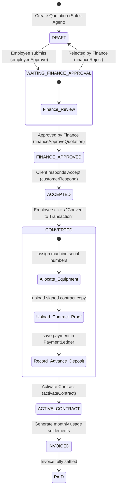

# 💳 Billing & Contract Ledger Reference

The Billing Service manages the company's financial records. It controls quotation estimates, quotation templates, customer contract states, equipment allocation, monthly usage meter calculations, and ledger accounts.

---

## 1. Database Schema (TypeORM Entities)

### `Invoice` Entity (Shared Quote & Ledger model)

Invoices represent both initial price estimates (Quotations) and finalized bills:

- `id` (UUID, PK)
- `invoiceNumber` (varchar(50), unique)
- `customerId` (UUID) - Links to CRM Customer.
- `status` (Enum) - `DRAFT`, `SENT`, `ACCEPTED`, `REJECTED`, `EXPIRED`, `WAITING_FINANCE_APPROVAL`, `FINANCE_APPROVED`, `ACTIVE_CONTRACT`, `INVOICED`, `PAID`, `CANCELLED`.
- `billType` (Enum) - `SALE`, `RENT`, `LEASE`.
- `rentType` (Enum) - `FIXED_LIMIT`, `FIXED_COMBO`, `FIXED_FLAT`, `CPC`, `CPC_COMBO`.
- `monthlyRent` (numeric(12,2)) - Monthly base price.
- `discountPercent` (numeric(5,2)) - Applied discount.
- `effectiveFrom` & `effectiveTo` (timestamp) - Contract date window.
- `contractProofUrl` (varchar(500), nullable) - Scanned signed contract copy.
- `branchId` (UUID) & `createdBy` (UUID)

### `InvoiceItem` Entity

Holds individual line items, limits, and excess rate slabs:

- `id` (UUID, PK)
- `invoiceId` (UUID) -> Links to Invoice.
- `itemType` (Enum) - `PRODUCT` or `SPARE_PART`.
- `modelId` (UUID, nullable)
- `sparePartId` (UUID, nullable)
- `quantity` (int)
- `unitPrice` & `sellingPrice` (numeric(12,2))
- `bwIncludedLimit` & `colorIncludedLimit` (int, nullable) - Copies included in base rent.
- `bwExcessRate` & `colorExcessRate` (numeric(8,4), nullable) - Flat excess rates.
- `bwSlabRanges` & `colorSlabRanges` (JSONB arrays, nullable) - Custom slab definitions.
  - Structure: `[{ "from": number, "to": number, "rate": number }]`
- `combinedIncludedLimit` (int, nullable)
- `combinedExcessRate` (numeric(8,4), nullable)
- `comboSlabRanges` (JSONB, nullable)

### `DeviceMeterReading` Entity

- `id` (UUID, PK)
- `contractId` (UUID) -> Links to Invoice (ACTIVE_CONTRACT).
- `readingDate` (timestamp)
- `bwA4`, `bwA3`, `colorA4`, `colorA3` (int) - Raw counters.

### `PaymentLedger` Entity

- `id` (UUID, PK)
- `invoiceId` (UUID)
- `paymentDate` (timestamp)
- `amount` (numeric(12,2))
- `paymentMethod` (varchar(50)) - `CASH`, `BANK_TRANSFER`, `CHEQUE`, `ONLINE`.
- `notes` (text)

---

## 2. The Pricing Calculation Engine

All calculations are executed in `billingCalculationService.ts` based on physical copy sizes:

### A. Copy Sizing Formulas (The A3 Double-Count Rule)

Standard A3 papers are physically twice the size of A4. The system automatically converts A3 counts to double A4 counts when computing usage:

- **Effective B&W Copies**: `effectiveBw = bwA4 + (bwA3 * 2)`
- **Effective Color Copies**: `effectiveColor = colorA4 + (colorA3 * 2)`
- **Total Usage Copies**: `totalUsage = effectiveBw + effectiveColor`

### B. Calculations by Rent Type

#### 1. `FIXED_LIMIT`

Base rent includes a specific copy limit. Excess is charged.

- `excessBw = Math.max(0, effectiveBw + extraBwA4 - bwIncludedLimit)`
- `excessColor = Math.max(0, effectiveColor + extraColorA4 - colorIncludedLimit)`
- Excess pricing:
  - If a slab range matches, matches rate from `bwSlabRanges` / `colorSlabRanges`.
  - Else, uses flat `bwExcessRate` / `colorExcessRate`.
- `grossAmount = baseRent + (excessBw * bwRate) + (excessColor * colorRate)`

#### 2. `FIXED_COMBO`

A single combined limit is applied to both B&W and Color.

- `excessTotal = Math.max(0, totalUsage + extraBwA4 + extraColorA4 - combinedIncludedLimit)`
- Excess pricing: uses `comboSlabRanges` or flat `combinedExcessRate`.
- `grossAmount = baseRent + (excessTotal * rate)`

#### 3. `FIXED_FLAT`

Simple fixed rental fee without meter counting:

- `grossAmount = monthlyRent`

#### 4. `CPC` (Cost Per Copy)

No monthly base rent. Every printed copy is charged:

- `grossAmount = (effectiveBw * bwRate) + (effectiveColor * colorRate)`
- Rates are resolved dynamically from copy counts matched against slabs or flat rates.

#### 5. `CPC_COMBO`

No base rent. All copies (B&W + Color combined) are charged:

- `grossAmount = totalUsage * rate` (rate resolved via `comboSlabRanges`).

---

## 3. Quotation-to-Contract Activation Lifecycle

Converting a price quote to an active contract follows a strict workflow:

**Note**: During `activateContract`, a RabbitMQ message is emitted to `inventory.product.allocate` with the machine serial barcode IDs, updating the physical equipment status in the inventory database to `LEASED`.

---

## 4. API Endpoints Directory

All routes in this service require `authMiddleware`.

### Quotations & Direct Sales Endpoints (`/`)

| Endpoint                          | Method | Roles              | Purpose                                                |
| :-------------------------------- | :----- | :----------------- | :----------------------------------------------------- |
| `/quotation`                      | `POST` | `EMPLOYEE` (Sales) | Creates a price estimate quotation (status: `DRAFT`).  |
| `/direct-sale`                    | `POST` | `EMPLOYEE` (Sales) | Bypasses the quotation flow; directly sells equipment. |
| `/quotation/:id`                  | `PUT`  | `EMPLOYEE`         | Modifies quotation details.                            |
| `/quotation/template`             | `POST` | `ADMIN`, `MANAGER` | Creates a reusable quotation template.                 |
| `/quotation/template`             | `GET`  | `ADMIN`, `MANAGER` | Returns list of quotation templates.                   |
| `/quotation/template/:id/assign`  | `POST` | `ADMIN`, `MANAGER` | Assigns a quotation template to a sales employee.      |
| `/quotation/:id/assign-customer`  | `POST` | `EMPLOYEE`         | Sales agent links a customer to an assigned template.  |
| `/quotation/assigned`             | `GET`  | `EMPLOYEE`         | Lists templates currently assigned to the agent.       |
| `/quotation/:id/download-premium` | `GET`  | All                | Generates professional Quotation PDF.                  |
| `/:id/download-premium`           | `GET`  | All                | Generates invoice billing PDF.                         |
| `/:id/employee-approve`           | `POST` | `EMPLOYEE`         | Sends quote to Finance for rate review.                |
| `/:id/request-validity-extension` | `POST` | `EMPLOYEE`         | Requests validity extension for an expired quotation.  |

### Contract Allocations & Activation Endpoints (`/`)

| Endpoint                         | Method | Roles              | Purpose                                                   |
| :------------------------------- | :----- | :----------------- | :-------------------------------------------------------- |
| `/:id/finance-approve-quotation` | `POST` | `FINANCE`, `ADMIN` | Finance team approves pricing.                            |
| `/:id/finance-reject`            | `POST` | `FINANCE`, `ADMIN` | Rejects quote; resets status to `DRAFT` with reason.      |
| `/:id/convert-to-transaction`    | `POST` | All                | Converts approved quotation to transaction.               |
| `/:id/allocate-machines`         | `POST` | All                | Assigns specific physical machine IDs to the quote items. |
| `/:id/upload-confirmation`       | `POST` | All                | Uploads a scan of the signed contract (multipart file).   |
| `/:id/approve`                   | `POST` | All                | Submits deposit / advance payments.                       |
| `/:id/activate-contract`         | `POST` | All                | Activates contract; publishes stock allocation events.    |
| `/allocations/replace`           | `POST` | `ADMIN`, `FINANCE` | Swaps out an allocated machine for a customer.            |
| `/:contractId/allocations`       | `GET`  | All                | Returns machine serial numbers linked to a contract.      |

### Invoicing & Billing Settlements Endpoints (`/`)

| Endpoint                                      | Method | Roles              | Purpose                                                    |
| :-------------------------------------------- | :----- | :----------------- | :--------------------------------------------------------- |
| `/settlements/generate`                       | `POST` | `ADMIN`, `FINANCE` | Generates final invoice billing settlements.               |
| `/settlements/next-month`                     | `POST` | `ADMIN`, `FINANCE` | Generates next month billing records for active contracts. |
| `/settlements/consolidate`                    | `POST` | `ADMIN`, `FINANCE` | Consolidates multiple monthly usage bills.                 |
| `/completed-collections/:contractId/download` | `GET`  | `ADMIN`, `FINANCE` | Downloads consolidated invoice PDF.                        |
| `/completed-collections/:contractId/send`     | `POST` | `ADMIN`, `FINANCE` | Emails consolidated invoice PDF to the customer.           |
| `/:id/returns`                                | `POST` | All                | Processes return credits or refunds on items.              |
| `/:id/usage`                                  | `PUT`  | `ADMIN`, `FINANCE` | Submits monthly meter usage numbers.                       |
| `/stats`                                      | `GET`  | All                | Returns billing summary stats.                             |
| `/sales/branch-overview`                      | `GET`  | All                | Returns sales overview performance for a branch.           |
