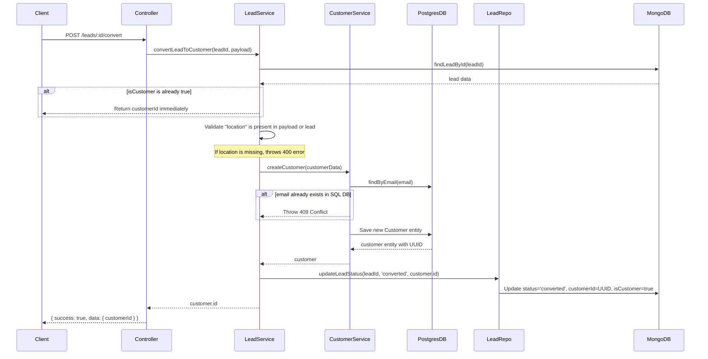

# 🤝 CRM Leads & Customer Service Reference

The CRM Service is responsible for tracking the sales funnel pipeline (leads) and managing the official directory of active customers. It utilizes a dual-database pattern combining MongoDB (unstructured sales leads) and PostgreSQL (structured active client details).

---

## 1. Dual Database Strategy & Schema Layouts

To facilitate dynamic, unstructured lead tracking combined with transactionally safe customer account management, the service isolates data stores:

### A. MongoDB Schema: Potential Leads (`Lead`)

Leads represent prospective customers. Since sales agents track custom metadata (e.g. initial requirements, source tags, notes), they are stored in MongoDB:

- `name` (String, required)
- `email` (String, indexed)
- `phone` (String, indexed)
- `source` (String, default: `'Website'`) - How the lead discovered us.
- `location` (String) - City/district location.
- `status` (Enum) - `new`, `contacted`, `qualified`, `converted`, `lost`.
- `metadata` (Mixed object) - Store custom fields from meetings or marketing campaigns.
- `isCustomer` (Boolean, default: `false`) - Checked when the lead transitions to customer.
- `customerId` (String, nullable) - Links to the Postgres `Customer` ID after conversion.
- `assignedTo` (String, UUID index) - Sales employee responsible.
- `createdBy` & `convertedBy` (String, UUID)
- `branch_id` (String, UUID index) - Associates the lead with a local office branch.
- `isDeleted` (Boolean, default: `false`) - Soft delete flag.

### B. PostgreSQL Schema: Customers (`Customer` entity)

When a lead is finalized, it is converted into a SQL entity under `customers` table:

- `id` (UUID, PK)
- `name` (varchar(255), required)
- `email` (varchar(255), nullable, indexed)
- `phone` (varchar(255), nullable, indexed)
- `location` (varchar(255), nullable) - General region.
- `address` (text, nullable) - Full shipping and billing street address.
- `isActive` (boolean, default: `true`)
- `branch_id` (UUID, nullable, indexed)
- `createdAt` & `updatedAt` (timestamp)

---

## 2. Lead-to-Customer Conversion Pipeline

The transition from a raw MongoDB Lead to an active PostgreSQL Customer follows a transactionally tracked sequence in `leadService.ts` (`convertLeadToCustomer`):



---

## 3. Customer Profile Sync & Caching Flow

To prevent microservices from repeatedly querying the CRM service for basic customer profile fields (such as name or email), the system synchronizes profile changes:

1. Staff submits customer details update via `PUT /customers/:id`.
2. `CustomerService.updateCustomer` commits updates to Postgres.
3. If the profile name changes, the service fires an asynchronous message:
   ```typescript
   const { publishCustomerUpdated } = await import('../events/publishers/customerPublisher');
   await publishCustomerUpdated({ id: updated.id, name: updated.name });
   ```
4. RabbitMQ route `customer.updated` dispatches the update.
5. The API Gateway consumes this event and updates its local Redis key (`customer:{id}:name`).

---

## 4. API Endpoints Directory

All routes in the CRM service require authentication (`authMiddleware`).

### Customer Directory Endpoints (`/customers`)

| Endpoint | Method   | Roles                                     | Purpose                                                    |
| :------- | :------- | :---------------------------------------- | :--------------------------------------------------------- |
| `/`      | `POST`   | `ADMIN`, `EMPLOYEE`                       | Adds a new customer directly into PostgreSQL.              |
| `/`      | `GET`    | `ADMIN`, `EMPLOYEE`, `FINANCE`, `MANAGER` | Fetches all customers, optionally filtered by `branch_id`. |
| `/:id`   | `GET`    | `ADMIN`, `EMPLOYEE`, `FINANCE`, `MANAGER` | Looks up customer details and addresses by ID.             |
| `/:id`   | `PUT`    | `ADMIN`, `EMPLOYEE`                       | Updates customer profile (triggers RabbitMQ sync events).  |
| `/:id`   | `DELETE` | `ADMIN`                                   | Deletes a customer profile from PostgreSQL.                |

### Lead Pipeline Endpoints (`/leads`)

| Endpoint       | Method   | Roles               | Purpose                                                                                              |
| :------------- | :------- | :------------------ | :--------------------------------------------------------------------------------------------------- |
| `/`            | `POST`   | `ADMIN`, `EMPLOYEE` | Records a new sales lead in MongoDB. Non-admin leads are auto-tagged with the creator's `branch_id`. |
| `/`            | `GET`    | `ADMIN`, `EMPLOYEE` | Lists pipeline leads. Regular employees only see leads belonging to their own branch.                |
| `/:id`         | `GET`    | `ADMIN`, `EMPLOYEE` | Looks up a specific lead details. Enforces branch security.                                          |
| `/:id`         | `PUT`    | `ADMIN`, `EMPLOYEE` | Updates lead contacts or notes. Enforces branch security.                                            |
| `/:id`         | `DELETE` | `ADMIN`, `EMPLOYEE` | Soft-deletes a lead by setting `isDeleted = true`.                                                   |
| `/:id/convert` | `POST`   | `ADMIN`, `EMPLOYEE` | Executes the Lead-to-Customer conversion workflow.                                                   |
