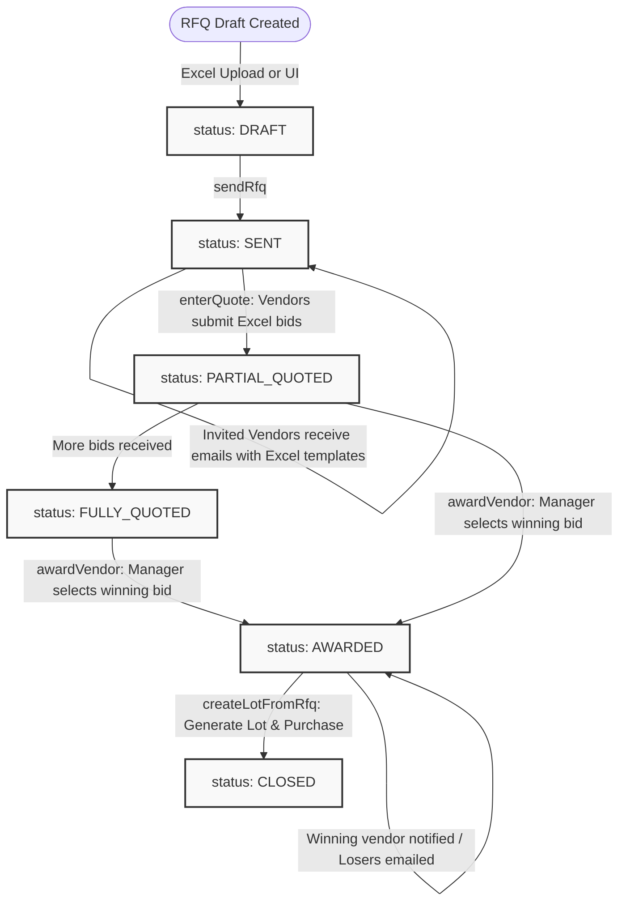

# 📦 Vendor, Inventory & RFQ Reference

The Vendor & Inventory Service manages warehouse items. It handles Requests for Quotation (RFQs) from vendors, processes incoming stock shipments (Lots), manages physical assets (Products with serial numbers), tracks spare part stock levels, and coordinates warehouse inventories.

---

## 1. Database Schema Categories (PostgreSQL TypeORM)

The database schema is organized into four logical sections:

### A. The RFQ Module

Used to solicit prices from vendors for large bulk orders:

- `Rfq` (Entity): tracks global RFQ sheets. Includes `rfq_number` (e.g. `RFQ-202606-1234`), `status` (`DRAFT`, `SENT`, `PARTIAL_QUOTED`, `FULLY_QUOTED`, `AWARDED`, `CLOSED`), and references for branch and creator.
- `RfqItem`: lines requested. Tracks `item_type` (`PRODUCT` or `SPARE_PART`), brand, custom name strings, required quantities, and target delivery dates.
- `RfqVendor`: maps invited vendors. Stores `status` (`INVITED`, `QUOTED`, `AWARDED`, `REJECTED`), `total_quoted_amount` and timestamp.
- `RfqVendorItem`: the bid values submitted by the vendor. Stores `unit_price`, computed `total_price`, availability flags (`IN_STOCK`, `OUT_OF_STOCK`, `ON_PRODUCTION`), and estimated ship dates.

### B. Consolidated Shipments (Lots)

Represents shipping containers / batches received from a vendor:

- `Lot`: global container info. Tracks `lotNumber` (e.g. `LOT-202606-4829`), vendor, `purchaseDate`, `status` (`PENDING`, `RECEIVING`, `RECEIVED`), and destination branch/warehouse.
- `LotItem`: details expected vs physical arrival counts. Fields:
  - `expectedQuantity` (int) - Ordered count.
  - `receivedQuantity` (int) - Verified intact arrivals.
  - `damagedQuantity` (int) - Broken items (default to returned).
  - `usedQuantity` (int) - Tracked count already scanned into inventory.
  - `unitPrice` & `sellingPrice` (numeric)

### C. Financial Purchase Ledger

Tracks cash outflows for vendor purchases:

- `Purchase`: maps directly to a Lot. Tracks basic `purchaseAmount` alongside logistics expenses: `documentationFee`, `labourCost`, `handlingFee`, `transportationCost`, `shippingCost`, and `groundfieldCost`.
- `PurchaseCost`: optional additional cost lines.
- `PurchasePayment`: record of bank transfers, cheques, or cash paid to the vendor.

### D. Active Stock & Barcodes

- `Product`: individual machines/equipment. Must have a unique `serial_no`, `barcode_id` (auto-formatted as `XC-P-${serial}`), and status (`IN_STOCK`, `LEASED`, `SALE`, `DAMAGED`).
- `SparePart`: catalog of spare parts. Tracks `sku`, `brand`, and `barcode_id` (`XC-S-${sku}`).
- `SparePartInventory`: maps stock count of spare parts per warehouse.
- `Warehouse`: tracks physical building names, location addresses, and short codes.

---

## 2. End-to-End Procurement RFQ Cycle



### Core RFQ Mechanics

1. **RFQ Dispatch (`sendRfq`)**: Generates a standard Excel workbook (`generateRfqExcel`) containing validation lists (dropdowns for stock availability and date pickers for shipment dates). Dispatches an email job with the binary Excel file attached.
2. **Quote Recording (`enterQuote`)**: Parses vendor bids, validates that quoted items match the RFQ request structure, and calculates total prices.
3. **Lot Conversion (`createLotFromRfq`)**:
   - Creates a new `Lot` entity copying items from the awarded vendor quote.
   - Automatically initializes a `Purchase` ledger entry with zero-filled logistics fees.
   - Marks the RFQ status as `CLOSED`.

---

## 3. Lot Receiving & Inventory Scan In

Once a Lot shipment arrives at the warehouse, it moves through a strict receipt sequence:

1. **Quantities Check (`updateReceivingQuantities`)**: Warehouse clerks inspect the box and log `received_quantity` and `damaged_quantity` for each lot item. The status moves to `RECEIVING`.
2. **Accepting Goods (`confirmLotReceived`)**: Clerks lock modifications by confirming the Lot. Status transitions to `RECEIVED`.
3. **Asset Registration**: Only after moving to `RECEIVED` does the system permit scanning these items into active inventory:
   - For Product Models: Clerks scan unique serial numbers, saving individual `Product` rows with status `IN_STOCK`. Barcode IDs are mapped as `XC-P-${serial}`.
   - For Spare Parts: Quantities are added to `SparePartInventory` tables. If the spare part is new, the system generates a custom SKU and sets the barcode as `XC-S-${sku}`.

---

## 4. Idempotent RabbitMQ Product Allocations

The service listens for billing transactions to allocate equipment to active client leases. To protect the system against duplicate message deliveries from RabbitMQ, it uses an idempotency tracker table (`processed_invoice_items`):

- **Event Topic**: `inventory.product.allocate`
- **Queue Worker**: `productAllocationWorker.ts`
- **Logic**:
  1. Opens a database transaction.
  2. Queries the `ProcessedInvoiceItem` table:
     ```typescript
     const alreadyProcessed = await manager.findOne(ProcessedInvoiceItem, {
       where: { invoiceItemId },
     });
     ```
  3. If present, logs a warning and exits immediately (ignores duplicate event).
  4. If not present:
     - Fetches target physical product serial numbers.
     - Updates status flags to `LEASED` or `SALE` based on invoice type.
     - Logs the `invoiceItemId` in the `ProcessedInvoiceItem` table.
     - Commits transaction and updates Redis stock counters.

---

## 5. API Endpoints Directory

All routes in the Inventory service require `authMiddleware`.

### RFQ Procurement Endpoints (`/rfq`)

| Endpoint                    | Method | Roles               | Purpose                                                 |
| :-------------------------- | :----- | :------------------ | :------------------------------------------------------ |
| `/`                         | `POST` | `ADMIN`, `EMPLOYEE` | Creates a new draft RFQ.                                |
| `/upload-items`             | `POST` | `ADMIN`, `EMPLOYEE` | Parses uploaded Excel file of RFQ items.                |
| `/`                         | `GET`  | All                 | Lists RFQs (filtered by branch).                        |
| `/:id`                      | `GET`  | All                 | Returns complete details, items, and vendors of an RFQ. |
| `/:id/download-excel`       | `GET`  | All                 | Downloads the standard RFQ template sheet.              |
| `/:id/vendor/:vId/download` | `GET`  | All                 | Downloads the review quote sheet for a vendor.          |
| `/:id/send`                 | `POST` | `ADMIN`, `EMPLOYEE` | Launches the RFQ invitation cycle (emails vendors).     |
| `/:id/vendor/:vId/quote`    | `POST` | All                 | Enters vendor quotes manually or via Excel parse.       |
| `/:id/comparison`           | `GET`  | All                 | Returns bidding comparison matrices.                    |
| `/:id/award/:vId`           | `POST` | `ADMIN`, `MANAGER`  | Awards RFQ to a specific vendor; emails losers.         |
| `/:id/create-lot`           | `POST` | `ADMIN`, `MANAGER`  | Creates Lot and Purchase entities from the awarded RFQ. |

### Lot Shipments Endpoints (`/lots`)

| Endpoint              | Method | Roles               | Purpose                                                     |
| :-------------------- | :----- | :------------------ | :---------------------------------------------------------- |
| `/`                   | `POST` | `ADMIN`, `EMPLOYEE` | Creates a new Lot shipment record.                          |
| `/`                   | `GET`  | All                 | Lists Lots (filtered by branch).                            |
| `/:id`                | `GET`  | All                 | Returns details, expected items, and receipt logs of a Lot. |
| `/:id/download-excel` | `GET`  | All                 | Downloads the shipment packing list template.               |
| `/upload-excel`       | `POST` | `ADMIN`, `EMPLOYEE` | Creates a Lot from an uploaded Excel file.                  |
| `/:id/receiving`      | `PUT`  | `ADMIN`, `EMPLOYEE` | Updates received/damaged counts for items.                  |
| `/:id/confirm`        | `POST` | `ADMIN`, `EMPLOYEE` | Confirms shipment; transitions status to `RECEIVED`.        |
| `/totals`             | `GET`  | All                 | Returns total spends on lots.                               |

### Inventory Stock Endpoints (`/products` & `/spareparts`)

| Endpoint                | Method | Roles               | Purpose                                                     |
| :---------------------- | :----- | :------------------ | :---------------------------------------------------------- |
| `/products`             | `POST` | `ADMIN`, `EMPLOYEE` | Scans/adds a new Product asset to stock (post-Lot receipt). |
| `/products`             | `GET`  | All                 | Lists active products (serial numbers, status, warehouse).  |
| `/products/:id`         | `PUT`  | `ADMIN`, `EMPLOYEE` | Updates product details or changes warehouse location.      |
| `/spareparts`           | `POST` | `ADMIN`, `EMPLOYEE` | Adds a new spare part metadata row.                         |
| `/spareparts`           | `GET`  | All                 | Lists spare parts catalog.                                  |
| `/spareparts/inventory` | `GET`  | All                 | Lists warehouse quantity registers for spare parts.         |
| `/warehouses`           | `GET`  | All                 | Lists physical warehouse sites.                             |
| `/vendors`              | `GET`  | All                 | Lists registered supply vendors.                            |
