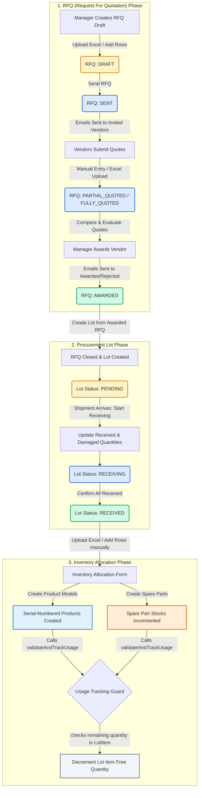

# Procurement & Inventory Allocation Workflow Documentation

This document explains the end-to-end workflow of requesting products and spare parts, tracking quotes, creating procurement lots, receiving shipments, and allocating items to inventory.

---

## 1. Workflow Architecture Overview

The procurement process follows a structured sequence: **RFQ $\rightarrow$ Lot $\rightarrow$ Inventory**. The diagram below demonstrates how data transitions through states and how various services interact:



---

## 2. Phase 1: Request for Quotation (RFQ)

The RFQ phase handles sourcing from multiple vendors. It is managed by `rfqService.ts` in the `ven_inv_service` backend.

### A. RFQ Creation

1. **Manual Creation**: The branch manager creates an RFQ via the dashboard, adding individual products or spare parts.
2. **Bulk Upload via Excel**: The manager uploads an Excel spreadsheet containing requested items.
   - Backend maps items to system `Model` records (for products) or `SparePart` records (for spare parts).
   - If a spare part is not registered, it is captured as a "custom" item name.
3. **Draft Status**: The RFQ is saved with status `DRAFT`.

### B. Inviting Vendors & Sending RFQ

- When the manager clicks **"Send RFQ"**, the backend transitions the status to `SENT`.
- An Excel template response spreadsheet (`RFQ_Template_[rfqId].xlsx`) is dynamically generated by `ExcelJS` containing all item descriptions, expected quantities, and ID fields.
- A background email job is published via RabbitMQ/Email Workers, sending the invitation and response spreadsheet to all selected vendor email addresses.

### C. Quoting Phase

- Vendors return their quotes (specifying unit price, stock status, available quantity, estimated shipment date, and notes).
- Managers input these quotes in the system:
  - **Manual Entry**: Inputting values directly into the dashboard.
  - **Excel Import**: Uploading the populated response template returned by the vendor.
- **Quoting Status**: The RFQ status moves to `PARTIAL_QUOTED` when the first quote is saved, and `FULLY_QUOTED` when all invited vendors have responded or been rejected.

### D. Quote Comparison & Awarding

- The system provides a **Comparison View** which calculates:
  - The lowest unit price for each item.
  - Percentage price difference between vendors.
  - The cheapest vendor overall based on total quoted amount.
- The manager awards the RFQ to a single vendor.
- **Awarding Logic**:
  - The awarded vendor's status is set to `AWARDED`.
  - All other invited vendors' statuses are set to `REJECTED`.
  - Automated emails are dispatched to all vendors notifying them of the decision.
  - The RFQ status updates to `AWARDED`.

---

## 3. Phase 2: Procurement Lot & Financials

Once a vendor is awarded, the RFQ must be converted into a procurement Lot to track receiving and landing costs.

### A. Lot Conversion

- The manager initiates **"Create Lot"** from the awarded RFQ.
- **Lot Creation Backend Execution (`createLotFromRfq`)**:
  1. Verifies the RFQ status is strictly `AWARDED`.
  2. Generates a unique lot number (`LOT-YYYYMM-RANDOM`).
  3. Creates a `Lot` record with status `PENDING` linked to the awarded vendor.
  4. Translates each quoted RFQ item into a `LotItem` record (saving expected quantities and contract prices).
  5. **Auto-registers Spare Parts**: If a spare part in the RFQ does not exist in the master spare parts table, the backend automatically creates a new master `SparePart` record (with `quantity = 0`) to establish its SKU and identity.
  6. Creates a companion `Purchase` record in the database for financial tracking.
  7. Updates the RFQ status to `CLOSED`.

### B. Financial Tracking (`Purchase` Entity)

- Each Lot has a 1-to-1 relationship with a `Purchase` record.
- Managers can edit the `Purchase` record to add landing/logistics costs:
  - _Documentation Fee_
  - _Labour Cost_
  - _Handling Fee_
  - _Transportation Cost_
  - _Shipping Cost_
  - _Groundfield Cost_
- The total purchase expense is automatically calculated as:
  $$\text{Total Cost} = \text{Item Pricing Total} + \text{Sum of Additional Costs}$$

### C. Lot Receiving Workflow

When the physical shipment arrives at the warehouse, it goes through an audit:

1. **Start Receiving**: The manager transitions the Lot status to `RECEIVING` in the UI.
2. **Quantity Audit**: For each item in the Lot, the manager inputs:
   - `Received Quantity`: The actual number of functional units received.
   - `Damaged Quantity`: The number of broken/defective units received.
   - _Constraint_: $\text{Received} + \text{Damaged} \le \text{Expected Quantity}$.
3. **Quantities Confirmation**:
   - The manager saves the received figures. Damaged quantities are automatically duplicated to `returnedQuantity` for return/refund processing.
   - The manager confirms the reception, transitioning the status to `RECEIVED`.
   - **Crucial Guard**: Once a Lot's status is `RECEIVED`, the quantities are locked and cannot be edited. It is now unlocked for inventory allocation.

---

## 4. Phase 3: Inventory Allocation

Items from a `RECEIVED` lot must be added to active inventory before they can be sold, leased, or used in servicing.

### A. Products (Serial-Numbered Models)

Products represent individual physical assets (e.g., photocopier machines) that are tracked by unique manufacturer serial numbers.

1. **Allocation Entry**: The user navigates to the products page, filtering by the received `lotId`.
2. **Bulk Form Generation**: The UI displays rows for each expected model unit based on the lot's received count.
3. **Form Input**: For each machine, the user inputs a unique `serial_no`, name, warehouse allocation, sales pricing details, manufacture date (MFD), print colour, and warranty.
4. **Backend Guard (`addProduct` / `bulkCreateProducts`)**:
   - Checks that the referenced `lot_id` exists and its status is `RECEIVED`.
   - Executes **Usage Validation**: Calls `validateAndTrackUsage` on the lot:
     - Calculates $\text{Remaining Free Qty} = \text{Received Quantity} - \text{Used Quantity}$.
     - Checks if requested quantity exceeds remaining.
     - Increments the `usedQuantity` counter on the `LotItem` to prevent double-allocating units.
   - Registers the individual `Product` record in the database.
   - Calls `syncModelQuantities(model_id)` to re-calculate aggregate stock levels.

### B. Spare Parts (Consumables & Parts)

Spare parts are tracked by SKUs and count aggregates rather than individual serial numbers.

1. **Allocation Entry**: User navigates to the spare parts page, filtering by the `lotId`.
2. **Bulk Form Generation**: The UI loads all spare parts registered during the lot creation.
3. **Form Input**: Autofills brand, part name, compatible models, and SKU from the lot item. User selects the warehouse and specifies the stock quantity to add (pre-filled with the lot's unallocated quantity).
4. **Backend Guard (`addSingleSparePart`)**:
   - Verifies the lot status is `RECEIVED`.
   - Checks if a spare part matching the SKU already exists in that lot.
   - Calls `validateAndTrackUsage` on the lot to ensure quantity matches the remaining received lot balance, incrementing `usedQuantity` on the `LotItem`.
   - If the spare part already exists in active inventory, it increments the stock level (`quantity`).
   - If not, it registers the new `SparePart` master record with the designated stock level.

---

## 5. Database Schema Reference

The tables and fields driving this workflow include:

```
  +------------------+         +------------------+         +------------------+
  |       Rfq        |1       *|     RfqItem      |1       *|   RfqVendorItem  |
  |------------------|---------|------------------|---------|------------------|
  | id (PK)          |         | id (PK)          |         | id (PK)          |
  | rfq_number       |         | item_type        |         | unit_price       |
  | status           |         | model_id         |         | total_price      |
  | branch_id        |         | spare_part_id    |         | stock_status     |
  | awarded_vendor_id|         | quantity         |         | available_qty    |
  +------------------+         +------------------+         +------------------+
           | 1                                                       | *
           |                                                         |
           | 1                                                       | 1
  +------------------+         +------------------+         +------------------+
  |    RfqVendor     |1       *|    RfqVendorItem |         |    RfqVendor     |
  |------------------|---------|------------------|---------|------------------|
  | id (PK)          |         | (Listed above)   |         | id (PK)          |
  | status           |         +------------------+         | status           |
  | total_amount     |                                      +------------------+
  +------------------+
           | (Convert)
           v
  +------------------+         +------------------+         +------------------+
  |       Lot        |1       *|     LotItem      |1       1|     Product      |
  |------------------|---------|------------------|---------|------------------|
  | id (PK)          |         | id (PK)          |         | id (PK)          |
  | lotNumber        |         | itemType         |         | serial_no        |
  | status           |         | expectedQuantity |         | lot_id (FK)      |
  | totalAmount      |         | receivedQuantity |         | model_id (FK)    |
  +------------------+         | damagedQuantity  |         +------------------+
           | 1                 | usedQuantity     |                  | * (validate)
           |                   +------------------+                  v
           | 1                                              +------------------+
  +------------------+                                      |    SparePart     |
  |     Purchase     |                                      |------------------|
  |------------------|                                      | id (PK)          |
  | id (PK)          |                                      | sku              |
  | purchaseAmount   |                                      | quantity (stock) |
  | shippingCost     |                                      | lot_id (FK)      |
  | totalAmount      |                                      +------------------+
  +------------------+
```

---

## 6. Critical Business Rules & Guards

1. **Lot Receiving Guard**: Inventory cannot be created for any items belonging to a lot unless the lot status is exactly `RECEIVED`. Attempting to add items prior to this returns an HTTP 400 error:
   > _"Inventory cannot be created until the lot is received. Please confirm the lot reception first."_
2. **Double-Allocation Prevention**: The field `usedQuantity` on `LotItem` records how many units have been allocated to inventory. The validation formula enforced is:
   $$\text{Remaining Received} = \text{receivedQuantity} - \text{usedQuantity}$$
   Any allocation request where $\text{requested\_qty} > \text{Remaining Received}$ is rejected with:
   > _"Lot quantity exceeded. Remaining (Received): X, Requested: Y"_
3. **RFQ Quoting Rules**: An RFQ can only transition to `AWARDED` if it has been quoted by the vendor. Upon awarding, all other vendors are automatically marked `REJECTED`.
4. **Financial Ledger Integrity**: When a lot is converted, a matching `Purchase` record is automatically initialized with $0$ additional fees. It acts as the financial anchor for accounts payable.
