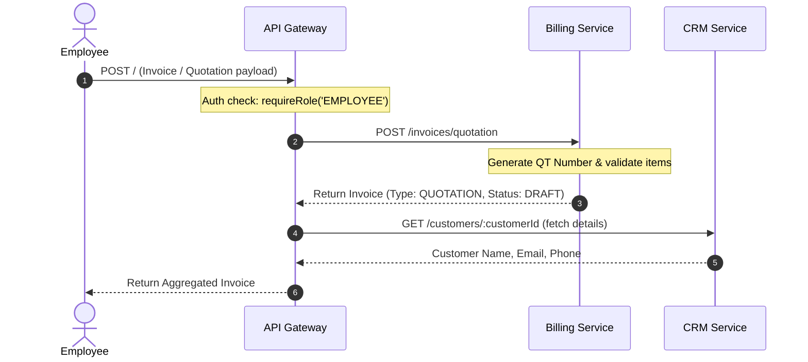
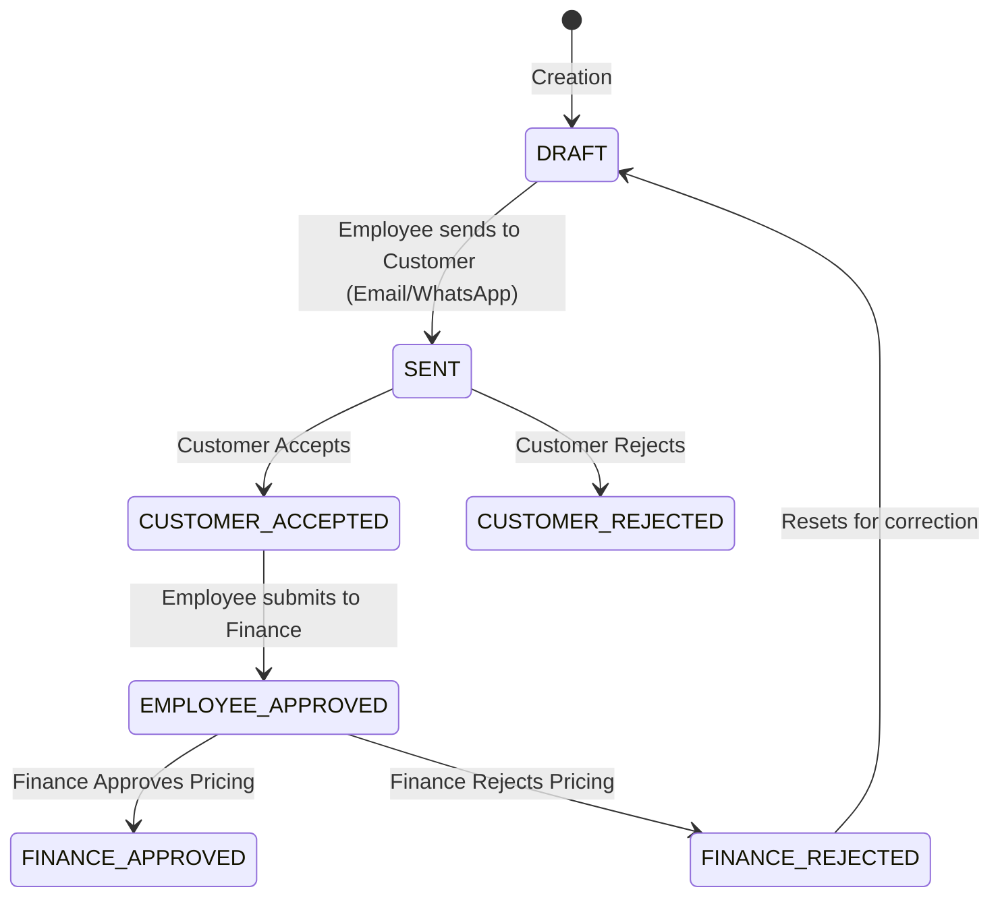
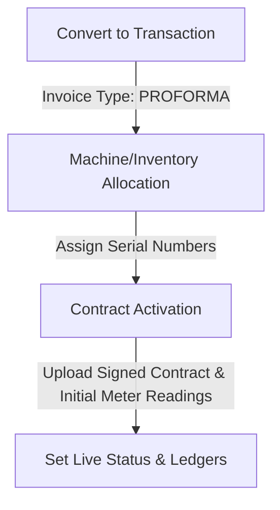

# Xerocare Quotation & Conversion Workflow Analysis

This document details the end-to-end architectural flow of creating and converting quotations in Xerocare, including user roles, lead-to-customer conversions, status progressions, and backend service integrations.

---

## 1. Architectural Roles & Permissions

The system defines specific responsibilities across user roles:

| Role                                         | Creation                     | Editing                  | Approval                            | Conversion / Allocation                          |
| :------------------------------------------- | :--------------------------- | :----------------------- | :---------------------------------- | :----------------------------------------------- |
| **Sales Employee (`SALES`)**                 | Allowed (Product Sales only) | Allowed (Until Approved) | N/A                                 | Convert Approved Quotation to Transaction        |
| **Rent & Lease Employee (`RENT_AND_LEASE`)** | Allowed (Rent/Lease only)    | Allowed (Until Approved) | N/A                                 | Convert Approved Quotation to Transaction        |
| **Branch Manager (`MANAGER`)**               | Allowed (All Types)          | Allowed (Until Approved) | N/A                                 | Allocate Serialized Products & Convert           |
| **Finance Team (`FINANCE`)**                 | N/A                          | N/A                      | **Price Approval** or **Rejection** | Allocate Serialized Products & Activate Contract |
| **Admin (`ADMIN`)**                          | Allowed (All Types)          | Allowed (Anytime)        | Bypass capabilities                 | Full override permissions                        |

---

## 2. Lead-to-Customer Integration

When working with prospects, the system allows creation and conversion dynamically:

### A. Creating a Lead on the Fly

1. Inside the **Add Quotation** modal, employees can click the **Create Lead** button.
2. This opens the `CreateLeadDialog`, prompting for `Name`, `Phone`, `Email`, and `Location` (Required).
3. Clicking submit triggers a call via the API Gateway (`POST /c/leads`) to the **CRM Service** (`leadRoutes.ts`), creating a new lead with status `new`.

### B. Lead Conversion

1. In the `CustomerSelect` dropdown, if a **Lead** is selected:
   - If the lead has not yet been converted, the UI opens `LeadConversionDialog`.
   - The dialog checks for missing essential fields (like contact information or location).
   - Once submitted, it calls `POST /c/leads/:id/convert` to convert the lead.
2. **CRM Service Conversion logic** (`leadService.convertLeadToCustomer`):
   - Validates that the lead is not already converted.
   - Automatically registers a new `Customer` record using the lead's information.
   - Updates the Lead's status in MongoDB to `CONVERTED` and saves the generated SQL `customerId` in the lead's document.
3. The UI receives the `customerId` from the response and proceeds to bind the quotation to this newly registered customer.

---

## 3. Phase 1: Creation & Drafting

1. **API Gateway Hook**: Employees trigger creation which hits the Gateway `POST /` (`invoiceController.createInvoice`).
2. **Billing Service Validation**: Forwards to Billing Service `POST /invoices/quotation`:
   - Checks that the sale type rules are followed (e.g. `FIXED_LIMIT` cannot have slab ranges, `CPC` cannot have fixed monthly rent).
   - Inserts the quotation into the SQL database with `InvoiceType.QUOTATION` and `InvoiceStatus.DRAFT`.
3. **Details Aggregation**: The Gateway aggregates details from CRM, Employee, and Vendor Inventory Services (for branch names) and returns the populated payload to the client.

---

## 4. Phase 2: Quotation Status & Approval Workflow

### A. Submitting to Finance

- Once the customer accepts the quotation, the employee submits it to Finance by calling `POST /:id/employee-approve` on the Gateway.
- Sets the status to `EMPLOYEE_APPROVED` and logs the approver details (`employeeApprovedBy`, `employeeApprovedAt`).

### B. Finance Decision

- **Approval**: Finance calls `POST /:id/finance-approve-quotation` (optionally extending the validity date `effectiveTo`). The status shifts to `FINANCE_APPROVED`.
- **Rejection**: Finance calls `POST /:id/finance-reject`, changing status to `FINANCE_REJECTED`. This releases any reserved product serial numbers and allows the employee to revise the draft.

---

## 5. Phase 3: The Conversion Flow (Quotation to Active Contract)

Once a quotation reaches `FINANCE_APPROVED`, it proceeds through a mandatory multi-step conversion flow:

### Step 1: Convert to Transaction

- **Endpoint**: `POST /invoices/:id/convert-to-transaction` (Employees or Managers).
- **Action**:
  - Verifies the quotation is within its validity date.
  - Updates the invoice type to `InvoiceType.PROFORMA` (representing a draft contract/order) and resets the status to `InvoiceStatus.DRAFT`.

### Step 2: Machine/Inventory Allocation

- **Endpoint**: `POST /invoices/:id/allocate-machines` (Finance/Managers).
- **Action**:
  - The user provides `itemUpdates` mapping quotation lines to specific physical product IDs.
  - The Billing Service contacts the **Inventory Service** (`ven_inv_service`) to verify availability of products (must be status `AVAILABLE`).
  - Creates `ProductAllocation` records with status `AllocationStatus.ALLOCATED`.
  - Shifts invoice status to `FINANCE_APPROVED` and sets `contractStatus` to `PENDING_CONFIRMATION`.
  - Publishes a message to RabbitMQ to mark physical items as `ALLOCATED` (so they cannot be assigned to other contracts).

### Step 3: Contract Activation

- **Endpoint**: `POST /invoices/:id/activate-contract` (Employees or Managers).
- **Action**:
  - **Contract Document**: Requires uploading a signed contract (`contractConfirmationUrl`).
  - **Caution Deposit**: Captures any optional security deposit (`amount`, `mode`, `reference`, `receivedDate`).
  - **Meter Readings**: Captures initial meter readings for Rent/Lease contracts (saves them as the starting count baseline inside `ProductAllocation` records).
  - **Contract State Transition**:
    - If `PRODUCT_SALE` or `SPAREPART_SALE` (Direct Sales):
      - Changes type to `InvoiceType.FINAL` and status to `InvoiceStatus.PAID`.
      - Shifts `contractStatus` to `ACTIVE`.
    - If `RENT` or `LEASE`:
      - Shifts `contractStatus` to `ACTIVE` and schedules recurrent billing cycles.
  - **Inventory Finalization**: Emits status updates via RabbitMQ to mark allocated products as `RENT`, `LEASE`, or `SALE` in the Inventory Service.

### Step 4: Advance Payment Recording

- **Action**:
  - If an advance payment is provided, the client calls `recordPayment` (`POST /payments`), registering a credit entry in the financial ledger against the newly activated contract/invoice.
