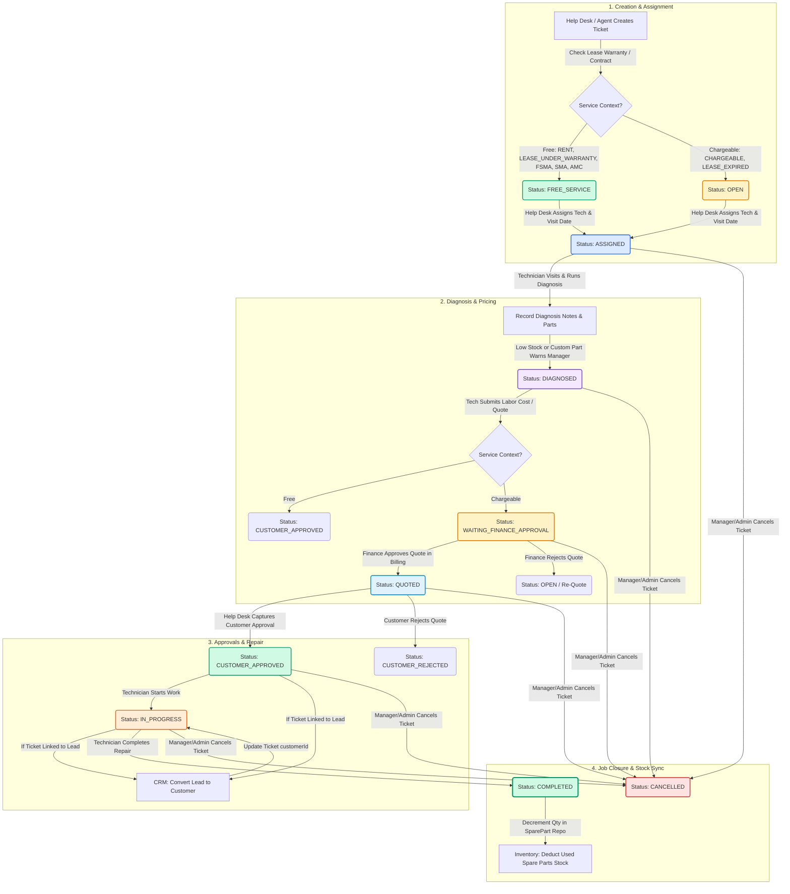

# Service Management & Ticket Workflow Documentation

This document explains the end-to-end service delivery and ticket management workflow. It details how the **Service Help Desk**, **Technicians**, **Managers**, and **Finance** interact to troubleshoot client machines, manage parts diagnostic, handle quotation approvals, perform repairs, and sync with other microservices (CRM, Billing, and Inventory).

---

## 1. Workflow Architecture Overview

The Service Management module coordinates ticket lifecycle transitions from creation to completion. The diagram below illustrates how a service ticket moves through different statuses, user roles, and cross-service API events:



---

## 2. Service Contexts & Warranty Rules

Every service ticket is classified under a specific **Service Context** (`ServiceContext`), which dictates whether parts and labor are provided free of charge or billed to the customer.

| Service Context        | Type           | Description                        | Warranty / Charging Rules                                                      |
| :--------------------- | :------------- | :--------------------------------- | :----------------------------------------------------------------------------- |
| `RENT`                 | **Free**       | Rented devices                     | All maintenance, parts, and labor are fully covered under the monthly rent.    |
| `LEASE_UNDER_WARRANTY` | **Free**       | Leased devices                     | Subject to warranty validations (time-based and volume-based limits).          |
| `LEASE_EXPIRED`        | **Chargeable** | Leased devices                     | Warranty expired because the lease tenure or max copy limit has been exceeded. |
| `FSMA`                 | **Free**       | Full Service Maintenance Agreement | Service contract covering all parts, consumables, and labor.                   |
| `SMA`                  | **Free**       | Service Maintenance Agreement      | Service contract with custom coverage rules.                                   |
| `AMC`                  | **Free**       | Annual Maintenance Contract        | Periodic maintenance agreement covering visits and labor.                      |
| `CHARGEABLE`           | **Chargeable** | Ad-hoc service                     | No active contract exists. Parts, consumables, and labor are chargeable.       |

### Lease Warranty Auto-Validation Logic

When a lease ticket is created, the system queries the `billing_service` (`GET /invoices/contract/serial/:serialNumber`) to retrieve contract details and machine allocations:

1. **Tenure check**:
   $$\text{Contract Expiry} = \text{effectiveFrom} + \text{leaseTenureMonths}$$
   If $\text{Current Date} \le \text{Contract Expiry}$, the time-based warranty is valid.
2. **Copy volume check**:
   $$\text{Current Copies} = \text{bwA4} + \text{bwA3} + \text{colorA4} + \text{colorA3}$$
   If $\text{Current Copies} < \text{maxCopyLimit}$, the volume-based warranty is valid.
3. **Outcome**: If **both** checks pass, the context defaults to `LEASE_UNDER_WARRANTY`. Otherwise, it is auto-demoted to `LEASE_EXPIRED`.

---

## 3. Step-by-Step Ticket State Transitions

### Phase 1: Creation & Routing

- **Creation**: The Help Desk agent creates a ticket. The branch identifier is assigned (`branchId`).
- **Initial Status**:
  - Chargeable contexts start in `OPEN`.
  - Free service contexts (`RENT`, `LEASE_UNDER_WARRANTY`, `FSMA`, `SMA`, `AMC`) start in `FREE_SERVICE`.
- **Assignment**: The agent assigns a `SERVICE_TECHNICIAN` and schedules a visit date (`scheduledVisitDate`). The status moves to `ASSIGNED`. The assigned technician receives an in-app notification.

### Phase 2: Diagnosis & Alerts

- **Diagnosis**: The technician inspects the machine and enters `diagnosisNotes` and required items (spare parts or custom parts). The status moves to `DIAGNOSED`.
- **Item Categorization**:
  - `SPARE_PART`: Regular inventory stock parts. If spare part quantity $\le 5$, the system triggers a **Low Stock Warning** to the Branch Manager.
  - `CUSTOM`: Unregistered custom parts. Triggers a **Custom Unregistered Part Requested Alert** requiring Manager review.
- **Pricing Enforcement**: If the ticket belongs to a **Free** service context, item pricing is automatically forced to $0$ and flagged as `isFree = true`.

### Phase 3: Quotation & Approvals

- **Quote Submission**: The technician inputs labor costs and submits the quotation.
  - **Free Tickets**: Auto-approves and transitions directly to `CUSTOMER_APPROVED`.
  - **Chargeable Tickets**: The backend packages the parts and labor into a billing payload and pushes it to `billing_service` (`POST /service-quotation`), creating a quotation in status `WAITING_FINANCE_APPROVAL`. The service ticket status is set to `WAITING_FINANCE_APPROVAL`.
- **Finance Review**: Finance team reviews and approves/rejects the quotation in the billing dashboard:
  - Approval updates the ticket status to `QUOTED`.
  - Rejection moves the ticket back to `OPEN`.
- **Customer Decision**: The Help Desk captures the customer's response:
  - If approved, status transitions to `CUSTOMER_APPROVED`.
  - If rejected, status transitions to `CUSTOMER_REJECTED`.

### Phase 4: Repair & Completion

- **Work Commenced**: The technician starts the job. Status updates to `IN_PROGRESS`.
- **Job Completion**: Once resolved, the technician records `completionNotes` and clicks complete. Status updates to `COMPLETED`.
- **Inventory Sync**: Upon completion, the backend loops through the items and decrements the used quantity of spare parts from active inventory stock (`SparePart` entity quantity decremented).

---

## 4. Cross-Service Integrations

```
        +-------------+                +-----------------------+
        | CRM Service |                |    Billing Service    |
        +-------------+                +-----------------------+
         ^           \                  ^                     /
         |            \ (Convert Lead)  | (Contract Warranty) / (Create Quote)
         |             v                |                    v
  +-----------------------------------------------------------------+
  |                Vendor & Inventory Service                       |
  |               (Service Ticket Controller)                       |
  +-----------------------------------------------------------------+
                                |
                                v (Deduct Stock)
                       +----------------+
                       | Spare Parts DB |
                       +----------------+
```

### A. CRM Service Integration (Lead-to-Customer Conversion)

To accommodate prospects requesting ad-hoc services, a ticket can be created using a CRM `leadId` instead of a registered `customerId`.

- **Trigger**: When the ticket transitions to `CUSTOMER_APPROVED` (or `IN_PROGRESS` for free contexts).
- **Action**: The Service Controller calls `CRM_SERVICE` (`POST /lead/:id/convert`).
- **Effect**: The lead is converted into an active customer account. The ticket's `customerId` is updated with the new account UUID, and `leadId` is set to `null` to complete the handover.

### B. Billing Service Integration (Service Quotation)

For chargeable service tickets, the `ven_inv_service` delegates quotation creation and approval workflows to the billing microservice.

- **Trigger**: Quote submission by the technician.
- **Action**: Post payload containing client ID, parts list, and labor cost to `BILLING_SERVICE` (`POST /service-quotation`).
- **Effect**: Initializes a quotation. Callback endpoint `PATCH /service/tickets/:id/quotation-link` is invoked by the billing service to associate `serviceQuotationId` back to the service ticket.

### C. Inventory Service Integration (Stock Deduction)

Service tickets consume inventory spare parts directly.

- **Trigger**: Status transition to `COMPLETED`.
- **Action**: Queries `ServiceTicketItem` list linked to the ticket.
- **Effect**: Loops through items with `itemSource = SPARE_PART` and decrements `quantity` in the master `SparePart` repository by the requested amount, maintaining inventory tracking accuracy.

---

## 5. Database Schema Reference

The entities driving service tickets and diagnosis items are structured as follows:

### Service Ticket (`service_tickets` table)

| Column Name            | Data Type   | Constraints / Relations                  | Description                           |
| :--------------------- | :---------- | :--------------------------------------- | :------------------------------------ |
| `id`                   | `uuid`      | Primary Key                              | Unique ticket identifier              |
| `ticketNumber`         | `varchar`   | Unique (e.g. `ST-YYYYMM-XXXX`)           | Format: prefix + year + month + index |
| `customerId`           | `uuid`      | Nullable                                 | Client account reference              |
| `leadId`               | `varchar`   | Nullable                                 | CRM Lead reference                    |
| `productId`            | `uuid`      | Nullable                                 | Target physical printer/copier        |
| `productBrand`         | `varchar`   | Required                                 | Machine brand name                    |
| `productModel`         | `varchar`   | Required                                 | Machine model number                  |
| `productName`          | `varchar`   | Required                                 | Machine common name                   |
| `serialNumber`         | `varchar`   | Required                                 | Unique manufacturer serial number     |
| `serviceContext`       | `enum`      | `ServiceContext`                         | Workflow categorization context       |
| `contractReferenceId`  | `uuid`      | Nullable                                 | Linked rental/lease contract ID       |
| `issueDescription`     | `text`      | Required                                 | Problem description                   |
| `jobType`              | `enum`      | `JobType` (`ONSITE` / `BRING_TO_CENTRE`) | Location of repair                    |
| `status`               | `enum`      | `ServiceTicketStatus`                    | Current lifecycle state               |
| `assignedTechnicianId` | `uuid`      | Nullable                                 | Employee ID of technician             |
| `createdBy`            | `uuid`      | Required                                 | Agent who logged the ticket           |
| `branchId`             | `uuid`      | Required                                 | Scopes tickets within office branches |
| `serviceQuotationId`   | `uuid`      | Nullable                                 | Linked billing quotation ID           |
| `diagnosisNotes`       | `text`      | Nullable                                 | Technician's inspection notes         |
| `scheduledVisitDate`   | `timestamp` | Nullable                                 | Planned site visit date               |
| `completedAt`          | `timestamp` | Nullable                                 | Completion timestamp                  |
| `completionNotes`      | `text`      | Nullable                                 | Resolution details                    |

### Service Ticket Item (`service_ticket_items` table)

| Column Name             | Data Type | Constraints / Relations                       | Description                           |
| :---------------------- | :-------- | :-------------------------------------------- | :------------------------------------ |
| `id`                    | `uuid`    | Primary Key                                   | Unique item identifier                |
| `ticketId`              | `uuid`    | Foreign Key (cascade delete)                  | Parent service ticket                 |
| `itemSource`            | `enum`    | `ServiceItemSource` (`SPARE_PART` / `CUSTOM`) | Type of part used                     |
| `sparePartId`           | `uuid`    | Nullable                                      | Master spare part catalog ID          |
| `sku`                   | `varchar` | Nullable                                      | Catalog stock keeping unit            |
| `barcodeId`             | `varchar` | Nullable                                      | Physical barcode reference            |
| `customPartName`        | `varchar` | Nullable                                      | Custom part name if not in catalog    |
| `customPartBrand`       | `varchar` | Nullable                                      | Custom part manufacturer              |
| `customPartDescription` | `text`    | Nullable                                      | Custom part details                   |
| `partName`              | `varchar` | Required                                      | Name displayed on billing quotation   |
| `quantity`              | `int`     | Default: `1`                                  | Units consumed                        |
| `unitPrice`             | `decimal` | Precision 10, scale 2                         | Cost per unit ($0 if free context)    |
| `totalPrice`            | `decimal` | Precision 10, scale 2                         | Computed cost: `unitPrice * quantity` |
| `isFree`                | `boolean` | Default: `false`                              | Zero-price override flag              |

---

## 6. Access Control & Branch Scoping

All endpoints check roles to guarantee security and strict operational boundaries:

- **Branch Scoping**: Non-admin users are restricted to tickets matching their active `branchId`. Managers and Help Desk operators only view and edit branch-scoped requests.
- **Technician Scope**: Users with the job role `SERVICE_TECHNICIAN` are restricted to tickets where `assignedTechnicianId` matches their user account.
- **Permissions Directory**:

| Endpoint                                   | Method | Required Roles / Jobs                     | Purpose                                         |
| :----------------------------------------- | :----- | :---------------------------------------- | :---------------------------------------------- |
| `/i/service/tickets`                       | `POST` | `SERVICE_HELP_DESK`                       | Register a new service ticket                   |
| `/i/service/tickets`                       | `GET`  | `SERVICE_HELP_DESK`, `SERVICE_TECHNICIAN` | List tickets (branch/technician scoped)         |
| `/i/service/tickets/:id`                   | `GET`  | `SERVICE_HELP_DESK`, `SERVICE_TECHNICIAN` | Get details of a single ticket                  |
| `/i/service/tickets/:id/assign`            | `POST` | `SERVICE_HELP_DESK`                       | Assign tech and scheduled date                  |
| `/i/service/tickets/:id/diagnose`          | `POST` | `SERVICE_TECHNICIAN`                      | Save inspection notes and parts used            |
| `/i/service/tickets/:id/quote`             | `POST` | `SERVICE_TECHNICIAN`                      | Submit labor cost and request billing quotation |
| `/i/service/tickets/:id/customer-approve`  | `POST` | `SERVICE_HELP_DESK`                       | Record customer approval & convert lead         |
| `/i/service/tickets/:id/customer-reject`   | `POST` | `SERVICE_HELP_DESK`                       | Record customer rejection                       |
| `/i/service/tickets/:id/start`             | `POST` | `SERVICE_TECHNICIAN`                      | Start repair job & trigger lead convert if free |
| `/i/service/tickets/:id/complete`          | `POST` | `SERVICE_TECHNICIAN`                      | Finalize ticket & deduct spare parts stock      |
| `/i/service/tickets/:id/cancel`            | `POST` | `ADMIN`, `MANAGER`                        | Cancel active ticket                            |
| `/i/service/technicians`                   | `GET`  | `SERVICE_HELP_DESK`, `SERVICE_TECHNICIAN` | List branch technicians for assignment          |
| `/i/service/customers/:customerId/history` | `GET`  | `SERVICE_HELP_DESK`, `SERVICE_TECHNICIAN` | Retrieve historical tickets & billing context   |
