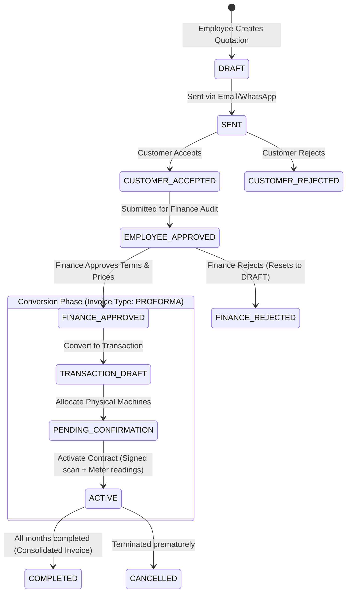
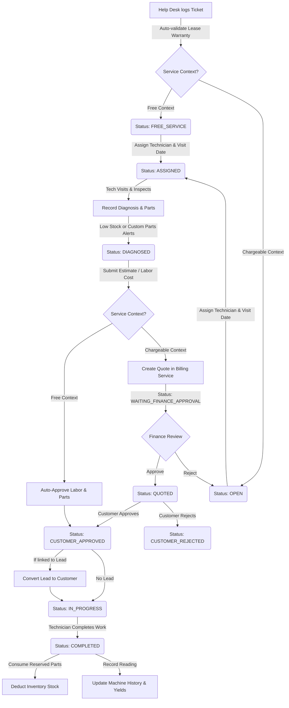

# Xerocare: Service Workflow & Contract Agreement Integration

This document provides a comprehensive, end-to-end explanation of how **Service Tickets**, **Quotations (Sales, Rentals, Leases)**, and **Agreement Contracts (AMC, FSMA, SMA, Warranties)** integrate and function across Xerocare's microservices.

---

## 1. System Architecture & Cross-Service Data Flows

Xerocare's operations are divided among distinct microservices that communicate using both synchronous HTTP REST endpoints (via the API Gateway) and asynchronous event publishing (via RabbitMQ):

```
                       +---------------------------------------+
                       |              API GATEWAY              |
                       +---------------------------------------+
                        /                  |                  \
                       /                   |                   \
       +--------------v----+      +--------v---------+      +---v--------------+
       |    CRM Service    |      | Billing Service  |      | Ven-Inv Service  |
       +-------------------+      +------------------+      +------------------+
       | Customers & Leads |      | Invoices, Quotes |      | Products, Lots,  |
       |                   |      | Contracts, Usage |      | Service Tickets  |
       +-------------------+      +------------------+      +------------------+
                 ^                          ^                         ^
                 |                          |                         |
                 +--------------------------+-------------------------+
                                   RabbitMQ Event Bus
```

### Microservice Roles in the Workflow:

1. **CRM Service (`crm_service`)**: Stores customer accounts and marketing leads. Converts hot leads into customers dynamically during the quotation or service approval pipeline.
2. **Billing Service (`billing_service`)**: The financial engine. Manages Quotations, Proforma Invoices (Contracts), and Final Invoices. Processes usage records, counts billing cycles, collects caution deposits, and stores initial/current meter readings.
3. **Vendor & Inventory Service (`ven_inv_service`)**: Manages physical warehouses, purchase lots, spare parts catalog, and individual machines (identified by manufacturer serial numbers). It also drives the **Service Ticket** lifecycle, including technician logs, field diagnostics, and part replacements.
4. **API Gateway (`api_gateway`)**: Exposes public and employee routes, handles authentication, branch isolation (RBAC), and aggregates data across services.

---

## 2. Quotation Creation & Conversion Workflow (Sale, Lease, Rent)

The transaction pipeline starts with an employee drafting a price estimate (Quotation) for a customer or a CRM lead.

### A. Quotation Types & Business Rules

| Sale Type                          | Billing Model     | Configuration Requirements                                                                                                                        | Finance & Ledger Impact                                                                                                        |
| :--------------------------------- | :---------------- | :------------------------------------------------------------------------------------------------------------------------------------------------ | :----------------------------------------------------------------------------------------------------------------------------- |
| **Direct Sale** / **Product Sale** | One-time Payment  | Specific product serial numbers assigned. Items mapped to catalog.                                                                                | Converted directly to `InvoiceType.FINAL` in `PAID` status. Updates physical item ownership status to `SALE`.                  |
| **Rental (`RENT`)**                | Recurrent Billing | Rent Type (`FIXED_LIMIT`, `FIXED_COMBO`, `FIXED_FLAT`, `CPC`, `CPC_COMBO`), Rent Period (Monthly, Custom Days), monthly rent, and advance amount. | Created as `InvoiceType.QUOTATION`. Converted to `PROFORMA` (Contract). Emits RabbitMQ event to update item status to `RENT`.  |
| **Lease (`LEASE`)**                | tenure-Based      | Lease Type (`EMI`, `FSM`), monthly lease/EMI/FSM charging, tenure (months), and advance amount.                                                   | Created as `InvoiceType.QUOTATION`. Converted to `PROFORMA` (Contract). Emits RabbitMQ event to update item status to `LEASE`. |

#### Rent Type Details:

- **Fixed Rent Models** (`FIXED_LIMIT`, `FIXED_COMBO`, `FIXED_FLAT`): Cannot contain slab ranges (graduated pricing per copy). They include a base copy limit; prints exceeding this limit are billed at a flat excess rate.
- **CPC Models** (`CPC`, `CPC_COMBO`): Cost-Per-Copy models. Monthly base rent is strictly $0$ (or not set), and pricing is calculated solely on actual print count using slab ranges.

### B. Lead-to-Customer Integration

- If a quotation is created for a prospect who is not yet a customer:
  1. A lead is registered in the **CRM Service** (`POST /leads`).
  2. During the checkout process or upon customer acceptance of the quote, the UI triggers `POST /leads/:id/convert`.
  3. The CRM service validates the lead data, writes a new `Customer` record, flags the lead as `CONVERTED` in MongoDB, and returns the new customer UUID to bind to the quotation.

### C. Step-by-Step Status Transitions (Draft to Active Contract)



#### The Conversion Phase in Detail:

1.  **Convert to Transaction**: The employee triggers `POST /invoices/:id/convert-to-transaction`. The system verifies the quotation's validity date (`effectiveTo`). The invoice type changes from `QUOTATION` to `PROFORMA`, and status resets to `DRAFT` to begin machine allocation.
2.  **Machine Allocation**:
    - **Endpoint**: `POST /invoices/:id/allocate-machines` (Finance/Managers).
    - **Action**: The user maps the contract lines to specific physical machine IDs in the warehouse. The Billing Service calls the Vendor Inventory Service to check if the machines are `AVAILABLE`.
    - The system creates `ProductAllocation` records, updates the invoice status to `FINANCE_APPROVED`, sets `contractStatus` to `PENDING_CONFIRMATION`, and broadcasts a RabbitMQ event to reserve the physical assets.
3.  **Contract Activation**:
    - **Endpoint**: `POST /invoices/:id/activate-contract` (Finance/Managers).
    - **Action**:
      - **Contract Document**: Requires uploading a signed PDF contract confirmation (`contractConfirmationUrl`).
      - **Caution Deposit**: Optionally records the security deposit (`amount`, `mode`, `reference`, `receivedDate`).
      - **Initial Meter Readings**: For Rent/Lease, the initial Black & White/Color meter counts are recorded directly in `ProductAllocation` to establish the baseline.
    - Upon confirmation, `contractStatus` transitions to `ACTIVE`, and recurring billing schedules are initialized.

---

## 3. Service Agreement Contracts & Context Warranty Rules

When a client's machine malfunctions, they request support. The system determines whether parts and labor are chargeable or covered under a contract by checking the **Service Context** (`ServiceContext`).

### A. Service Context Classifications

| Service Context        | Type           | Description                        | Coverage Rules                                                                           |
| :--------------------- | :------------- | :--------------------------------- | :--------------------------------------------------------------------------------------- |
| `RENT`                 | **Free**       | Rented devices                     | All maintenance, parts, consumables, and labor are fully covered under the monthly rent. |
| `LEASE_UNDER_WARRANTY` | **Free**       | Leased devices                     | Subject to warranty limits (time-based and copy-count based).                            |
| `WARRANTY`             | **Free**       | Sold devices under warranty        | Covered under standard product sale warranty.                                            |
| `FSMA`                 | **Free**       | Full Service Maintenance Agreement | Service contract covering all spare parts, consumables (toner), and labor.               |
| `SMA`                  | **Free**       | Service Maintenance Agreement      | Custom coverage rules (e.g., covers labor, but parts are chargeable).                    |
| `AMC`                  | **Free**       | Annual Maintenance Contract        | Periodic maintenance agreement covering visits and labor. Parts are chargeable.          |
| `LEASE_EXPIRED`        | **Chargeable** | Leased devices                     | Warranty expired (tenure or copy limit exceeded). No active contract exists.             |
| `CHARGEABLE`           | **Chargeable** | Ad-hoc service                     | No active contract or warranty. Customer pays list price for parts and labor.            |

### B. Auto-Validation Logic

When a service ticket is created, the system queries the Billing Service (`GET /invoices/contract/serial/:serialNumber`) and runs the following checks:

#### 1. Lease/Warranty Tenure Check

The warranty expiration date is calculated based on the lease commencement date:

$$\text{Contract Expiry} = \text{effectiveFrom} + \text{leaseTenureMonths}$$

If $\text{Current Date} \le \text{Contract Expiry}$, the time-based warranty check passes.

#### 2. Copy Volume Check

The system aggregates the machine's lifetime meter readings (Black & White + Color) and compares it with the lease copy limit:

$$\text{Current Copies} = \text{bwA4} + \text{bwA3} + \text{colorA4} + \text{colorA3}$$

If $\text{Current Copies} \le \text{maxCopyLimit}$, the volume-based check passes.

#### 3. Resolution Context

- If **both** checks pass, the ticket status is set to `LEASE_UNDER_WARRANTY` (Free).
- If **either** check fails, the system looks up active service contract records (`ServiceContract` table) linked to the device's product ID. If found, it maps it to `FSMA`, `SMA`, or `AMC`.
- If no active contract is found, the context is demoted to `LEASE_EXPIRED` or `CHARGEABLE`.

---

## 4. End-to-End Service Ticket Workflow

The service workflow ensures that customer machines are diagnosed, parts are reserved, approvals are obtained, and repairs are completed with inventory and billing synchronized.



### Phase 1: Creation & Assignment

1.  **Help Desk Logging**: The Help Desk agent creates the service ticket. The system auto-calculates the `branchId` and `serviceContext`.
2.  **Initial Status**:
    - Free tickets (`RENT`, `LEASE_UNDER_WARRANTY`, `FSMA`, `SMA`, `WARRANTY`) are set to `FREE_SERVICE`.
    - Chargeable tickets (`CHARGEABLE`, `LEASE_EXPIRED`) are set to `OPEN`.
3.  **Technician Assignment**: The agent assigns a `SERVICE_TECHNICIAN` and schedules the visit date (`scheduledVisitDate`). The status moves to `ASSIGNED`, and the technician receives an in-app notification.

### Phase 2: On-Site Diagnosis & Alerts

1.  **Technician Visit**: The technician inspects the machine and enters `problemFound`, `rootCause`, and `technicianNotes`. The status transitions to `DIAGNOSED`.
2.  **Item Request**: The technician requests necessary parts (consumables or spare parts) from the warehouse:
    - `SPARE_PART`: Cataloged inventory items. If stock $\le 5$, the Branch Manager receives a **Low Stock Warning**.
    - `CUSTOM`: Non-cataloged items. Triggers an alert requiring Manager review.
3.  **Pricing Policy**:
    - For **Free** contexts, unit prices for requested items are automatically forced to $0$ and flagged as `isFree = true`. The parts are immediately placed in a `RESERVED` status in the inventory database (`InventoryReservation` table) to prevent stock allocation to other jobs.

### Phase 3: Estimation & Approvals

1.  **Estimate Submission**:
    - **Free Contexts**: The estimate is automatically approved by the system and transitions directly to `CUSTOMER_APPROVED`.
    - **Chargeable Contexts**: The technician inputs labor costs and submits the estimate. The system calls the Billing Service (`POST /service-quotation`) to create a quotation in `WAITING_FINANCE_APPROVAL` status. The service ticket status matches.
2.  **Finance Audit**: The Finance team reviews the quotation on the billing dashboard:
    - _Approve_: Updates ticket status to `QUOTED`.
    - _Reject_: Resets ticket status to `OPEN` for correction.
3.  **Customer Review**: The customer reviews the quotation:
    - _Accept_: Ticket status moves to `CUSTOMER_APPROVED`, and the system reserves the requested parts in inventory.
    - _Reject_: Ticket status moves to `CUSTOMER_REJECTED`.

### Phase 4: Repair & Completion

1.  **Repair In-Progress**: The technician starts the repair, moving the status to `IN_PROGRESS` (recording `repairStartedAt`).
2.  **Job Completion**: Once the machine is operational, the technician enters `workPerformed`, `resolutionDetails`, customer remarks (digital signatures are no longer required, falling back to a default signed state). The status updates to `COMPLETED`, and the system automatically generates a monthly sequential Service Completion Bill (e.g. `SCB-YYYYMM-XXXX`) saved to `completion_bill_number`.
3.  **Document Sharing & Delivery**: Employees can access both the Service Quotation PDF (once approved by finance/recorded) and the Service Completion Bill PDF (once completed) from the ticket list and details view. They can download the documents directly and share them with the customer via Email and WhatsApp (configured dynamically in the sharing modal).
4.  **Inventory & Stock Sync**:
    - Upon completion, the system transitions reservations from `RESERVED` to `CONSUMED`.
    - It decrements the physical stock levels in the master `SparePart` repository by the quantities used.
5.  **History Logging**:
    - The system creates a `MachineServiceHistory` record to track the machine's lifetime costs (parts cost + labor cost).
    - If a consumable (e.g., toner or drum) was replaced, a `ConsumableYieldHistory` record is written to track print yields between replacements.

---

## 5. Summary of Key Database Entities

### Service Ticket (`service_tickets` table)

- `ticketNumber` (e.g., `ST-YYYYMM-XXXX`): The unique customer-facing ticket identifier.
- `serviceContext`: Enum (`RENT`, `LEASE_UNDER_WARRANTY`, `LEASE_EXPIRED`, `FSMA`, `SMA`, `AMC`, `CHARGEABLE`, `WARRANTY`).
- `status`: Enum (`OPEN`, `FREE_SERVICE`, `ASSIGNED`, `DIAGNOSED`, `WAITING_FINANCE_APPROVAL`, `QUOTED`, `CUSTOMER_APPROVED`, `CUSTOMER_REJECTED`, `IN_PROGRESS`, `COMPLETED`, `CANCELLED`).
- `contractReferenceId`: Foreign key to `ServiceContract` or `Invoice` (Proforma).
- `completion_bill_number`: Sequential completed bill identifier (format: `SCB-YYYYMM-XXXX`).

### Service Ticket Item (`service_ticket_items` table)

- `itemSource`: Enum (`SPARE_PART`, `CUSTOM`).
- `sparePartId`: Link to master `SparePart` catalog.
- `quantity`, `unitPrice`, `totalPrice`: Cost details ($0$ if `isFree` is true).
- `isFree`: Boolean flag determining if the item is covered.

### Product Allocation (`product_allocations` table)

- `contractId`: Link to active contract (`Invoice` in `PROFORMA` type).
- `productId`: Link to physical machine in inventory.
- `initialBwA4`, `initialColorA4`, etc.: Baseline meter readings when contract started.
- `currentBwA4`, `currentColorA4`, etc.: Last recorded meter readings.
